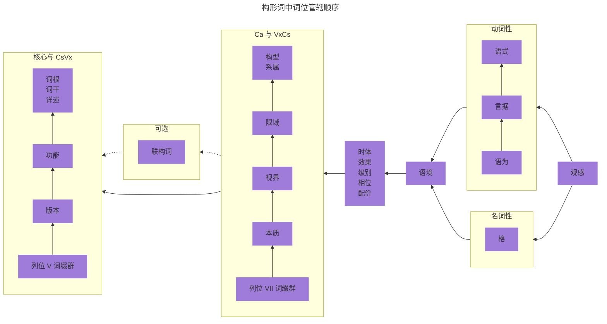

## 2.0 形态语音学 {#Sec2}

形态音系学研究的是语言如何利用音位和音系特征来生成模式，以便构词和应用于词汇的形态范畴。这些形态范畴的例子有单数与复数、动词时态等。

在新 Ithkuil 语中，词类分为三种类型：构形词、小词和指代词。构形词相当于自然人类语言中的名词和动词。（在下面的[第 2.4.2 条](02#Sec2_4_2)中，我们将了解为何将名词和动词合并为新 Ithkuil 语的单一词类是有意义的。）小词是与构形词关联的辅助词汇，提供更多关于相邻构形词的语义信息。指代词是一种类似于自然人类语言中的代词的词汇类型，尽管在新 Ithkuil 语中，它们的用法比其他语言中的代词更加动态和广泛。

在语法类型学方面。新 Ithkuil 语主要是一种黏着语，其次是一种综合语。这意味着形义词干、屈折变化和词汇派生的形成方式，以及这些要素如何有意义地组合成词，主要是通过将一个或多个词缀（包括前缀、后缀和中缀）连接到一个语义词根上实现的。词缀本身具有高度的综合性，即将多个形态范畴组合成一个音位形式。基本上，新 Ithkuil 语的单词是通过将多个词缀连接到一个核心词干上形成的，其中每个词缀可以包含多个意义要素。

::: details
Morpho-phonology refers to how a language uses its phonemes (meaningful sounds) and phonological features (e.g., syllabic stress, gemination, tone, etc.) to generate patterns for word-formation and for morphological categories (e.g., singular versus plural, verb tense, etc.) to be applied to words.

Parts of Speech:  There are three types of words in New Ithkuil:  formatives, adjuncts, and referentials.  Formatives constitute a class of words which generally correspond to both nouns and verbs in natural human languages.  (In Sec. 2.4.2 below, we will see why it makes sense to combine nouns and verbs into a single word-type in New Ithkuil grammar.)  Adjuncts are “helper” words which operate in association with formatives to provide further semantic information about the adjoining formative.  Referentials are a type of word that operates similarly to pronouns in natural human languages, although we will see that they are more dynamic and expansive in their usage than the usual range of pronouns in other languages.

Grammatical Typology:  New Ithkuil is primarily an agglutinative language and secondarily a synthetic language.  This means that the manner in which morpho-semantic stems, inflections and derivations are formed, and how those elements combine meaningfully into words, is primarily via the joining of one or more affixes (including prefixes, suffixes, and infixes) to a semantic root, where the affixes themselves are highly synthetic (i.e., combining numerous morphological categories together into a single phonological form).  Essentially, this means that New Ithkuil words are formed by joining multiple affixes to a core stem, where each affix can pack multiple elements of meaning within it.
:::

## 2.1 标准元音形式序列 {#Sec2_1}

当研究新 Ithkuil 语的单词结构时，我们可以看到单词结构是通过一系列顺序的列位来操作的。每个列位都填充有一个词缀。这些列位中的许多组成型词缀具有九个元音的频繁重复模式，或者是一个矩阵，其中矩阵的一个轴携带九个元音形式。因此，该语言采用了一种标准且通用的九个元音形式序列模式，用于填充各种列位。这种标准的九个元音形式序列模式方便了那些希望学习该语言的人们记忆众多词缀。

下面的表格展示了标准元音形式序列的各种模式。在研究新 Ithkuil 语中使用的不同形态列位时，读者可以参考此表格。尽管有很多元音形式，但如果仔细分析，这个序列结构是相当系统的。

| 标准元音形式序列 | 系列一 | 系列二 | 系列三\* | 系列四 |
| :------------------------: | :--------------: | :--------------: | :----------------: | :--------------: |
|      形式一      |        a        |        ai        |      ia / uä      |        ao        |
|      形式二      |        ä        |        au        |      ie / uë      |       aö       |
|      形式三      |        e        |        ei        |     io / üä     |        eo        |
|      形式四      |        i        |        eu        |     iö / üë     |       eö       |
|      形式五      |       ëi       |       ëu       |        eë        |       oë       |
|      形式六      |        ö        |        ou        |     uö / öë     |       öe       |
|      形式七      |        o        |        oi        |     uo / öä     |        oe        |
|      形式八      |        ü        |        iu        |      ue / ië      |       öa       |
|      形式九      |        u        |        ui        |      ua / iä      |        oa        |

\* 以 -i 开头的系列三形式，当其前面有 y- 时，使用其替代形式替换（例如，yuä，而非 yia）；而以 -u 开头的系列三形式，在前其有 w- 时，使用其替代形式替换（例如，wiä，而非 wua）。

## 2.2 插入声门塞音到元音形式之规则 {#Sec2_2}

在研究构词时，我们将看到构成构形词结构的一些形态音系学列位需要在元音形式 V 中插入声门塞音。请按照以下规则操作：

1. 如果 V 是一个单独的元音或二合元音，声门塞音放在 V 后面，例如，-a 变为 -a’、-ai 变为 -ai’ 。
2. 如果 V 是一个双音节组合，将声门塞音插入 V 的两个音节之间，例如，-ua 变为 -u’a 。
3. 当应用上述规则 1 时，如果插入结果是语音组合法所禁止的或不悦耳的双音节组合，或者导致声门塞音位于词尾位置，则必须添加增音性元音，具体规则如下：
   * 如果 V 是一个单独的元音，将此元音重复一次放在声门塞音之后；例如，-a 变为 -a’a 。
   * 如果 V 是一个二合元音，则将声门塞音放在二合元音的两个元音之间（作为规则 1 的例外）；例如，-ai 变为 -a’i 而不是通常的 -ai’ 。
4. [第 4.6 节中的特别说明](04#Sec4_6)将解释在特定情况下，如何将列位 IX Vc 中的声门塞音完全移到单词的其他列位，以缩短单词的音节数。

## 2.3 构形词的结构 {#Sec2_3}

构形词的形态结构可以用以下公式表示：

::: center

(Cc +  Vv ) + Cr + Vr + ( CsVx ... ) + Ca + ( VxCs ... ) + ( VnCn ) + Vc / Vk + [重读]

:::

其中，除了 Cr 和 [重读] 外，每个术语都指代一个由辅音形式（在公式中表示为 C ）、元音形式（表示为 V ）或它们的组合（例如，CsVx 或 VnCn ）组成的词缀。术语 Cr 指的是词根本身，是由一个至五个辅音形式组成的辅音形式。根据不同几组括号，公式中的几个术语是可选的，因此一些构形词由最少的五个术语组成：Cr + Vr + Ca + Vc / Vk +  [重读] 。这些不同的形态元素必须按照给定的顺序出现，因此可以分析为填充十个形态「列位」。如下图所示，这些列位依次标记为列位 I 到列位 X。

**构形词标准列位结构**

| 列位 | 术语 | 范畴 | 形式 |
|:---:|:---:|:---:|:---:|
| I | (Cc | 联态指示语素 | 辅音形式，包括声门塞音或以 -h- 起首的形式 |
| II | Vv ) | 版本 + 词干 | 元音词缀 |
| III | Cr | 主词根 | 辅音形式 |
| IV | Vr | 功能 + 详述 + 语境 | 元音词缀 |
| V | (CsVx ... ) | VxCs 词缀（丛）应用于词干但不于 Ca； 为标准列位 VII VxCs 形式的倒装 | 辅音 + 元音 |
| VI | Ca | 构型 + 限域 + 系属 + 视界 + 本质 | 若已填列位 V 则 Ca 需加长 |
| VII | (VxCs ... ) | VxCs 词缀（丛）应用于词干 + Ca | 元音 + 辅音 |
| VIII | (VnCn ) | 配价 + 语式/格辖  **或** 时体 + 语式/格辖  **或** 相位 + 语式/格辖  **或** 级别 + 语式/格辖  **或** 效果 + 语式/格辖 | 模列位包含元音形式 + 辅音形式 |
| IX | Vc / Vk | 格 **或** 格式 **或** 语为 + 言据 由列位 X 的音节重读所决定 | 元音形式 |
| X | [重读] | 次音节重读 = 无框关系 + Vc  尾音节重读 = 无框关系 + Vk  前音节重读 = 有框关系 + Vc |  |

这些列位的具体形态结构和语义功能将在本件的专门章节中单独讨论。以下是对每个列位的初步概述。

| 列位 | 术语 | 描述 |
| :--: | :-: | --- |
| I | Cc | 可填入声门塞音 ’-、h-，或以 h- 开头的双辅音形式（例如 hw-、hr-、hm- 等）。它表示构形词是独构词（未联的）、甲型联构词、还是乙型联构词。构形词的联接在[第 10.1 节](10#Sec10_1)中有所讨论。它还表明下方的列位 II 是否包含用于列位 IV 和 VI 的「简体」信息（以便可以省略列位 IV 和 VI，从而缩短词语长度） |
| II | Vv | 包含 32 种不同的元音形式，用于表示构形词的词干和版本。每个词根关联着四个词干；词干在[第 2.4.3 条](02#Sec2_4_3)中有所讨论。每个构形词有两个版本，进程版和完成版，在[第 3.7 节](03#Sec3_7)中有详细说明。此外，还可包含用于列位 IV 和 VI 的「简体」信息（以便可以省略列位 IV 和 VI，从而缩短词语长度）。在特定情况下，该列位还可以用作传达三个预选列位 VII 词缀的「简体」方式 |
| III | Cr | 该列位由一个到五个辅音构成，表示构形词的语义根，在[第 2.4 节](02#Sec2_4) |
| IV | Vr | 该列位包含 32 种元音形式，用于表示构形词的功能、详述和语境。有两种功能：静态功能和动态功能，在[第 3.8 节](03#Sec3_8)中有详细说明。有四种详述：基本述、内容述、构成述和对象述，在[第 2.4.4 条](02#Sec2_4_4)中有讨论。有四种语境：存在语境、意味语境、寓意语境和融合语境，在[第 3.9 节](03#Sec3_9)中有讨论 |
| V | (CsVx ... ) | 包含一个或多个描述性词缀，形式为辅音+元音，应用于词干本身（而不是整个词）。每个词缀有三种类型：语境性、派生性或限制性。共有超过 400 个这样的词缀可用，在[第 7 章](07)中有描述  |
| VI | Ca | 一个强制性辅音型多成分综合词缀，表示以下五个范畴：构型、系属、限域、视界和本质。这些范畴在[第 3 章](03)中都有讨论。该 Ca 复合型词缀的构造本身在 第 3.6 节中有讨论  |
| VII | (VxCs ... ) | 包含一个或多个描述性词缀，形式为元音+辅音，应用于词干及列位 VI Ca 范畴的组合（而不仅限于词干）。除了倒装辅音和元音形式之外，这些词缀与列位 V 所用的词缀相同  |
| VIII | (VnCn ) | 包含一个元音+辅音形式的词缀，用于表示语式或格辖，以及时体、相位、级别或效果中的任意一个。所有这些范畴的解释在[第 5 章](5)中讨论  |
| IX | Vc / Vk | 一个元音形式的词缀，根据列位 X 显示的重读模式，可以传达构形词的格、格式，或者两个范畴的组合：语为 + 言据。格在[第 4 章](04)中有讨论；格式在[第 10.1 节](10#Sec10_1)中有讨论；而语为和言据在[第 6 章](06)中有讨论 |
| X | [重读] | 词的音节重读模式决定了列位IX显示哪种类型的词缀。这在[第 6.2.1 条](06#Sec6_2_1)中有讨论  |

### 构形词中词位的管辖次第

构形词的列位结构或多或少反映了词位在构形词中的管辖次序，即每个词位的语义信息在词语口语或书写中逐步展开时对前面形态的影响顺序。以下展示了这种管辖顺序：

在详细解释形态公式中每个词位的细节之前，了解构形词的词根和词干的运作方式非常重要。以下部分将详细说明这一过程。

## 2.4 词根和词干的构成 {#Sec2_4}

在 Ithkuil 语中，所有被翻译成英语名词或动词的词都基于一个词干，而这个词干又源于一个语义上抽象的词根。下面的章节将对这个过程进行解释。

    
构形词标准列位结构

    

        <table>
            <thead>
            <tr>
                <th>列位</th>
                <th>术语</th>
                <th>范畴</th>
                <th>形式</th>
            </tr>
            </thead>
            <tbody>
            <tr>
                <td>I</td>
                <td>(Cc</td>
                <td>联态指示语素</td>
                <td>辅音形式，包括声门塞音或以 -h- 起首的形式</td>
            </tr>
            <tr>
                <td><mark>II</mark></td>
                <td><mark>Vv )</mark></td>
                <td><mark>版本 + 词干</mark></td>
                <td><mark>元音词缀</mark></td>
            </tr>
            <tr>
                <td><mark>III</mark></td>
                <td><mark>Cr</mark></td>
                <td><mark>主词根</mark></td>
                <td><mark>辅音形式</mark></td>
            </tr>
            <tr>
                <td><mark>IV</mark></td>
                <td><mark>Vr</mark></td>
                <td><mark>功能 + 详述 + 语境</mark></td>
                <td><mark>元音词缀</mark></td>
            </tr>
            <tr>
                <td>V</td>
                <td>(CsVx ... )</td>
                <td>VxCs 词缀（丛）应用于词干但不于 Ca；&lt;br/&gt;为标准列位 VII VxCs 形式的倒装</td>
                <td>辅音 + 元音</td>
            </tr>
            <tr>
                <td>VI</td>
                <td>Ca</td>
                <td>构型 + 限域 + 系属 + 视界 + 本质</td>
                <td>若已填列位 V 则 Ca 需加长</td>
            </tr>
            <tr>
                <td>VII</td>
                <td>(VxCs ... )</td>
                <td>VxCs 词缀（丛）应用于词干 + Ca</td>
                <td>元音 + 辅音</td>
            </tr>
            <tr>
                <td>VIII</td>
                <td>(VnCn )</td>
                <td>配价 + 语式/格辖 &lt;br/&gt;<strong>或</strong> 时体 + 语式/格辖 &lt;br/&gt;<strong>或</strong> 相位 + 语式/格辖 &lt;br/&gt;<strong>或</strong> 级别 + 语式/格辖 &lt;br/&gt;<strong>或</strong> 效果 + 语式/格辖</td>
                <td>模列位包含元音形式 + 辅音形式</td>
            </tr>
            <tr>
                <td>IX</td>
                <td>Vc / Vk</td>
                <td>格 <strong>或</strong> 格式 <strong>或</strong> 语为 + 言据&lt;br/&gt;由列位 X 的音节重读所决定</td>
                <td>元音形式</td>
            </tr>
            <tr>
                <td>X</td>
                <td>[重读]</td>
                <td>次音节重读 = 无框关系 + Vc &lt;br/&gt;尾音节重读 = 无框关系 + Vk &lt;br/&gt;前音节重读 = 有框关系 + Vc</td>
                <td></td>
            </tr>
            </tbody>
        </table>
    

**构形词标准列位结构**

| 列位 | 术语 | 范畴 | 形式 |
|:---:|:---:|:---:|---:|
| I | (Cc | 联态指示语素 | 辅音形式，包括声门塞音或以 -h- 起首的形式 |
| ==II== | ==Vv )== | ==版本 + 词干== | ==元音词缀== |
| ==III== | ==Cr== | ==主词根== | ==辅音形式== |
| ==IV== | ==Vr== | ==功能 + 详述 + 语境== | ==元音词缀== |
| V | (CsVx ... ) | VxCs 词缀（丛）应用于词干但不于 Ca； 为标准列位 VII 中 VxCs 形式的倒装 | 辅音 + 元音 |
| VI | Ca | 构型 + 限域 + 系属 + 视界 + 本质 | 若已填列位 V 则 Ca 需加长 |
| VII | (VxCs ... ) | VxCs 词缀（丛）应用于词干 + Ca | 元音 + 辅音 |
| VIII | (VnCn) | 配价 + 语式/格辖  **或** 时体 + 语式/格辖  **或** 相位 + 语式/格辖  **或** 级别 + 语式/格辖  **或** 效果 + 语式/格辖 | 模列位包含元音形式 + 辅音形式 |
| IX | Vc / Vk | 格 **或** 格式 **或** 语为 + 言据 由列位 X 的音节重读所决定 | 元音形式 |
| X | [重读] | 次音节重读 = 无框关系 + Vc  尾音节重读 = 无框关系 + Vk  前音节重读 = 有框关系 + Vc |  |

### 2.4.1 词根 {#Sec2_4_1}

词根构成了实际名词 / 动词干的语义基础。词根由辅音形式 Cr 组成，它占据了上述形态公式中的列位 III。词根由一个到五个辅音组成（例如 -k-、-st-、-ntr-、-pstw-、-rmzgl-）。该语言的语音组合约束（见[第 1.5 节](01#Sec1_5)）允许超过 33,000 个可能的词根。

词根是基本的语义单位。例如，词根 -DN- 的语义参照为「命名 / 指定 / 标记」。通过在列位二中使用 Vv- 元音词缀，从词根生成功能性词干（也称为词干），如下文的[第 2.4.3 条](#Sec2_4_3)所述。然而，在讨论词干之前，有必要首先了解「构形词」的概念，这样读者就能理解为什么语言中的所有词干都可以同时用作名词和动词，并具有名词和动词的含义。

### 2.4.2 「构形词」的概念 {#Sec2_4_2}

在新 Ithkuil 语中，名词和动词被合并为一种称为「构形词」的语法词类。所有的构形词都可以作为名词或动词使用，具体是名词还是动词取决于其形态语音结构和形态句法关系的分析。因此，不存在像西方语言中仅用于指代名词或动词的构形词。

举例来说，之前提到的词根 -DN- 的词干一既可以表示「一个名字」，也可以表示「命名」，而这两个意义之间并没有被视为更本质、更基本或是一个派生自另一个的关系。这种名词意义或动词意义的层级关系只在翻译成英语或其他西方语言时出现，在这些语言中，名词和动词之间的词汇限制是固有的。

名词和动词之所以可以作为同一语法词类在形态上派生出来，是因为新 Ithkuil 语的形态语义学不认为名词和动词在认知上是完全不同的，而是认为它们是一个概念在共同基础语义连续体中的互补表现。可以将其类比于物理学中的时空概念。在这个时空连续体中，新的 Ithkuil 语通过将语义思想实例化为词根来形成构形词这一语法词类。然后，说话者可以选择在空间上「物化」这个构形词，使其表示一个对象或实体（即名词），或者在时间上「事化」这个构形词，使其表示一个行为、事件或状态（即动词）。这种互补过程可以用下图描述：

### 2.4.3 词干 {#Sec2_4_3}

每个词根具有三个词干，这些词干通过位于列位 II 的元音形式 Vr 来表示（见[第 2.3 节](#Sec2_3)）。在词干层面上，词根转化为具有实际意义的单词。例如，对于词根 -DN-，它的第一个词干是 -adn-，表示「（有）一个名字【加上被命名的实体】；某物 / 某人被称为某物 / 某人」。词根的第二个词干是 -edn-，表示「（有）一个指定 [加上被指定的实体]；某个实体被引用作」，而词根的第三个词干是 -udn-，表示「（有）一个标签【加上被标记的实体】；【某个实体】（被）标记作」。

除了这三个通过列位 II 的元音形式 -a-、-e - 和 -u- 表示的词干外，还有一个通过列位 II 的元音形式 -o- 表示的第四个形式，称为「词干零」。这种词干形式是特殊的，它指代的是原始词根的整体概念意义，与特定的词干无关。具体的意义是根据词根本身的实用情况确定的。因此，对于词根 -DN-，词干零形式 -odn- 本质上综合了三个词干的意义，表示「（有）某物被称为或标记为的东西【加上被称为 / 标记为的实体】」。这使得说话者可以使用词干来创建一个有意的语义模糊，当他们不希望作出区分时，例如成年人和儿童。

### 2.4.4 详述 {#Sec2_4_4}

为了进一步区分一个词的基本语义概念，还有一个称为「详述」的额外形态范畴。每个词干，包括第四个「词干零」形式，都有四个详述。这些详述用于在句子语境中指示词干的语义解释方式。下面对每个详述的目的和示例进行了描述，以便更好地理解。这四个详述是基本述、内容述、构成述和对象述。

|缩写| 描述 |
|---|---|
| BSC | 基本述：对词干的整体实例化，在应用其他三个详述之一之前，基本上包含了下面的 CTE 及 CSV 详述的含义。对词根的整体实例化，在应用其他三个详述之一之前，基本上包含了下面的 CTE 及 CSV 详述的含义。对于代表自然地「被活性化的」、「时间不定的」、动态的或心理上类似动词的概念的词干，基本述的名词性构形词表示「～的一个实例 / 事件」，而基本述的动词性构形词表示「～的一个实例／事件发生」。对于代表自然地「被具体化的」、「时间稳定的」、静态的或心理上类似名词的概念的词干，基本述的名词性构形词表示将意味着「一个（存在的）～」，或者对于「不可数的」实体则意味着「一个（不明确的 / 某个）～的数量 / 总数」，而基本述的动词性构形词将带有静态功能的解释，意思是「（一个）～存在」或「有（一个）～」；通过使用其他详述，可以为动词扩展这个意义 |
| CTE | 内容述：与以下 CSV 的互补。无论是物理的还是非物理的，意味着「内容」、本质、有目的的功能、其理想化而抽象的或柏拉图式（纯精神的）的形式，而不是其单纯的物理形式。例如：一件艺术作品的内容【其所代表的 \ 所画所雕刻的内容】、河流中的水【不管它的渠道或水道如何】、信息的传播内容【不管它通过什么手段 / 媒介如何】、铁制的某物【它的形式 / 形状，而不仅仅作为该物质的例子】、一个房间，作为一个具备功能性的 / 可居住的空间，由其社会交流的目的所建立，或从其设计、家具、装饰等能看出的 |
| CSV | 构成述：表示实体 / 状态 / 行为实际自身表达中的一个形式（无论是物理的或非物理的），被塑造、或被实现，而非其功能性 / 目的性的内容；即 “构成～的”，例如：一件艺术品【作为由画布、雕刻的大理石等所构成的东西，而不考虑图像或雕像代表了什么】、一条河流的水道、信息的（书面、口头、记录等）形式 / 媒介【不管其所传达的是什么】、铁制的某物（重点是它是一种特定的材料 / 物质，不管它的形式 / 形状如何）、一个房间，作为由相连的墙壁及天花板构成的空间容积【不管其目的、尺寸、布局、设计、家具或装饰】 |
| OBJ | 对象述:表示针对特定词干的语义以下最显着项：（1）有形的工具 / 仪器 / 手段，使用它们就会发生一个行为 / 状态 / 事件；不适用则（2）与双方互动有关的第三方对象 / 实体（例如，给予互动中所赋予的对象）；不适用则（3）由此产生的有形物体 / 产物 / 情况；不适用则（4）状态 / 行为 / 事件的语义受事者或感事者，例如：在现场音乐表演中演奏的乐器、包含正在阅读的故事的书、赠送给某人的物品、一名艺术家所创造的（即艺术品）、构成一个人信仰的对象 / 来源的实体 / 个人 / 机构、一个测量行为所产生的测量结果 |

详述的范畴由构形词中位 IV 的元音词缀 Vr 显示（如上面的[第 2.3 节](#Sec2_3)所示）。这四个详述的默认词缀分别为：`BSC` = -a-、`CTE` = -ä-、`CSV` = -e-、`OBJ `= -i-。

因此，为了说明详述如何与一个词根的三个词干配合使用，可以根据四个详述分别分解示例词根 -DN- 的三个词干的含义，如下所示：

<table>
<thead>
  <tr>
    <th colspan="4">-DN-      ‘NAME / DESIGNATION / LABEL’</th>
  </tr>
</thead>
<tbody>
  <tr>
    <td> </td>
    <td>Stem 1</td>
    <td>Stem 2</td>
    <td>Stem 3</td>
  </tr>
  <tr>
    <td>BSC</td>
    <td>-adna-:   (to be) a name [plus the entity named]; to be named/called something</td>
    <td>-edna-:   (to be) a designation or reference [plus the entity so designated]; to refer to as  </td>
    <td>-udna-:   (to be) a label [plus the entity so labeled]; to label as</td>
  </tr>
  <tr>
    <td>CTE</td>
    <td>-adnä-:   (to be) an entity having a name</td>
    <td>-ednä-:   (to be) an entity having a designation or reference</td>
    <td>-udnä-:   (to be) an entity having a label</td>
  </tr>
  <tr>
    <td>CSV</td>
    <td>-adne-:   (to have) a name; to bear a name</td>
    <td>-edne-:   (to have) a designation or reference; to bear a designation or reference</td>
    <td>-udne-:   (to have) a label; to bear a label</td>
  </tr>
  <tr>
    <td>OBJ</td>
    <td>-adni-:   (to be) the name that an entity has</td>
    <td>-edni-:   (to be) the designation or reference that an entity has</td>
    <td>-udni-:   (to be) the label that an entity has</td>
  </tr>
</tbody>
</table>

「词干零」形式分别为 -odna-、-odnä-、-odne- 和 -odni-。

这儿有另一个词根的例子，以及其三个词干在四个详述下的含义：

<table>
<thead>
  <tr>
    <th colspan="4">-LK-         ‘MUSIC/ PLAY MUSIC / COMPOSE MUSIC’</th>
  </tr>
</thead>
<tbody>
  <tr>
    <td> </td>
    <td>Stem 1</td>
    <td>Stem 2</td>
    <td>Stem 3</td>
  </tr>
  <tr>
    <td>BSC</td>
    <td>-alka-:  (to be) a state/act of music playing (whether recorded or live)</td>
    <td>-elka-:  (to be) a state/act of playing/making music (i.e., on a musical instrument)</td>
    <td>-ulka-: (to be) a state/act of composing a passage of music, a musical phrase, a melody, a tune; to compose a melody/tune/musical phrase or passage</td>
  </tr>
  <tr>
    <td>CTE</td>
    <td>-alkä-:  (to be) the state of there being music to be heard (playing)</td>
    <td>-elkä-:  (to be) the state of music being made by the playing of a musical instrument</td>
    <td>-ulkä-:  (to be) the state of there being a musical phrase/passage/tune or melody in one’s mind; to be a melody/tune/musical phrase or passage one hears in one’s mind when composing</td>
  </tr>
  <tr>
    <td>CSV</td>
    <td>-alke-:  (to be) a state/act of hearing/listening to music</td>
    <td>-elke-:  (to be) an act of playing music on a musical instrument; to (be) play(ing) a musical instrument</td>
    <td>-ulke-:  (to be) a state/act of composing music; to compose (a passage/piece) of music</td>
  </tr>
  <tr>
    <td>OBJ</td>
    <td>-alki-:  (to be) the sound of music, the particular (piece of) music being heard</td>
    <td>-elki-:  (to be) a particular musical instrument (used to play music)</td>
    <td>-ulki-:  (to be) the particular melody/tune/musical phrase or passage being composed or played from one’s mind</td>
  </tr>
</tbody>
</table>

「词干零」形式为 -olka-、-olkä-、-olke- 和 -olki-。

### 2.4.5 词汇 {#Sec2_4_5}

语言中的词根和词干（以及它们的详述）列在一个单独的词汇表文档中。

## 2.5 小词 {#Sec2_5}

除了构形词，新 Ithkuil 语中还有另一类词叫做小词。小词之所以被称为小词，是因为它们与相邻的构形词结合，为构形词提供额外的语法信息，类似于英语中的助动词（例如，may、will、would、do、have）或名词限定词（例如，the、this、those）。小词由一个或多个辅音和 / 或元音词缀以黏着方式组合而成。在[第 8 章](08)中详细描述了几种不同类型的小词。

## 2.6  指代词 {#Sec2_6}

指代词类似于自然语言中的代词，用于标识与构形词相关联的人称。然而，指代词的结构和运作比自然语言中的代词更加复杂和动态。指代词将在[第 9 章](09)中讨论。

## 2.7 自我辨别形态 {#Sec2_7}

该语言采用音高重读系统作为划分单词边界的手段。以下是该音高重读系统的详细规则：

1. 单词中重读音节之前的所有非重读音节采用中性音高（中平调）。从重读音节开始，单词的剩余部分必须采用单一的非中平调的音高轮廓，如规则 2 所述。

2. 单词从重读音节开始，发音者可以自由选择以下任何一种音高轮廓：降调、高平调、升降调和降升调。在以下情况下，还可以使用其他音高轮廓：

   * 如果句子具有确认语为（相当于是 / 否问题），发音者可以选择在疑问子句的最后一个词上使用升调音高。
   * 对于具有非叙事域的子句，可以选择在语域子句的第一个及最后一个词上使用低音调（这种情况下不需要使用域尾小词）。

通常情况下，音高的选择可以与发音者在自己的母语中自然使用的音高相匹配，但必须遵守这些规则。

3. 一旦为重读音节选择了音高，它必须连续保持到单词的末尾，不能变成不同的音高轮廓（即，每个单词只能有一个非中平调音高轮廓）。

4. 如果一个单词具有词首重读（即，它不以中平调开始）或者是单音节词，并且不位于一个呼吸群的开头，那么它的音高起始音调必须与前一个词的最后一个音调不同，以避免在两个单词之间的边界处出现两个相同的音调。实际上，在同一个呼吸群中的两个相邻单词之间（即它们之间没有语音停顿），如果第二个单词具有词首重读或者是单音节词，则适用以下规则：

   * 当它前面是一个具有降调、升降调或低音调的单词时，单音节词或者具有词首重读的单词必须具有降调、降升调或高平调。

   * 当它前面是一个具有高平调、升调或降升调的单词时，单音节词或者具有词首重读的单词必须具有升调、升降调或低音调。

5. 在特殊情况下（例如唱歌），当音高重读不可用或不适合作为划分单词边界的手段，并且在单词之间放置语音停顿是不现实的时候，可以在需要划分的任何单词之前放置一个特殊的语析小词，形式为 ’V’，其中 V 表示两个声门塞音之间的单个元音，特定的元音表示以下单词的音节重读位置，如下所示：

   * ’a’ 表示以下单词是单音节的。
   * ’e’ 表示以下单词尾音节重读。
   * ’o’ 表示以下单词次音节重读。
   * ’u’ 表示以下单词前音节重读。

关于如何表示句子间隔，请参见[第 11.8 节](11#Sec11_8)。

