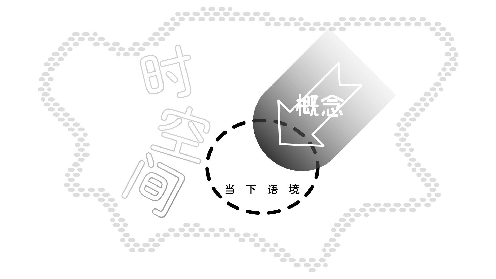

## 3.0 基本形态 {#Sec3}

在本章中，我们将讨论构形词的强制性形态范畴。这些范畴同时适用于名词和动词性构形词。换句话说，这些在[第 2.3 节](02#Sec2_3)中所提到、适用于名词或动词形态的列位，其本身而非可选项，要求以屈折型词缀表达。我们将讨论的具体范畴包括构型、系属、视界、限域、本质、版本、功能和语境。

<!-- @include: struct.md{313-468} -->

## 3.1 构型 {#Sec3_1}

要理解 New Ithkuil 中名词的集合关系和量化概念（即其他语言中的术语单数、复数等），必须分析三个独立但相关的语法范畴，即构型、系属和视界。这些概念对其他语言中并不常见。虽然它们涉及的语义区别本质上是量化性质的，但在其他语言中通常是在词汇层面上通过词语选择来表示，而不是像 New Ithkuil 那样在形态层面上表示。在本节中，我们首先讨论构型，然后在[第 3.2 节](#Sec3_2)讨论系属，最后在[第 3.3 节](#Sec3_3)讨论视界。

具体而言，构型涉及名词指称中成员之间的物理相似性或关系。这些成员存在于群体、集合、组合、排列或语境下的格式塔中。通过内部构成、可分性、区隔化、物理相似性或构成结构来界定它们。通过与某些英语词组进行类比，可以更好地解释和阐述这一点。

让我们考虑英语单词<q>tree</q>。在英语中，一个单独的树可以独立存在于语境之外，也可以是一组树中的一部分。这样一组树可以仅仅基于数量而被视为复数，比如两棵树、三棵树或二十棵树。然而，树的存在远不止于数量上的组合，还涉及到更具语境相关性的集体。例如，树可以是同一物种的，例如<q>grove</q>（树林）。集体也可以是不同种类树木的组合，如<q>forest</q>（森林），或以无规律混乱的方式出现，如<q>jungle</q>（丛林）。

以另一个例子，我们来看英语单词<q>person</q>。尽管可以用简单的数字组合出现，比如<q>a (single) person</q>（一个人）或<q>three persons</q>（三个人），但更常见的是使用表示不同组合的词来指代人，比如<q>group</q>（群体）、<q>gathering</q>（一些人）、<q>crowd</q>（人群）等。

在英语中，分割和合并成分的结构体现出进一步区分相关词汇的构型原则。例如，<q>car</q>（汽车）与<q>convoy</q>（车队）、<q>hanger</q>（衣架）与<q>rack</q>（衣架架子）、<q>chess piece</q>（棋子）与<q>chess set</q>（一套西洋棋）、<q>sentry</q>（哨兵）与<q>blockade</q>（封锁）、<q>piece of paper</q>（一张纸）与<q>sheaf</q>（一叠纸）、<q>girder</q>（梁）与<q>(structural) framework</q>（结构性框架）、<q>coin</q>（硬币）与<q>roll of coins</q>（一卷硬币）等之间的关系都体现了这些原则。

名词的另一种语境分组方式发生在二元集合中，尤其是涉及身体部位时。这些二元集合可以由两个相同的指称组成，如<q>a pair of eyes</q>（一双眼睛），但更常见的是相反或「镜像」（即互补）的集合，如<q>limbs</q>（肢体）、<q>ears</q>（耳朵）、<q>hands</q>（手）、<q>wings</q>（翅膀）等。

以上示例涉及的语义区别与树或人的不同组合有关。它们可以通过将「树」或「人」的词干变化为二十种不同的构型来实现。通过系属（见下文[第 3.2 节](#Sec3_2)）和特定的词缀，还可以基于用途或功能在集合中的个体成员之间进行其他语义区分。例如，一旦通过构型从「树」和「人」派生出词语「森林」或「人群」，再通过系属和其他词缀，可以轻松地派生出词语<q>orchard</q>（园林）、<q>copse</q>（树丛）、<q>team</q>（团队）或<q>mob</q>（暴民）；这种通过词缀派生新词的过程在[第7章《词缀》](07)中详细探讨。

构型范畴由三个独立子范畴的融合组成：构数、似度和分性。

* 构数可分为三种状态，用于区分实体/事件/行为/状态是单一或内部统一的、二元（由两个部分组成）的、还是由三个或更多组件/部分/成员组成。这三种构数状态被称为**单构**、**双构**和**复构**；缩写为 <abbr>U</abbr>、<abbr>D</abbr>、<abbr>M</abbr>。

* 似度可分为三种状态，用于区分作为整体看待时一组实体的个体成员是否在物理上相似、物理上不相似、或者共同构成了一种「模糊集」（即其相似性程度是主观的、不可确定的、不相关的或不易定义的）。这三种似度状态被称为**相似**、**各异**和**含混**；作为构数后和分性缩写字母前的第二个字母进行缩写，分别缩写为 <abbr>S</abbr>、<abbr>D</abbr>、<abbr>F</abbr>。请注意，似度不适用于单构的实体/事件/行为/状态。

* 分性可分为三种状态，用于区分作为整体看待时一组实体的个体成员是否具有相互分离、以某种方式（无论是物理上、抽象上还是比喻上）相连，或者（无论是物理上、抽象上还是比喻上）融合在一起。这三种分性状态被称为**相离**、**相连**和**相合**；作为构数和分性缩写字母后的第三个字母进行缩写，分别缩写为 <abbr>S</abbr>、<abbr>C</abbr>、<abbr>F</abbr>。请注意，分性不适用于单构的实体/事件/行为/状态。

根据上述内容，总共有二十种构型，通过构形词中列位 VI 的辅音词缀 `Ca` 来表示。请注意，除了表示构型外，`Ca` 词缀还表示了词干的系属、视界、限域和本质。以下是这二十种构型，每种形式都有相应在构形词中列位 VI 的辅音词缀：

::: tabs

@tab 单复构型

<dl class="gloss">
    <dt>*</dt>
    <dd>UPX</dd>
    <dd>单构型</dd>
</dl>
<dl class="gloss">
    <dt>t</dt>
    <dd>MSS</dd>
    <dd>复/似/离</dd>
</dl>
<dl class="gloss">
    <dt>k</dt>
    <dd>MSC</dd>
    <dd>复/似/连</dd>
</dl>
<dl class="gloss">
    <dt>p</dt>
    <dd>MSF</dd>
    <dd>复/似/合</dd>
</dl>
<dl class="gloss">
    <dt>ţ</dt>
    <dd>MDS</dd>
    <dd>复/异/离</dd>
</dl>
<dl class="gloss">
    <dt>f</dt>
    <dd>MDC</dd>
    <dd>复/异/连</dd>
</dl>
<dl class="gloss">
    <dt>ç</dt>
    <dd>MDF</dd>
    <dd>复/异/合</dd>
</dl>
<dl class="gloss">
    <dt>z</dt>
    <dd>MFS</dd>
    <dd>复/混/离</dd>
</dl>
<dl class="gloss">
    <dt>ž</dt>
    <dd>MFC</dd>
    <dd>复/混/连</dd>
</dl>
<dl class="gloss">
    <dt>ẓ</dt>
    <dd>MFF</dd>
    <dd>复/混/合</dd>
</dl>

@tab 双构型

<dl class="gloss">
    <dt>s</dt>
    <dd>DPX</dd>
    <dd>双构型</dd>
</dl>
<dl class="gloss">
    <dt>c</dt>
    <dd>DSS</dd>
    <dd>双/似/离</dd>
</dl>
<dl class="gloss">
    <dt>ks</dt>
    <dd>DSC</dd>
    <dd>双/似/连</dd>
</dl>
<dl class="gloss">
    <dt>ps</dt>
    <dd>DSF</dd>
    <dd>双/似/合</dd>
</dl>
<dl class="gloss">
    <dt>ţs</dt>
    <dd>DDS</dd>
    <dd>双/异/离</dd>
</dl>
<dl class="gloss">
    <dt>fs</dt>
    <dd>DDC</dd>
    <dd>双/异/连</dd>
</dl>
<dl class="gloss">
    <dt>š</dt>
    <dd>DDF</dd>
    <dd>双/异/合</dd>
</dl>
<dl class="gloss">
    <dt>č</dt>
    <dd>DFS</dd>
    <dd>双/混/离</dd>
</dl>
<dl class="gloss">
    <dt>kš</dt>
    <dd>DFC</dd>
    <dd>双/混/连</dd>
</dl>
<dl class="gloss">
    <dt>pš</dt>
    <dd>DFF</dd>
    <dd>双/混/合</dd>
</dl>

:::

\* 通过没有任何构型词缀来表示单构型；如果所有五个 `Ca` 词缀都为其<tooltip label="zero">零</tooltip>/默认值，`Ca` 形式为 -l-。

注意，仅标记为 <abbr>DPX</abbr> 构型的构形词表明它构成一对，且不明确指定一对成员实体之间的相似度或可分性。

各种构型的例子：

::: tabs

@tab 猫

<dl class="gloss">
    <dt>rrala</dt>
    <dd>“cat”-<b>UPX</b></dd>
    <dd>「猫」-单构型</dd>
</dl>

<q>a cat</q>

一只猫

<dl class="gloss">
    <dt>rrasa</dt>
    <dd>“cat”-<b>DPX</b></dd>
    <dd>「猫」-双构型</dd>
</dl>

<q>a pair of cats</q>

一对猫

<dl class="gloss">
    <dt>rraca</dt>
    <dd>“cat”-<b>DSS</b></dd>
    <dd>「猫」-双似离</dd>
</dl>

<q>a pair of similar cats</q>

一对形态相似的猫

<dl class="gloss">
    <dt>rraţsa</dt>
    <dd>“cat”-<b>DDS</b></dd>
    <dd>「猫」-双异离</dd>
</dl>

<q>a pair of dissimilar cats</q>

一对形态各异的猫

<dl class="gloss">
    <dt>rrata</dt>
    <dd>“cat”-<b>MSS</b></dd>
    <dd>「猫」-复似离</dd>
</dl>

<q>a group of similar cats</q>

一群形态相似的猫

<dl class="gloss">
    <dt>rraţa</dt>
    <dd>“cat”-<b>MDS</b></dd>
    <dd>「猫」-复异离</dd>
</dl>

<q>a group of dissimilar cats</q>

一群形态各异的猫

<dl class="gloss">
    <dt>rraza</dt>
    <dd>“cat”-<b>MFS</b></dd>
    <dd>「猫」-复混离</dd>
</dl>

<q>a group of what appear to be cats, some more than others</q>

一群看起来像是猫的实体，有些比另一些更像

@tab 球体

<dl class="gloss">
    <dt>anzwil</dt>
    <dd>“spherical.shape”-OBJ-<b>UPX</b></dd>
    <dd>「球形」-对象述-单构型</dd>
</dl>

<q>a sphere</q>

一颗球体

<dl class="gloss">
    <dt>anzwit</dt>
    <dd>“spherical.shape”-OBJ-<b>MSS</b></dd>
    <dd>「球形」-对象述-复似离</dd>
</dl>

<q>a group of similar spheres</q>

一群形态相似的球体

<dl class="gloss">
    <dt>anzwik</dt>
    <dd>“spherical.shape”-OBJ-<b>MSC</b></dd>
    <dd>「球形」-对象述-复似连</dd>
</dl>

<q>a group of similar spheres touching each other/connected to one another</q>

一群彼此接触/相连的形态相似球体

<dl class="gloss">
    <dt>anzwip</dt>
    <dd>“spherical.shape”-OBJ-<b>MSF</b></dd>
    <dd>「球形」-对象述-复似合</dd>
</dl>

<q>a group of similar spheres fused together</q>

一群融合在一起的形态相似球体

<dl class="gloss">
    <dt>anzwif</dt>
    <dd>“spherical.shape”-OBJ-<b>MDC</b></dd>
    <dd>「球形」-对象述-复异连</dd>
</dl>

<q>a group of dissimilar spheres touching each other/connected to one another</q>

一群彼此接触/相连的形态各异球体

<dl class="gloss">
    <dt>anzwiç</dt>
    <dd>“spherical.shape”-OBJ-<b>MDF</b></dd>
    <dd>「球形」-对象述-复异合</dd>
</dl>

<q>a group of dissimilar spheres fused together</q>

一群融合在一起的形态各异球体

<dl class="gloss">
    <dt>anzwiž</dt>
    <dd>“spherical.shape”-OBJ-<b>MFC</b></dd>
    <dd>「球形」-对象述-复混连</dd>
</dl>

<q>a group of rounded objects touching each other/connected to one another, some of which appear to be spheres, others less so</q>

一群相互接触/相连的圆形物体，其中有些看起来像是球体，其他的则不太像

@tab 曲线平移运动

<dl class="gloss">
    <dt>Blöfêi</dt>
    <dd>“curved.translative.motion”-DYN/OBJ-MDC-ASR/USP</dd>
    <dd>「曲线平移运动」-动态功能/对象述-复异连-表述语为/未定据</dd>
</dl>
<dl class="gloss">
    <dt>onţlilu</dt>
    <dd>词干.0-“automobile”-STA/OBJ-IND</dd>
    <dd>词干零-「汽车」-静态功能/对象述-自发格</dd>
</dl>

<q>The driver drove the car along a series of variously-sized curves.</q>

汽车驾驶员沿着一系列大小各异的曲线移动自身

:::

## 3.2 系属 {#Sec3_2}

前一章讨论了构型范畴，用于区分集合中个体成员之间的关系，这种区分基于物理相似性、物理连接和组成性实体数量。而系属范畴则通过主观目的、功能或互相得益来区分成员之间的关系。系属和构型相互协同，共同描述了集合成员之间的完整语境性关系。与构型范畴一样，标记了各种系属的构形词在翻译成英语时通常涉及词汇上的变换。

回到<q>tree</q>这个例子，同一物种的一组树变成了标记了 <abbr>MSC</abbr> 构型的<q>a grove</q>。<q>grove</q>这个词暗示着这些树是自然生长的，没有与人类设计或利用有关的特定目的或功能。另一方面，树木的群落也可以根据设计来种植，这时它们就成为了<q>an orchard</q>（园林）。我们还看到，由不同种类的树自然组成的情况被称为<q>a forest</q>（森林）。然而，这样的组合可能会呈现出完全的混沌状态，从主观人类设计的角度来看，呈现出无序的混沌状态，这时就会称之为<q>a jungle</q>（丛林）。

作为另一个例子，<q>person</q>这个词变成了<q>group</q>或<q>gathering</q>，这两个词都对主观目的或功能持中立态度。然而，赋予目的性的设计会产生诸如<q>team</q>（队伍）之类的词，而缺乏目的性则产生了<q>crowd</q>（人群）。

系属分为四种：**自然属**、**一致属**、**协同属**和**分化属**。和构型一样，系属也通过构形词中列位 VI 辅音词缀 `Ca` 的一部分来表示。系属词缀是列位 VI `Ca` 复合型词缀中的首个词缀，紧接在构型词缀之前。下面将详细解释这四种系属及其词缀。

### 3.2.1 <abbr>CSL</abbr> 自然属 {#Sec3_2_1}

自然属通过一个空缀来表示，即系属词缀在列位 VI 中的缺失表示了自然属。这种系属表示一个构型集合中各个成员是一个自然存在的集合，其中各个成员的功能、状态、目的或得益是不适用、不相关的，或者如果适用的话，则是共享的。它与下文的一致属不同之处在于，个体集合成员的角色不是由人类设计来主观定义的。例如：<q>tree branches</q>（树枝）、<q>a grove</q>（一片树林）、<q>a mound of rocks</q>（一堆石头）、<q>some people</q>（一些人）、<q>the clouds</q>（几朵云）。

在中性的语境下，自然属也通常适用于单构型名词的情况，因为单构型名词指定单一实体，而没有涉及到集合，因此「共享」功能的概念是不适用的。例如：<q>a man</q>（一个男人）、<q>a door</q>（一扇门）、<q>a sensation of heat</q>（一种热的感觉）、<q>a leaf</q>（一片叶子）。对于动词而言，自然属意味着行为、状态或事件是自然发生的，或是就目的或设计而言中性的。

    <dl class="gloss">
      <dt>čväţa</dt>
    </dl>
    
<q>a bunch of tools</q>

    
一批工具

    <dl class="gloss">
      <dt>arsweţ</dt>
    </dl>
    
<q>a group of planets</q>

    
一群行星

    <dl class="gloss">
      <dt>zvata</dt>
    </dl>
    
<q>a set/group of similar dogs</q>

    
一群相似的狗

    <dl class="gloss">
      <dt>sřala</dt>
    </dl>
    
<q>a room</q>

    
一个房间

### 3.2.2 <abbr>ASO</abbr> 一致属 {#Sec3_2_2}

一致属由列位 VI 中的前缀 -l- 来表示，其后紧随的是构型词缀。注意，如果该前缀是整个列位 VI `Ca` 复合型词缀中唯一显示的词缀，那么就会使用独立的前缀 -nļ- 表示一致属。一致属表示构型集合的个体成员共享相同的主观功能、状态、目的或得益。通过将复构型的<q>soldier</q>一词进行词形变化，并比较其在自然属（= 一群士兵）和一致属（= 一队士兵、一个排）下的翻译，可以说明其用法。因此，这正是自然属与一致属的区别，将树的等效词形变化分别翻译为「一片树林」和「一片园林」。

一致属也可用于单构型名词，以表示个体的特征、目的、思想等之间的统一感。例如，将词语「人」以单构型和一致属进行词形变化，可以翻译为<q>a single-minded person</q>（一个专心一志的人）。甚至像「岩石」、「树」或「艺术品」这样的名词也可以进行这种词形变化，主观上可以翻译为<q>a well-formed rock</q>（一块形态良好的岩石）、<q>a tree with integrity</q>（一棵完整无瑕的树）、<q>a “balanced” work of art</q>（一件和谐的艺术品）。

对于动词而言，一致属表示行为、状态或事件是经过设计或具有特定目的的。例如，在句子<q>I turned toward the window</q>（我转向窗口）中，动词<q>turn</q>（转身）使用自然属表示没有特定原因或目的，而使用一致属则可能表示想看看窗外之类。

    <dl class="gloss">
      <dt>čvälţa</dt>
    </dl>
    
<q>a well-designed set of tools</q>

    
一套设计精良的工具

    <dl class="gloss">
      <dt>arswelţ</dt>
    </dl>
    
<q>an alliance of planets</q>

    
一个行星同盟

    <dl class="gloss">
      <dt>zvalta</dt>
    </dl>
    
<q>a pack of similar dogs</q>

    
一群相似的狗（一同生活和／或猎食）

    <dl class="gloss">
      <dt>sřanļa</dt>
    </dl>
    
<q>the room with singular purpose</q>

    
具有独特目的的房间

### 3.2.3 <abbr>COA</abbr> 协同属 {#Sec3_2_3}

协同属由列位 VI 中的前缀 -r- 来表示，其后紧随的是构型词缀。注意，如果该前缀是整个列位 VI `Ca` 复合型词缀中唯一显示的词缀，那么就会使用独立的前缀 -rļ- 表示协同属。协同属表示构型集合的成员在其各自的功能、状态、目的、得益等方面具有互补的关系。这意味着，虽然每个成员的功能与其他成员不同，但每个成员都在发挥某种更大统一角色的过程中互相补充。

例如，对<q>tool</q>一词使用了 <abbr>MDS</abbr>（复异离）构型（因为每个工具的外观各不相同），并结合协同属来表示每个工具在促进建筑或修理活动中都具有独特但互补的功能，可以翻译成<q>toolset</q>（工具集）。另一个例子是将「手指」一词以 <abbr>MSC</abbr>（复似连）构型进行词形变化，并结合协同属，可以翻译成<q>the fingers on one’s hand</q>（手上的手指）（注意使用 <abbr>MSC</abbr> 构型来暗示每个手指通过手与其他手指的物理连接）。进一步举例，使用协同属与<q>(piece of) food</q>（食物）一词相结合，表示<q>a well-balanced meal</q>（安排均衡的一餐）。

协同属最常与双构型结合使用，因为二元集合往往具有互补性。例如，它用于表示对称的二元集合，如身体部位，通常指示左手/右手的镜像区分，例如「一对耳朵」、「一双手」、「一对翅膀」。通常不具备这种互补区分的配对（例如「一双眼睛」）仍然可以选择性地使用协同属来强调两侧对称性（例如「共同工作的左右眼」）。

对于动词而言，协同属表示相关而协同的性质，这种性质出现在构成更大整体行为、状态或事件的组成部分行为、状态和事件之间。它将情境结构赋予给一个行为、状态或事件，使得各种个体情况以互补的方式共同构成整体情境。例如，它可以用于区分句子<q>He traveled in the Yukon</q>（他在育空地区游历了）和<q>He ventured in the Yukon</q>（他在育空地区探险了），或者<q>I came up with a plan</q>（我想出了一个计划）与<q>I fashioned a plan</q>（我制定了一个计划）。

    <dl class="gloss">
      <dt>čvärţa</dt>
    </dl>
    
<q>a toolset</q>

    
一套工具集

    <dl class="gloss">
      <dt>arswerţ</dt>
    </dl>
    
<q>a confederation of planets</q>

    
一个行星联盟

    <dl class="gloss">
      <dt>zvarta</dt>
    </dl>
    
<q>a dog team</q>

    
一个狗团队

    <dl class="gloss">
      <dt>sřarļa</dt>
    </dl>
    
<q>a room whose purposes are interrelated</q>

    
具有相关目的的房间

### 3.2.4 <abbr>VAR</abbr> 分化属 {#Sec3_2_4}

分化属由列位 VI 中的前缀 -ř- 来表示，其后紧随的是构型词缀。注意，如果该前缀是整个列位 VI `Ca` 复合型词缀中唯一显示的词缀，那么就会使用独立的前缀 -ň- 表示分化属。分化属表示构型集合的个体成员在主观功能、状态、目的或得益方面存在差异。

成员之间的差异可能在不同程度上存在（即构成功能、目的等方面的模糊集合），也可能完全相互矛盾，尽管需要注意的是，分化属不用于表示构型集合成员之间相互对立但互补的差异（请参阅上文的协同属）。因此，它可以表示「一堆杂乱的工具」、「杂七杂八的东西」、「散兵游勇」、「貌合神离的一对」、「不和谐的一组音符」、「一堆乱七八糟的书」、「杂乱无章的收藏品」。

在搭配单构型的情况下，它可以表示诸如「一个自己跟自己过不去的人」、「一个形态不良的岩石」、「一件矛盾混乱的作品」、「左右为难的处境」等含义。

对于动词而言，分化属表示一个行为、状态或事件具有多种理由或目的，并且这些原因或目的多多少少是无关的。这种意义可能只能通过转述方式在英语中表达，比如<q>She bought the house for various reasons</q>（她购买房屋有各种理由）或<q>My being at the party served several purposes</q>（我参加派对有几个目的）。

在搭配非单构型的情况下，使用分化属可以描述相当复杂的现象；例如，在使用 <abbr>MSS</abbr> 构型的句子中，如<q>The light is blinking</q>（灯在闪烁）与分化属结合使用，意味着每一下闪烁传达的信息跟上一个或下一个闪烁所传达的都不一样（虽然闪烁本身的物理特性一样）。

  <dl class="gloss">
    <dt>čväřţa</dt>
  </dl>
  
<q>a mishmash of various tools</q>

  
一堆工具混杂物

  <dl class="gloss">
    <dt>arsweřţ</dt>
  </dl>
  
<q>a disorganized group of planets</q>

  
无组织的行星群

  <dl class="gloss">
    <dt>zvařta</dt>
  </dl>
  
<q>a rag-tag group of dogs</q>

  
一群组织散乱的狗

  <dl class="gloss">
    <dt>sřaňa</dt>
  </dl>
  
<q>a room with disparate purposes</q>

  
具有不同目的的房间

## 3.3 视界 {#Sec3_3}

视界是 New Ithkuil 语中最接近自然语言中语法数范畴（如单数、复数、集合数等）的等效物。它包括四个视界：**个例界**、**类聚界**、**宇宙界**和**无形界**，分别由这些列位 VI 词缀表示：\[空值\]（可独立使用的替代形式为 -l）、-r-、-w-（可独立使用的替代形式为 -v）和 -y-（可独立使用的替代形式为 -j-）。视界词缀位于列位 VI `Ca` 词缀组合中的最后位置。下面对这四个视界进行描述：

### 3.3.1 <abbr>M</abbr> 个例界 {#Sec3_3_1}

个例界在词缀方面没有标记（即空值词缀），除非它是列位 VI `Ca` 复合型词缀中唯一的词缀，在这种情况下，它的词缀是 -l-。它表示一个特定构型的单一实体，即在语境中被视为一个「个例」、一个统一的整体的语境实体，尽管可能在成员性质上有许多、在结构上多面、在时间上分布广泛。这一点很重要，因为非单构型在理论上暗示存在或发生了一个以上的离散实体/实例。对于名词而言，在西方语言中通常对应于单数。对于动词而言，可以将其视为一次行为、事件或状态的单一实例/发生/表现。

因此，以单词<q>tree</q>为例，尽管可能在数量上存在许多树，但个例界表示它们仅构成了特定构型范畴的一个实体。以 <abbr>MDC</abbr> 构型为例，搭配个例界将意味着只有一个 <abbr>MDC</abbr> 的树集，即「一个森林」。

::: info 个体数的等效物

在自然语言中，名词可以分为可数且可复数化的名词，例如：<q>one apple</q>（一个苹果）、<q>four boys</q>（四个男孩）、<q>several nations</q>（几个国家）；以及不可数或不可复数化的名词，例如：<q>water</q>（水）、<q>sand</q>（沙）、<q>plastic</q>（塑料）、<q>air</q>（空气）、<q>laughter</q>（笑声）。

在 New Ithkuil 中，所有名词都是可数的，因为所有名词都可以作为语境中的个例存在。因此，New Ithkuil 中的个例界名词，如果它指代了其他语言中的不可数名词（或称为「集合」名词，如<q>leaves</q>或<q>hair</q>），则必须翻译为语言学家所称的<q>singulative</q>（个体数）形式，指的是所讨论实体的最小显著单一表现。

举例来说，「一滴水」，「一粒尘土」，「一根头发」，「一片叶子」，「一丝空气」，「一步/一大步（行走/散步中的一步）」等都是使用个例界来表达的。

相比之下，在英语和其他语言中，常常使用不确定的数量来表达不可数名词的表现方式。在 New Ithkuil 中，这种情况可以通过下文的类聚界来表达，例如：「一些水」，「一些尘土」，「(某人的)头发」，「一些叶子」，「（这里的）空气」。

:::

  <dl class="gloss">
    <dt>avsal</dt>
  </dl>
  
<q>a season</q>

  
一个季节

  <dl class="gloss">
    <dt>ţrala</dt>
  </dl>
  
<q>a drop of water</q>

  
一滴水

  <dl class="gloss">
    <dt>elzaţ</dt>
  </dl>
  
<q>different rivers</q>

  
一组不同的河流

### 3.3.2 <abbr>G</abbr> 类聚界 {#Sec3_3_2}

类聚界是由词缀 -r- 标记的，作为列位 VI 中的最后一个（或唯一的）词缀。它表示数量的中性或模糊意义：「至少一个 X / 一个或多个 X / 任意数量的 X」。当实体的具体数量不重要或语境适用于一个或多个实体时，可以使用类聚界。

对于名词而言，类聚界还用于从不可数名词中创建<tooltip label="mass nouns">物质名词</tooltip>，如前面所述，，使用类聚界可以表示例如「一些米 / 一定量的米」、「（一些）头发」，「（一些 / 一定量的）水」，「（数量不定的）叶子」。

对于动词而言，与名词的情况一样，类聚界区分出了模糊的「不可数」区别：「发生/表现出一些 X」或「有一些 X 发生/进行」，而个例界则表示「一次 X 的单一实例发生/表现」。

::: note

在 New Ithkuil 中，没有对应于大多数西方语言中的复数范畴「两个或更多」含义的视界。如果需要表达复数概念，可以使用 <abbr>XX2</abbr> 词缀的程度五或六来表示（请参阅附带的[词缀文档](http://ithkuil.net/newithkuil_affixes.pdf)）

:::

  <dl class="gloss">
    <dt>avsar</dt>
  </dl>
  
<q>one or more seasons</q> / <q>any number of seasons</q>

  
一个或多个季节 / 任意数量的季节

  <dl class="gloss">
    <dt>ţrara</dt>
  </dl>
  
<q>some water</q>

  
一些水

  <dl class="gloss">
    <dt>elzaţra</dt>
  </dl>
  
<q>at least one set of different rivers</q>

  
至少一组不同的河流

### 3.3.3 <abbr>N</abbr> 宇宙界 {#Sec3_3_3}

宇宙界是由词缀 -w- 标记的，作为列位 VI 中的最后一个词缀；如果它是列位 VI 中唯一的词缀，那么词缀变为 -v-。宇宙界指的是一个通用的集体实体或原型，包括时空（或特定的时空背景）中所有构型集合的成员或实例。

该术语强调涉及的是所有成员，而不是特定的个体成员，因此该类别与个例界或类聚界是互斥的。对于名词而言，宇宙界大致对应于英语中用于指代集体名词的几种结构，如以下句子所示：

* 「**狗**是一种高贵的动物」
* 「**小丑**是孩子们最喜欢的」
* 「没有什么比**树**更好的了」

对于动词而言，宇宙界用来指代一个行为、事件或情况，它们描述一般的自然法则或持续存在的真实状况或情况，而不涉及特定实例或活动的发生（事实上，指的是所有可能的实例或活动）。英语没有专门表达这种一般性陈述的方式，通常使用简单现在时。如以下句子所示：

* 「太阳在我们的星球上**不会落下**」
* 「奥科特勒先生**身体虚弱**」
* 「冬天会**下很多雪**」
* 「那个女孩**唱得好**」

  <dl class="gloss">
    <dt>avsav</dt>
  </dl>
  
“a season” (as a generic concept)

  
一个季节（作为一个通用概念）

  <dl class="gloss">
    <dt>ţrava</dt>
  </dl>
  
“water” (as a generic concept)

  
水（作为一个通用概念）

  <dl class="gloss">
    <dt>elzaţwa</dt>
  </dl>
  
“different rivers” (as a generic concept)

  
一组不同的河流（作为一个通用概念）

### 3.3.4 <abbr>A</abbr> 无形界 {#Sec3_3_4}

无形界是由词缀 -y- 标记的，作为列位 VI 中的最后一个词缀；如果它是列位 VI 中唯一的词缀，那么词缀变为 -j-。类似于使用英语后缀如<q>-hood</q>或<q>-ness</q>来形成抽象名词，无形界将一个构型范畴转化为一个抽象概念，使得在与空间、时间、数量皆无关的语境下看待它。

尽管只有特定的英语名词可以通过后缀变成抽象名词，但所有 Ithkuil 语名词都可以转化为抽象名词；然而，通常需要使用迂回的方式来翻译这些名词，例如：<q>grove</q>（树林） →<q>the idea of being a grove, or grovehood</q>（树林的概念、林性）；<q>book</q>（书） →<q>everything about books, having to do with books, involvement with books</q>（与书有关的、与书相关的事物）。

在动词方面，无形界用于动词结构中创建时间抽象。这种抽象表示动作、事件或状态与当前时间无关或不适用，类似于英语中的不定式或动名词形式，它们不传达特定的时态。以下例句：

* 「**唱歌**不是他的长处」
* 「**担心它**没有意义」
* 「我无法忍受她的**撅嘴**」

因此，无形界作为一个「与时间无关」的动词形式，类似于这些英语的不定式和动名词，与其他三种视界的独立主要动词一起使用。无形界通常与一些范畴搭配使用，如动词的特定语式（[第 5.2 节](05#Sec5_2)）以及各种「情态」词缀（请参阅附带的[词缀文档](http://ithkuil.net/newithkuil_affixes.pdf)）：这些词缀传达假设的或未实现的情况，在这些情况下，与当下时间的关系是任意的、不适用的或无法知晓的。

  <dl class="gloss">
    <dt>avsaj</dt>
  </dl>
  
<q>everything about a season / “season-hood”</q>

  
关于季节的一切 / 「季节性」

  <dl class="gloss">
    <dt>ţraja</dt>
  </dl>
  
<q>everything having to do with water</q>

  
与水有关的一切

  <dl class="gloss">
    <dt>elzaţya</dt>
  </dl>
  
<q>different rivers as an idea</q>

  
一组不同的河流（的概念）

## 3.4 限域 {#Sec3_4}

限域是一种形态范畴，另一个其他语言中没有确切的对应范畴。它适用于所有的构形词，并表明名词或动词在空间或时间范围或界限内如何看待。换句话说，限域指示了实体/行为/事件/状态中所关注或专注的「部分」。限域在构形词的列位 VI `Ca` 词缀中表示，该词缀同时还指示了范畴如构型、系属、视界和本质。共有六种限域：**全限域**、**近限域**、**起始域**、**终止域**、**渐长域**和**渐消域**。

### 3.4.1 <abbr>DEL</abbr> 全限域 {#Sec3_4_1}

全限域表示将名词视作整体的语境实体，具有清晰的时空边界，无强调特定部分、边缘、边界、界限或超出当下语境的体现。

它可以被视为中性或默认视角，例如：「一棵树」、「一片树林」、「一套书」、「一支军队」。举个例子，「他爬梯子」一句中的「梯子」用全限域，则表示他爬了整个梯子。

搭配动词的情况下，该限域表示将行为、状态或事件作为一个整体看待，从开始到结束，例如：「她每个冬天都节食」（即她开始并结束每一次节食）。

全限域可以被看作是一个在时空上具有明确的起点和终点的区域，在该区域之外，名词或动词不存在或不发生。

以下图示说明标记了全限域的概念与当下语境（即时空中的「当下」）的时空关系。

<!--  -->

全限域通过空值词缀缀表示，即以 `Ca` 复合型词缀中限域词缀的缺失来表示全限域存在。

  <dl class="gloss">
    <dt>elzal</dt>
  </dl>
  
<q>a river</q>

  
一条河流

  <dl class="gloss">
    <dt>psulça</dt>
  </dl>
  
<q>a situation</q>

  
一次事件

  <dl class="gloss">
    <dt>uẓfäl</dt>
  </dl>
  
<q>a tunnel</q>

  
一条隧道

  <dl class="gloss">
    <dt>erbräl</dt>
  </dl>
  
<q>an explanation</q>

  
一条解释

### 3.4.2 <abbr>PRX</abbr> 近限域 {#Sec3_4_2}

近限域表示名词在所述语境中并非作为整体提及，而是仅涉及与当下语境相关的部分、持续时长、子集或方面。如以下句子中的「树」、「旅行」和「梯子」：

* 「**那棵树那儿**很硬」（指的是我撞到的具体部位）
* 「她**在旅行时**减肥」（指的是某个时候，而不是整个旅行过程）
* 「他爬上了**梯子**」（无需关注他是否爬完了整个梯子）

::: note

在这些句子中，近限域并不指代树或梯子的特定或界定的部分或组件，而是指所界定的边界，如梯子的两端或树的整体并不与当下语境相关或适用。

:::

搭配动词的情况下，该限域表示并非将行为、状态或事件作为整体看待，而是将其视为与当下语境相关的行为、状态或事件的空间范围或持续时长，例如：

* 「她**每个冬天**都节食」（专注于「有需要时」节食生活，而不是从开始到结束的整个所费时间）

以下图示说明了标记了近限域的名词或动词概念与当下语境（即时空中的「当下」）的时空关系。

<!--  -->

近限域由 -t- 词缀表示，在 `Ca` 复合型词缀中位于构型词缀和视界词缀之间。然而，如果构型词缀为空（即词的构型是单构型），则近限域词缀变成 -d-。

  <dl class="gloss">
    <dt>elzad</dt>
  </dl>
  
<q>a section/stretch of (a) river</q>

  
河流的一段

  <dl class="gloss">
    <dt>psulçta</dt>
  </dl>
  
<q>the midst of a situation</q>

  
事件之中

  <dl class="gloss">
    <dt>ujrarft</dt>
  </dl>
  
<q>an area/section of a transportation system</q>

  
交通系统的一个片段

  <dl class="gloss">
    <dt>erbräd</dt>
  </dl>
  
<q>a portion of an explanation</q>

  
解释的一部分

### 3.4.3 <abbr>ICP</abbr> 起始域 {#Sec3_4_3}

起始域侧重于最近的边界、开始、初始或可立即接触的部分，而不关注其余部分的边界。它将用于翻译以下句子中的名词：「隧道」、「歌曲」、「沙漠」、「天亮」和「计划」：

* 「我们往**隧道里**看」
* 「他辨认出**那首歌**」（即从前几个音符开始）
* 「他们进入了**一片沙漠**」
* 「让我们等到**天亮**」
* 「我正在制定**一个计划**」（即我刚刚想到的）

搭配动词的情况下，它对应于「开始（做）...」或「着手（做）...」例如：

* 「他**开始阅读**」
* 「它**开始换羽**」
* 「她**要**每个冬天**都节食**」
* 「他**发起了一场诱惑的过程**」

以下图示说明了标记了起始域的名词或动词概念与当下语境（即时空中的「当下」）的时空关系。

<!--  -->

起始域由 -k- 词缀表示，在 `Ca` 词缀复合中位于构型词缀和视界词缀之间。然而，如果构型词缀为空（即词的构型是单构型），则起始域词缀变成 -g-。

  <dl class="gloss">
    <dt>elzag</dt>
  </dl>
  
<q>the source of a river</q>

  
河流源头

  <dl class="gloss">
    <dt>psulçka</dt>
  </dl>
  
<q>the beginning of a situation</q>

  
事件开始

  <dl class="gloss">
    <dt>ujrarfk</dt>
  </dl>
  
<q>the initial part of a transportation system</q>

  
交通系统的初始部分

  <dl class="gloss">
    <dt>erbräg</dt>
  </dl>
  
<q>the start of an explanation</q>

  
解释的开头

### 3.4.4 <abbr>ATV</abbr> 终止域 {#Sec3_4_4}

终止域侧重于概念的末尾、结束、最后部分或尾部边界，而不关注其之前的状态。它将用于翻译以下句子中的词语：「水」、「故事」和「到达」：

* 「**没有水了**」（即我们用完了）
* 「我喜欢**那个故事的结尾**」
* 「我们等待**你的到来**」

搭配动词的情况下，可以通过以下句子进行说明：

* 「它**换羽完成了**」
* 「她**结束了节食**」

以下图示说明了标记了终止域的名词或动词概念与当下语境（即时空中的「当下」）的时空关系。

<!--  -->

终止域由 -p- 词缀表示，在 `Ca` 词缀复合中位于构型词缀和视界词缀之间。然而，如果构型词缀为空（即词的构型是单构型），则终止域词缀变成 -b-。

  <dl class="gloss">
    <dt>elzab</dt>
  </dl>
  
<q>the end of a river</q>

  
河流的终点

  <dl class="gloss">
    <dt>psulçpa</dt>
  </dl>
  
<q>a situation’s end</q>

  
事件结束

  <dl class="gloss">
    <dt>ujrarfpa</dt>
  </dl>
  
<q>end of a transportation system</q>

  
交通系统的尽头

  <dl class="gloss">
    <dt>erbräb</dt>
  </dl>
  
<q>the end of an explanation</q>

  
解释的结尾

### 3.4.5 <abbr>GRA</abbr> 渐长域 {#Sec3_4_5}

渐长域侧重于概念的界限模糊、延伸「渐入」或逐渐开始的部分。它将用于翻译以下句子中的词语：「黑暗」、「惊奇」和「音乐」：

* 「**黑暗降临**在我们身上」
* 「我感到**一种日益增长的惊奇**」
* 「**音乐一开始**很轻柔」

搭配动词的情况下，可以通过诸如「淡入」、「逐渐开始」、「逐渐积累」等短语进行说明，例如：

* 「最近她**吃得越来越多**」

以下图示说明了标记了渐长域的名词或动词概念与当下语境（即时空中的「当下」）的时空关系。

<!--  -->

渐长域由 -g- 词缀表示，在 `Ca` 词缀复合中位于构型词缀和视界词缀之间。然而，如果构型词缀为空（即词的构型是单构型），则渐长域词缀变成 -gz-。

  <dl class="gloss">
    <dt>elzagz</dt>
  </dl>
  
<q>the headwaters of a river</q>

  
河流上游

  <dl class="gloss">
    <dt>psulçga</dt>
  </dl>
  
<q>an evolving situation</q>

  
事件逐渐进展

  <dl class="gloss">
    <dt>ujrarfga</dt>
  </dl>
  
<q>a developing transportation system</q>

  
交通系统正在发展

  <dl class="gloss">
    <dt>erbrägz</dt>
  </dl>
  
<q>a gradual explanation</q>

  
解释逐渐展开

### 3.4.6 <abbr>DPL</abbr> 渐消域 {#Sec3_4_6}

渐消域是上述渐长域的反义，侧重于概念的终点边界或「尾部」，在这个终点处界限定义不清晰、模糊或延伸到某种程度（即逐渐消失或逐渐结束的当下语境）。本质上，它适用于任何涉及实际或比喻的逐渐减弱的情况。它将用于翻译以下句子中的词语：「水」、「力气」和「暮光」：

* 「他喝完了**最后一口水**」
* 「我没**多少力气**了」
* 「她消失在**暮光**中」

搭配动词的情况下，可以通过诸如「逐渐减弱」、「淡出」、「逐渐消失」等短语进行说明，例如：

* 「她这些天**吃得越来越少**」

以下图示说明了标记了渐消域的名词或动词概念与当下语境（即时空中的「当下」）的时空关系。

<!--  -->

渐消域由 -b- 词缀表示，在 `Ca` 词缀复合中位于构型词缀和视界词缀之间。然而，如果构型词缀为空（即词的构型是单构型），则渐消域词缀变成 -bz-。

  <dl class="gloss">
    <dt>elzabz</dt>
  </dl>
  
<q>the mouth of a river</q>

  
河口

  <dl class="gloss">
    <dt>psulçba</dt>
  </dl>
  
<q>last vestiges of a situation</q>

  
事件接近尾声

  <dl class="gloss">
    <dt>ujrarfba</dt>
  </dl>
  
<q>decline of a transportation system</q>

  
交通系统日渐衰退

  <dl class="gloss">
    <dt>erbräbz</dt>
  </dl>
  
<q>the unraveling of an explanation</q>

  
解释逐渐揭开

## 3.5 本质 {#Sec3_5}

**本质**是 Ithkuil 特有的二元形态范畴。参考各种例句，可以更好地解释。比较以下多对句子：

(1a) <em>The boy ran off to sea.</em>（男孩跑向大海）
(1b) <em>The boy who ran off to sea didn’t run off to sea.</em>（跑向大海的男孩並没有跑向大海）
(2a) <em>The dog you saw is to be sold tomorrow.</em>（你看到的狗明天要卖给别人）
(2b) <em>The dog you saw doesn’t exist.</em>（你看到的狗不存在）

句子(1a)和(2a)在意义和解释上似乎很明确。然而，乍一看，句子(1b)和(2b)乍看上去莫名其妙，除非我们考虑到这些句子的具体语境，它们才可能有意义。比如，如果是一个作者在表达故事情节构思的改变，那么(1b)就能理解。如果你在一家宠物店里看见过一只狗，而其实那狗不是宠物店的，现在你问起店主，他迷茫地这样对你说，那么(2b)也能理解。

之所以(1b)和(2b)这种句子从现实世界的角度去理解会让人莫名其妙，是因为它们其实並不指代某个现实中的男孩或狗，而是在一个创造自精神、暗示于语言的「替代心理空间」中对现实世界的男孩和狗的假设演示；在这个空间里可以谈论不真实、未实现或现实替代版本的事物。因此这个替代心理空间，本质上是潜能与想象的精神世界。一般语言里，这个替代心理空间只能通过上下文提示，或用某些词语，如所谓的「情态动词」指示，如以下例句：

(3) <em>You must come home at once.</em>（你要马上回家）
(4) <em>That girl can sing better than anybody.</em>（那女孩能唱得比谁都好听）
(5) <em>We should attack at dawn.</em>（我们应当黎明发起攻击）

三个句子描述的都是可能性事件，而非实际已经发生或正在发生的事件。句(3)里，还没有人回家，甚至不知道回家是否可能。句(4)里，女孩说不定以后一个字都不会再唱。句(5)并无交代攻击会否真的发起。

### 3.5.1 <abbr>NRM</abbr> 正常本质和 <abbr>RPV</abbr> 假想本质 {#Sec3_5_1}

本质形态范畴公然区分对现实世界事物的指代和与之相应的精神世界的替代、想象、可能版本。只存在两种本质：**正常本质**与**假想本质**。前者表示现实指代版，后者表示其替代版本。由是，发话者可以不借助额外的语境，听者也无需费神推测，而表达现实指代版与假想替代版的任何概念。

本质是 `Ca` 复合型词缀的一部分；该词缀还指示了构型、系属、视界和限域。正常本质是无标的（即以本质词缀的缺失来表示正常本质）。通过改变 `Ca` 复合型词缀末尾的视界词缀的音值来表示假想本质：

* 将个例界词缀从空值变为 -l-；除非所有其他 `Ca` 词缀都为空，此时将个例界词缀更改为独立值 -tļ-；
* 将类聚界词缀从 -r- 变为 -ř-；
* 将宇宙界词缀从 -w- 变为 -m-，除非紧接在辅音 +t、辅音 +p 或辅音 +k，此时将宇宙界词缀更改为 -h-；
* 将无形界词缀从 -y- 变为 -n-，除非紧接在辅音 +t、辅音 +p 或辅音 +k，此时将无形界词缀更改为 -ç-。

    <dl class="gloss">
      <dt>Ẓalá</dt>
      <dd>“see”-<b>NRM</b></dd>
    </dl>
    <dl class="gloss">
      <dt>kšili</dt>
      <dd>“clown”-<b>NRM</b>-AFF</dd>
    </dl>
    <dl class="gloss">
      <dt>ežḑatļëi.</dt>
      <dd>“ghost”-<b>RPV</b>-STM</dd>
    </dl>
    
<q>The clown sees what he thinks is/imagines to be ghost.</q>

    
小丑认为自己看到的是鬼

    <dl class="gloss">
      <dt>Ẓatļá</dt>
      <dd>“see”-<b>RPV</b></dd>
    </dl>
    <dl class="gloss">
      <dt>kšili</dt>
      <dd>“clown”-<b>NRM</b>-AFF</dd>
    </dl>
    <dl class="gloss">
      <dt>wežḑëi.</dt>
      <dd>“ghost”-<b>NRM</b>-STM</dd>
    </dl>
    
<q>The clown imagines he is seeing a ghost.</q>

    
小丑想象自己看到了鬼

## 3.6 `Ca` 复合型词缀 {#Sec3_6}

正如上文第 3.1 到 3.5 节所述，`Ca` 复合型词缀构成了一个复合的黏着性辅音词缀集合，以单个形态列位（列位 VI）传达了五个不同的形态范畴。第一个辅音形式表示系属，第二个表示构型，第三个表示限域，第四个同时表示视界和本质。这四个辅音形式按顺序串联在一起，形成整个 `Ca` 复合型词缀。需注意，除了四个辅音形式中的一个之外，其他都有默认值为零的形式，这意味着在大多数情况下，`Ca` 复合型词缀将表现为少于四个辅音形式。事实上，最常见的 `Ca` 形式是 <abbr>CSL/UPX/DEL/M/NRM</abbr>，仅通过单个词缀 -l- 表示。

<!-- @include: struct.md{469-624} -->

由于 `Ca` 复合型词缀的黏着性质，以表格形式呈现其音系结构是有帮助的，如下所示。需要注意的是，由于该复合型词缀内可能存在大量的辅音组合，某些辅音组合不可避免地会难以发音，与其他词缀组合引起歧义，甚至违反语言的音韵规则。因此，有19个辅音 `Ca` 组合必须用不同的辅音组合替换。这些替代组合被称为同位异音替代，在下表中列出（请注意，在同位异形替换的列表中，符号 \[C\] 表示「任意辅音」）

    <table>
        <thead>
        <tr>
            <th colspan="3"><code>Ca</code> 复合型词缀 — 系属 + 构型 + 限域 + 视界 + 本质</th>
        </tr>
        </thead>
        <tbody>
        <tr>
            <th rowspan="4">系属</th>
            <th>自然属 CSL</th>
            <th>一致属 ASO</th>
        </tr>
        <tr>
            <td>∅</td>
            <td>l (nļ)</td>
        </tr>
        <tr>
            <th>协同属 COA</th>
            <th>分化属 VAR</th>
        </tr>
        <tr>
            <td>r (rļ)</td>
            <td>ř (ň)</td>
        </tr>
        <tr>
            <th rowspan="2">构型</th>
            <th>单构型 UPX</th>
            <th>双构型 DPX</th>
        </tr>
        <tr>
            <td>∅</td>
            <td>s</td>
        </tr>
        <tr>
            <th>(复/双)似离 (M/D)SS</th>
            <th>(复/双)似连 (M/D)SC</th>
            <th>(复/双)似合 (M/D)SF</th>
        </tr>
        <tr>
            <td>t</td>
            <td>k</td>
            <td>p</td>
        </tr>
        <tr>
            <td>c</td>
            <td>ks</td>
            <td>ps</td>
        </tr>
        <tr>
            <th>(复/双)异离 (M/D)DS</th>
            <th>(复/双)异连 (M/D)DC</th>
            <th>(复/双)异合 (M/D)DF</th>
        </tr>
        <tr>
            <td>ţ</td>
            <td>f</td>
            <td>ç</td>
        </tr>
        <tr>
            <td>ţs</td>
            <td>fs</td>
            <td>š</td>
        </tr>
        <tr>
            <th>(复/双)混离 (M/D)FS</th>
            <th>(复/双)混连 (M/D)FC</th>
            <th>(复/双)混合 (M/D)FF</th>
        </tr>
        <tr>
            <td>z</td>
            <td>ž</td>
            <td>ẓ</td>
        </tr>
        <tr>
            <td>č</td>
            <td>kš</td>
            <td>pš</td>
        </tr>
        <tr>
            <th colspan="3">限域</th>
        </tr>
        <tr>
            <th>全限域 DEL</th>
            <th>起始域 ICP</th>
            <th>渐长域 GRA</th>
        </tr>
        <tr>
            <td>∅</td>
            <td>k / g¹</td>
            <td>g / gz¹</td>
        </tr>
        <tr>
            <th>近限域 PRX</th>
            <th>终止域 ATV</th>
            <th>渐消域 DPL</th>
        </tr>
        <tr>
            <td>t / d¹</td>
            <td>p / b¹</td>
            <td>b / bz¹</td>
        </tr>
        <tr>
            <th>视界 + 本质</th>
            <th>正常本质 NRM</th>
            <th>假想本质 RPV</th>
        </tr>
        <tr>
            <th>个例界 M</th>
            <td>∅ (l)</td>
            <td>l (tļ)</td>
        </tr>
        <tr>
            <th>类聚界 G</th>
            <td>r</td>
            <td>ř</td>
        </tr>
        <tr>
            <th>宇宙界 N</th>
            <td>w (v)</td>
            <td>m / h²</td>
        </tr>
        <tr>
            <th>无形界 A</th>
            <td>y (j)</td>
            <td>n / ç²</td>
        </tr>
        <tr>
            <td colspan="3">括号内为独立形式</td>
        </tr>
        <tr>
            <th colspan="3">同位异形替换</th>
        </tr>
        <tr>
            <td>pp &gt; mp</td>
            <td>rr &gt; ns</td>
            <td>(C)gm &gt; [C]x</td>
        </tr>
        <tr>
            <td>tt &gt; nt</td>
            <td>rř &gt; nš</td>
            <td>[C]gn &gt; [C]ň</td>
        </tr>
        <tr>
            <td>kk &gt; nk</td>
            <td>řr &gt; ňs</td>
            <td>ngn &gt; ňn</td>
        </tr>
        <tr>
            <td>pb &gt; mb</td>
            <td>řř &gt; ňš</td>
            <td>[C]çx &gt; [C]xw</td>
        </tr>
        <tr>
            <td>kg &gt; ng</td>
            <td></td>
            <td>[C]bm &gt; [C]v</td>
        </tr>
        <tr>
            <td>çy &gt; nd</td>
            <td></td>
            <td>[C]bn &gt; [C]ḑ</td>
        </tr>
        <tr>
            <td>ll &gt; pļ</td>
            <td></td>
            <td>fbm &gt; (fv) &gt; vw</td>
        </tr>
        <tr>
            <td></td>
            <td></td>
            <td>ţbn &gt; (tḑ) &gt; ḑy</td>
        </tr>
        </tbody>
    </table>

[¹]: 若该词构型为 <abbr>UPX</abbr> 则使用该替代形式

[²]: 若紧随 \[C\]t-、\[C\]k- 或 \[C\]p- 则使用该替代形式

### 3.6.1 列位 V 存在 `CsVx` 词缀时需延长 `Ca` {#Sec3_6_1}

当列位 V 存在 `CsVx` 词缀时，需要一种手段界定列位 V 的结尾和列位 VI 的开始。由是，根据以下规则，通过 `Ca` 形态的延长来实现这一点；这也是为什么不存在长辅音形式的列位 V/VII `Cs` 词缀。

在应用以下规则之前，首先对 `Ca` 形式应用所有需要的同位异形替换：

1. 单辅音 `Ca` 直接延长：p → pp, t → tt, m → mm, c → cc, ẓ → ẓẓ, r → rr, s → ss.

2. 独立形式 tļ 变成 ttļ；但如果它处于词尾位置，根据塞擦音的延长规则，实际上发音为tļļ，见[第 1.4 节](01#Sec1_4)

3. 以 (t、k、p、d、g、b) 开头，后随流音或近音 (l、r、ř、w、y) 时，延长前者：pl → ppl, gw → ggw.

4. 对于任何位置的 (s、š、z、ž、ç、c、č)，延长它：kst → ksst, gz → gzz, çkl → ççkl, čtw → ččtw.

5. 以 (f、ţ、v、ḑ) 或 (n、m、ň) 开头的形式，除非应用了规则4 (s、š、z、ž、ç、c、č)，延长它：fk → ffk, mpw → mmpw.

6. 以 (t、k、p) 开头，后随 (s、š、f、ţ、ç) 时，延长后者：pf → pff, tçkl → tççkl, kst → ksst.

7. 以两个塞音结尾的，且对此前六个规则不适用者，使用以下替换形式：

    * pt → bbḑ
    * pk → bbv
    * kt → ggḑ
    * kp → ggv
    * tk → ḑvv
    * tp → ddv

8. 以 (t、k、p、d、g、b) + (n、m、ň) 结尾的，且对此前七个规则不适用者，使用以下替换形式：

    * pm → vvm
    * pn → vvn
    * km → xxm
    * kn → xxn
    * tm → ḑḑm
    * tn → ḑḑn
    * bm → mmw
    * bn → mml
    * gm → ňňw
    * gn → ňňl
    * dm → nnw
    * dn → nnl

9. 以 (l-、r-、ř-) 开头的，可无视它们直接应用以上八个规则之一；如果形式不为音位组合法允许，延长 l-、r-、ř- 以代替。

## 3.7 版本 {#Sec3_7}

**版本**指的是语言学中称为<tooltip label="telicity">终性</tooltip>的双向区分，即一个实体、行为、事件或状态是否以目标或结果为导向。版本解决了语义上的区别，这些区别在英语等自然语言中通常是通过词汇的区分（即选词）来呈现的。两个版本是**进程版**和**完成版**，如下所述。

<!-- @include: struct.md{625-780} -->

### 3.7.1 <abbr>PRC</abbr> 进程版 {#Sec3_7_1}

进程版是默认的版本，是无标的。它描述了所有的对象、实体、行为、条件或事件，它们本身就是目的，不以目标为导向；也就是说，不以预期的结果或最终目的为重点而为之做出逐步的努力。

### 3.7.2 <abbr>CPT</abbr> 完成版 {#Sec3_7_2}

完成版描述的是实现或打算实现预期结果的行为、条件或事件，即面向实现某种目的、结果或最终状态。这样的区别在西方语言中通常是通过选词来处理的。从以下的比较中可以看出版本的动态性：

    
进程版 → 完成版

    <li><tooltip label="to hunt">打猎</tooltip> → <tooltip label="to hunt down">猎获</tooltip></li>
    <li><tooltip label="to be losing">处于失利情况</tooltip> → <tooltip label="to lose">输</tooltip></li>
    <li><tooltip label="to study">学习</tooltip> → <tooltip label="to learn">学会</tooltip></li>
    <li><tooltip label="to be winning">处于得利情况</tooltip> → <tooltip label="to win">赢</tooltip></li>
    <li><tooltip label="to strive for">争取</tooltip> → <tooltip label="to accomplish, achieve">达成</tooltip></li>
    <li><tooltip label="to risk">冒险</tooltip> → <tooltip label="to defeat the odds; win">获胜</tooltip></li>
    <li><tooltip label="to work">建造</tooltip> → <tooltip label="to build, construct, make">造出</tooltip></li>
    <li><tooltip label="to displace; infiltrate">渗透</tooltip> → <tooltip label="infest, to take over; vanquish">佔据/征服</tooltip></li>
    <li><tooltip label="to pour out">倾泻</tooltip> → <tooltip label="to drain">排空</tooltip></li>
    <li><tooltip label="to remove (incrementally)">逐渐移除</tooltip> → <tooltip label="to eliminate">消除</tooltip></li>
    <li><tooltip label="to increase">增多</tooltip> → <tooltip label="to maximize">最大化</tooltip></li>
    <li><tooltip label="to read">阅读</tooltip> → <tooltip label="to read to the end; finish reading">阅读到结尾；读完</tooltip></li>
    <li><tooltip label="to decrease">减少</tooltip> → <tooltip label="to minimize">最小化</tooltip></li>
    <li><tooltip label="to flank">侧拥</tooltip> → <tooltip label="to surround">包围</tooltip></li>
    <li><tooltip label="to enlarge">扩大</tooltip> → <tooltip label="to make gigantic">巨型化</tooltip></li>
    <li><tooltip label="to spread upon or over">盖/包</tooltip> → <tooltip label="to cover, engulf, envelop">盖住/包住</tooltip></li>
    <li><tooltip label="to shrink">收缩</tooltip> → <tooltip label="to miniaturize">小型化</tooltip></li>
    <li><tooltip label="to chase">追逐</tooltip> → <tooltip label="to catch up to">追上</tooltip></li>
    <li><tooltip label="to eat">吃</tooltip> → <tooltip label="eat all up">全部吃完</tooltip></li>
    <li><tooltip label="to pursue">追求</tooltip> → <tooltip label="to capture">捕获</tooltip></li>
    <li><tooltip label="to compete">竞争</tooltip> → <tooltip label="to win">赢</tooltip></li>
    <li><tooltip label="to be pregnant">怀孕</tooltip> → <tooltip label="to give birth">分娩</tooltip></li>
    <li><tooltip label="to throw at">扔向</tooltip> → <tooltip label="to hit (with a throw)">扔中</tooltip></li>
    <li><tooltip label="to run low on">短缺</tooltip> → <tooltip label="to run out of, deplete">耗尽</tooltip></li>
    <li><tooltip label="to grow">生长</tooltip> → <tooltip label="to grow up">长大</tooltip></li>
    <li><tooltip label="to use">使用</tooltip> → <tooltip label="to use up">用尽</tooltip></li>
    <li><tooltip label="to possess, hold">拥有、持有</tooltip> → <tooltip label="to keep">保有</tooltip></li>
    <li><tooltip label="to tear/ rip">撕</tooltip> → <tooltip label="to tear/rip up or to pieces">撕碎</tooltip></li>
    <li><tooltip label="to join together">结合</tooltip> → <tooltip label="to unify">合一</tooltip></li>
    <li><tooltip label="to accelerate, speed up">加速</tooltip> → <tooltip label="to achieve maximum speed">达到最高速</tooltip></li>
    <li><tooltip label="to pour into">灌进</tooltip> → <tooltip label="to fill (up)">灌满</tooltip></li>
    <li><tooltip label="to bleed">流血</tooltip> → <tooltip label="to bleed to death">血尽身亡</tooltip></li>
    <li><tooltip label="to run">跑</tooltip> → <tooltip label="to run all the way">跑完全程</tooltip></li>
    <li><tooltip label="to descend, go down">下行</tooltip> → <tooltip label="to get to the bottom">到底</tooltip></li>
    <li><tooltip label="to brighten">变亮</tooltip> → <tooltip label="to illuminate">照亮</tooltip></li>
    <li><tooltip label="to decelerate, slow down">减速</tooltip> → <tooltip label="to stop">停下</tooltip></li>
    <li><tooltip label="to search for, seek">搜寻、寻找</tooltip> → <tooltip label="to find">找到</tooltip></li>
    <li><tooltip label="to polish">打磨</tooltip> → <tooltip label="to burnish">磨亮</tooltip></li>
    <li><tooltip label="to practice">练习</tooltip> → <tooltip label="to perfect">完善</tooltip></li>
    <li><tooltip label="to darken">变暗</tooltip> → <tooltip label="to make dark">最暗化</tooltip></li>
    <li><tooltip label="to ascend, rise">上行</tooltip> → <tooltip label="to reach the top">到顶</tooltip></li>
    <li><tooltip label="to explore">探索</tooltip> → <tooltip label="to discover">发现</tooltip></li>

完成版是通过修改形式中列位 II 的词干元音形式来表示的。将词干一的元音从 -a- 改为 -ä-。将词干二的元音从 -e- 改为 -i-。将词干三的元音从 -u- 改为 -ü-。将词干零的元音 -o- 改为 -ö-。

下面这对句子说明了进程版和完成版之间的区别。

    <dl class="gloss">
      <dt>Arţtulawá</dt>
      <dd>PRC-“study”-DYN-RTR-OBS</dd>
      <dd>进程版-「学习」-动态功能-回顾体-观察据</dd>
    </dl>
    <dl class="gloss">
      <dt>ulhiliolu</dt>
      <dd>Stem.3-“cousin”-OBJ-GEN/1m-IND</dd>
      <dd>词干.3-「父母兄弟的孩子」-对象述-生有格/一称个指-自发格</dd>
    </dl>
    <dl class="gloss">
      <dt>wiosaḑca</dt>
      <dd>Stem.2/N-[carrier]-CLG₁/1-THM</dd>
      <dd>词干二/宇宙界-【载】-CLG₁/1-主事格</dd>
    </dl>
    <dl class="gloss">
      <dt>Iţkuil.</dt>
      <dd>“Ithkuil”</dd>
      <dd>「Ithkuil」</dd>
    </dl>
    
<q>My cousin studied the Ithkuil language.</q>

    
我表哥学习了 Ithkuil 语

    <dl class="gloss">
      <dt>Ärţtulawá</dt>
      <dd>CPT-“study”-DYN-RTR-OBS</dd>
      <dd>完成版-「学习」-动态功能-回顾体-观察据</dd>
    </dl>
    <dl class="gloss">
      <dt>ulhiliolu</dt>
      <dd>Stem.3-“cousin”-OBJ-GEN/1m-IND</dd>
      <dd>词干.3-「父母兄弟的孩子」-对象述-生有格/一称个指-自发格</dd>
    </dl>
    <dl class="gloss">
      <dt>wiosaḑca</dt>
      <dd>Stem.2/N-[carrier]-CLG₁/1-THM</dd>
      <dd>词干二/宇宙界-【载】-CLG₁/1-主事格</dd>
    </dl>
    <dl class="gloss">
      <dt>Iţkuil.</dt>
      <dd>“Ithkuil”</dd>
      <dd>「Ithkuil」</dd>
    </dl>
    
<q>My cousin learned the Ithkuil language.</q>

    
我表哥掌握了 Ithkuil 语

## 3.8 功能 {#Sec3_8}

功能指的是一种双向的区分，即构形词的意义是指静态的存在或心理状态，还是指动态的行动或事件。静态功能与动态功能之间的区别既是客观的，也是主观的。某些背景情况需要其中之一，而对于其他背景情况，静态功能或动态功能都可以使用，各自有不同的意义/解释。

功能由构形词的列位 IV 中的 `Vr` 词缀标记。注意这个 `Vr` 词缀是一个具有三种用途的词缀；除了功能之外，它还表示四种详述中的一种（见[第 2.4.4 条](02#Sec2_4_4)），以及四种语境中的一种（见[第 3.9 节](03#Sec3_9)）。32种不同的 `Vr` 词缀的完整阵列展现在[第 3.9 节](03#Sec3_9)的表格中。

<!-- @include: struct.md{781-936} -->

### 3.8.1 静态功能 {#Sec3_8_1}

一般来说，静态功能表明构形词指的是一个不变的静态存在（至少在所指的上下文情况的持续时间内）。以下情况会标记为静态功能：

* 表示有形物/存在的名词（即有非框架 `Vc` 格标记的构形词），它们被指代只是作为识别它们的一种手段（即物体/实体的任何运动或变化或使用都与发话者的意图无关）例如：一个球、一棵树、一块石头、一个人、一朵云等。

* 指代集体、情感、无形或抽象存在的名词，它们被指代只是作为识别它们的一种手段（即与该对象/实体相关的任何变化、运动或用途都与发话者的意图无关），例如：一群人、一种思想、一种情感状态、一种情况、一种君主制的政府形式、作为一种概念的美、一种美学上的体验、一种情感的感受等。

* 指代有形的行动/运动/动作/变化的名词，发话者只是将其作为一个类似于格式塔而有边界的实体（有一个隐含的持续时间或空间边界）来指代，而其中与该实体涉及变化/运动/动作/成长的实际情况不相关，例如：笑（的实例/状态）、海浪（的模式）、谈话、（外出）钓鱼、（外出）散步、阅读（的行为）、（进行中的）敲打（的实例/状态）、吃饭【作为一个事件，而非一个过程】，等等。

* 动词（即标记 `Vk` 语为/言据的无框构形词；或有框构形词），自然地指代一种非动态的不变状态（至少在发话者预期语境的持续时间/范围内），包括识别、指称、描述的状态。例子：

    * 她是一个舞者；天空呈现橙色；夕阳很美；我的名字是乔/我叫乔；盒子里有钉子；你看起来糟透了；我在读书；金钱象征邪恶；不幸福意味着失败；疾病在那个城市很猖獗；适当的营养与健康的孩子携手并进。

### 3.8.2 动态功能 {#Sec3_8_2}

一般来说，动态功能表明构形词指的是一个行动/运动/动作/变化或涉及变化/运动/动作的状态，其中的变化/动作/移动/行动与发话者的意图相关。对于涉及语法受事者（以自发格、感事格或受事格所标志）的语境，动态功能意味着受事者所承受的实际效果/影响/变化。以下情况将被标记为动态功能：

* 指代了涉及变化/运动/移动/行动的状态名词，其中变化/运动/移动/行动与发话者的意图相关。将这种带有动态功能的名词翻译成英语时，往往（在英语）会采用动名词形式或迂回形式以强调这种名词的动词性派生。例如：暴风雨（的肆虐）、跳舞、问题的解决、吃饭【作为一个过程】等等。

* 涉及变化/动作/移动/行动的动词，其中变化/动作/移动/行动与发话者的意图有关，特别是涉及施事者/使然者与受事者的情况。

::: note

在许多情况下，一个特定的构形词采取静态或动态功能，可能会导致微妙的不同含义/翻译。例子见表格（注意，这些例子中有几个包含了[第 3.10 节](03#Sec3_10)中描述的列位 IV 和 VI 形态语音「简替形式」）

:::

::: tabs

@tab 静态功能

<dl class="gloss">
    <dt>Byalá pa.</dt>
</dl>

<q>He has/shows/is showing common sense.</q>

他有/表现出常识

<dl class="gloss">
    <dt>Vvralá mi wurçpi.</dt>
</dl>

<q>Her passion is dance / She feels passionate about dance.</q>

她热衷舞蹈

<dl class="gloss">
    <dt>Tlasatřá çkava.</dt>
</dl>

<q>Disease is rampant there.</q>

那里疾病猖獗

<dl class="gloss">
    <dt>Txasá ku.</dt>
</dl>

<q>They are having a meal.</q>

他们吃着饭/处于进食状态

<dl class="gloss">
    <dt>Waltlá wele lo.</dt>
</dl>

<q>I make the child wear a jacket.</q>

处于我给孩子穿夹克的状态

<dl class="gloss">
    <dt>Malá welu wiosaḑcä espanya.</dt>
</dl>

<q>The child is speaking (in) Spanish.</q>

孩子说西班牙语

<dl class="gloss">
    <dt>Yeg arrlalu.</dt>
</dl>

<q>The cheetah is running.</q>

猎豹当下处于奔跑状态（这里强调猎豹的速度和优雅，奔跑是该物种的特点等）

@tab 动态功能

<dl class="gloss">
    <dt>Byulá pa.</dt>
</dl>
<dl class="gloss">
    <dt>（Byulá pu.*）</dt>
</dl>

<q>He uses/exercises/is demonstrating common sense.</q>

他运用/行使常识（*强调由此产生的受益性状态变化）

<dl class="gloss">
    <dt>Vvralá mi urçpuli.</dt>
</dl>

<q>Her passion is dancing / She feels passionate about dancing.</q>

她热衷跳舞

<dl class="gloss">
    <dt>Tlusatřá çkava.</dt>
</dl>

<q>Disease runs rampant there.</q>

那里疾病横行

<dl class="gloss">
    <dt>Txusá ku.</dt>
</dl>

<q>They are eating a meal.</q>

他们正在吃饭

<dl class="gloss">
    <dt>Altlulá wele lo.</dt>
</dl>

<q>I put a jacket on the child / I dress the child in a jacket.</q>

经历我给孩子穿夹克的过程

<dl class="gloss">
    <dt>Mulá welu wiosaḑcä espanya.</dt>
</dl>

<q>The child is saying something in Spanish.</q>

孩子用西班牙语传递语言信息（这个意思也可以用内容述 <abbr>CTE</abbr> 来表达：mülá）

<dl class="gloss">
    <dt>Egúd arrlalu.</dt>
</dl>

<q>The cheetah is running.</q>

猎豹当下经历奔跑过程（这里强调猎豹正在追逐猎物、到达目的地或逃避捕食者等）

:::

## 3.9 语境 {#Sec3_9}

**语境**是又一个在其他语言中没有对应的形态范畴。表示话语中构形词其有形的或无形的特征或方面是否被赋予某种主观意义。除了转述之外，没有办法在翻译中显示这一点。有四种语境：**存在语境**、**意味语境**、**喻意语境**和**融合语境**，在下文第 3.9.1 至 3.9.4 条中解释。

语境是通过修改列位 II 元音形式来表示的。这个元音形式也表示详述（见[第 2.4.4 条](02#Sec2_4_4)）和功能（见[第 3.8 条](03#Sec3_8)）。所有这三种形态范畴的元音形式都显示在下表中。

    <table>
        <thead>
            <tr>
                <th colspan="6">列位 IV <code>Vr</code> 音值</th>
            </tr>
        </thead>
        <tbody>
            <tr>
                <th rowspan="2">功能</th>
                <th rowspan="2">详述</th>
                <th colspan="4">语境</th>
            </tr>
            <tr>
                <th>存在语境 <abbr>EXS</abbr></th>
                <th>意味语境 <abbr>FNC</abbr></th>
                <th>喻意语境 <abbr>RPS</abbr>*</th>
                <th>融合语境 <abbr>AMG</abbr></th>
            </tr>
            <tr>
                <th rowspan="4">静态功能 <abbr>STA</abbr></th>
                <th>基本述 <abbr>BSC</abbr></th>
                <td>a</td>
                <td>ai</td>
                <td>ia / uä</td>
                <td>ao</td>
            </tr>
            <tr>
                <th>内容述 <abbr>CTE</abbr></th>
                <td>ä</td>
                <td>au</td>
                <td>ie / uë</td>
                <td>aö</td>
            </tr>
            <tr>
                <th>构成述 <abbr>CSV</abbr></th>
                <td>e</td>
                <td>ei</td>
                <td>io / üä</td>
                <td>eo</td>
            </tr>
            <tr>
                <th>对象述 <abbr>OBJ</abbr></th>
                <td>i</td>
                <td>eu</td>
                <td>iö / üë</td>
                <td>eö</td>
            </tr>
            <tr>
                <th rowspan="4">动态功能 <abbr>DYN</abbr></th>
                <th>基本述 <abbr>BSC</abbr></th>
                <td>u</td>
                <td>ui</td>
                <td>ua / iä</td>
                <td>oa</td>
            </tr>
            <tr>
                <th>内容述 <abbr>CTE</abbr></th>
                <td>ü</td>
                <td>iu</td>
                <td>ue / ië</td>
                <td>öa</td>
            </tr>
            <tr>
                <th>构成述 <abbr>CSV</abbr></th>
                <td>o</td>
                <td>oi</td>
                <td>uo / öä</td>
                <td>oe</td>
            </tr>
            <tr>
                <th>对象述 <abbr>OBJ</abbr></th>
                <td>ö</td>
                <td>ou</td>
                <td>uö / öë</td>
                <td>öe</td>
            </tr>
        </tbody>
    </table>

\* 四个以 -i- 开头的 <abbr>RPS</abbr> 形式，前接 -y- 时请采用替换形式；四个以 -u- 开头的 <abbr>RPS</abbr> 形式，前接 -w- 时请采用替换形式。

### 3.9.1 <abbr>EXS</abbr> 存在语境 {#Sec3_9_1}

存在语境是默认的语境，表示纯粹客观的本体论特征描述，即，不论观察者是谁、观点/诠释/信念/态度如何、词所指的对象的作用/应用/角色/利益如何。确切地说，存在语境的作用仅仅是指出一个名词作为讨论中的有形、客观实体的存在。因此，使用它来单纯识别一个概念。

以「猫跑过门口」举例。如果「猫」、「门」、「跑」都用存在语境，那么这句话只是描述了一个客观场景，没什么别的意思，纯粹是说某两个存在体之间发生某种动态的空间关系罢了。恰好那两个实体一个是只猫，一个是道门罢了。恰好跑传递了那个空间关系的性质罢了。

<dl class="gloss">
    <dt>Frulawá</dt>
    <dd>“parallel.translative.motion”-DYN/EXS-RTR-OBS</dd>
    <dd>「平行平移运动」-动态功能/存在语境-回顾体-观察据</dd>
</dl>
<dl class="gloss">
    <dt>warru</dt>
    <dd>“cat”-STA/EXS-IND</dd>
    <dd>「猫」-静态功能/存在语境-自发格</dd>
</dl>
<dl class="gloss">
    <dt>přeluʼa.</dt>
    <dd>“doorway”-STA/EXS-NAV</dd>
    <dd>「双向接入点」-静态功能/存在语境-路径格</dd>
</dl>

<q>The cat ran past the doorway.</q>

猫跑过门口（仅仅是物理场景的中性描述）

### 3.9.2 <abbr>FNC</abbr> 意味语境 {#Sec3_9_2}

意味语境强调事物被人的观念、态度、信念、观点、习俗、文化、习惯等主观定义的功能/意味/作用等等。它的目的不是确定名词在存在上的本质，而是显示名词具有特定（且主观）的语境意义、相关性或目的。

上面的例句，如果我们把「猫」、「门」、「跑」都改为意味语境，那么那猫不再仅仅恰好是只猫，而意味着别的什么，比如，为什么是一只猫，不是一只狗？这体现出猫的存在在话语中的重要性，也许说话人怕猫，也许猫会冲进房间把东西搞乱？又或许在暗示猫是一种神秘的生物，或许在提示某个邻居最近丢失了一只猫……。而门，强调了它的通道属性，暗示着猫可能会通过它进来。至于跑，大概说明了那猫的鬼祟。

<dl class="gloss">
    <dt>Fruilawá</dt>
    <dd>“parallel.translative.motion”-DYN/FNC-RTR-OBS</dd>
    <dd>「平行平移运动」-动态功能/意味语境-回顾体-观察据</dd>
</dl>
<dl class="gloss">
    <dt>rrailu</dt>
    <dd>“cat”-STA/FNC-IND</dd>
    <dd>「猫」-静态功能/意味语境-自发格</dd>
</dl>
<dl class="gloss">
    <dt>přeʼilua.</dt>
    <dd>“doorway”-STA/FNC-NAV</dd>
    <dd>「双向接入点」-静态功能/意味语境-路径格</dd>
</dl>

<q>The cat ran past the doorway.</q>

猫跑过门口（强调猫、跑过、门口对个人或社会的意义或重要性）

### 3.9.3 <abbr>RPS</abbr> 喻意语境 {#Sec3_9_3}

喻意语境表示描述的事物是象征、比喻、转喻[^1],暗示另外一个与它有抽象关联的概念。例如，英语句子<em><q>That pinstripe-suited dog is checking out a kitty</q></em>（那只穿着细条纹西装的狗正在检查着一只小猫）的隐喻内涵可以通过将狗和小猫的词形置于喻意语境来同样以 New Ithkuil 传达。喻意语境是 New Ithkuil 在语法层面上用于明确表达所有隐喻、符号或转喻用法的一种方式。

猫从门口跑过，用喻意语境，要表达的就不再是猫从门口跑过了，也许表面上根本没有发生猫从门口跑过这事，发话者只是想比喻什么，比如，某个不祥之兆。

[^1]: 转喻，意为用一类词代表另一类词（通常是人），如地名代表人：「白宫下了命令」、物品代表人：「跟厨房说，火腿奶酪还要加一份薯条」、短语代表人：「那个谁刚刚来了」

<dl class="gloss">
    <dt>Frualawá</dt>
    <dd>“parallel.translative.motion”-DYN/RPS-RTR-OBS</dd>
    <dd>「平行平移运动」-动态功能/喻意语境-回顾体-观察据</dd>
</dl>
<dl class="gloss">
    <dt>rrialu</dt>
    <dd>“cat”-STA/RPS-IND</dd>
    <dd>「猫」-静态功能/喻意语境-自发格</dd>
</dl>
<dl class="gloss">
    <dt>přiʼolua.</dt>
    <dd>“doorway”-STA/RPS-NAV</dd>
    <dd>「双向接入点」-静态功能/喻意语境-路径格</dd>
</dl>

<q>The cat ran past the doorway.</q>

猫跑过门口（表示猫、奔跑、门口是隐喻）

### 3.9.4 <abbr>AMG</abbr> 融合语境 {#Sec3_9_4}

融合语境是从西方语言学角度来说最抽象和难以理解的。它强调事物的系统、整体、原形、构成的性质，暗示其客观&主观成份共同源自其所有部分之间的关系，不限于静态瞬间、目光短浅的评估, 还考虑到事物与它在更大的世界背景下的有关事件（不论过去的现在的抑或尚未的）的整个发展史的任何互动和关系。它表明发话者请对方一起感受与该事物作为一个小宇宙的存在、意味、意图有关的所有与更广大的世界在各种层面上天然相连的主观惊叹、微妙情感、心理效应及/或哲学意味。

因此，我们的例句用到融合语境将带有相当戏剧性的意味，这时这猫代表了关于猫的一切和猫关于的一切；这门代表了所有门的性质：新生活的入口，旅程的起点，过去与未来的连结；这跑么，代表了逃离、速度、身体处于最大能量消耗状态，等等。

<dl class="gloss">
    <dt>Froalawá</dt>
    <dd>“parallel.translative.motion”-DYN/AMG-RTR-OBS</dd>
    <dd>「平行平移运动」-动态功能/融合语境-回顾体-观察据</dd>
</dl>
<dl class="gloss">
    <dt>rraolu</dt>
    <dd>“cat”-STA/AMG-IND</dd>
    <dd>「猫」-静态功能/融合语境-自发格</dd>
</dl>
<dl class="gloss">
    <dt>přaʼölua.</dt>
    <dd>“doorway”-STA/AMG-NAV</dd>
    <dd>「双向接入点」-静态功能/融合语境-路径格</dd>
</dl>

<q>The cat ran past the doorway.</q>

猫跑过门口（强调事件的情感影响和文化意义）

## 3.10 将列位 I 及 II 重构作替代列位 IV 及 VI 的「简替形式」 {#Sec3_10}

在某些情况下，可以省略列位 IV 及 VI，而使用列位 I 及 II 表示它们的形态信息，来达到减少一个构形词音节数的效果。包含这种列位 IV/VI 省略的构形词被称为「简替形式」构形词。下面对此进行解释。

构形词列位 I 含有一个辅音前缀 `Cc`，它具有两个功能： (1) 指示构形词是否为联构词（在第 8 章中解释），以及 (2) 指示是否省略了列位 IV 及 VI 的某些 `Vr+Ca` 形态；因此由列位 I 的 `Cc` 词缀和列位 II 的 `Vv` 词缀来表示。

列位 I 的默认值是声门塞音 (’)，每当词首位置时本语言的罗马化方案中都不会书写之（注意，这意味着没有构形词以元音起首；罗马化书写系统所写的任何元音起首的构形词实际上带有前行的声门塞音）该未书写的声门塞音表示 (1) 该构形词不是联构词（见第 8 章）、及 (2) 该构形词的列位 II 不显示列位 IV 或 VI 信息，并且该构形词的列位 IV 或 VI 未受省略。

另一方面，如果列位 I 包含值 w- 或值 y-，则意味着构形词的列位 IV 和 VI 已经省略，并且除了携带构形词的常规词干+版本信息外，列位 II 还传达了 <abbr>STA</abbr> 功能、<abbr>BSC</abbr> 详述和 <abbr>EXS</abbr> 语境（即相当于列位 IV 的 `Vr` 前缀值 -a-），以及列位 VI 中八种可能的 `Ca` 排列之一，其中四种由列位 I 的值 w- 表示，另外四种由列位 I 的值 y- 表示。具体的 `Ca` 值在下表中指示。

::: warning 请注意

除非另有说明，所有的 `Ca` 值都是默认的 <abbr>CSL</abbr> 系属、<abbr>UPX</abbr> 构型、<abbr>DEL</abbr> 限域、<abbr>M</abbr> 视界和 <abbr>NRM</abbr> 本质

:::

<b>

列位 I `Cc` 为 w- 或 y- 时（即，构形词包含一个列位 IV/VI a+ `Ca` 的简替形式）的列位 II `Vv`

</b>

    <table>
        <thead>
        <tr>
            <th>词干</th>
            <th>版本</th>
            <th colspan="4"><code>Vv</code></th>
        </tr>
        </thead>
        <tbody>
        <tr>
            <th rowspan="2">一</th>
            <th>进程版 <abbr>PRC</abbr></th>
            <td>(a)</td>
            <td>ai</td>
            <td>ia / uä</td>
            <td>ao</td>
        </tr>
        <tr>
            <th>完成版 <abbr>CPT</abbr></th>
            <td>ä</td>
            <td>au</td>
            <td>ie / uë</td>
            <td>aö</td>
        </tr>
        <tr>
            <th rowspan="2">二</th>
            <th>进程版 <abbr>PRC</abbr></th>
            <td>e</td>
            <td>ei</td>
            <td>io / üä</td>
            <td>eo</td>
        </tr>
        <tr>
            <th>完成版 <abbr>CPT</abbr></th>
            <td>i</td>
            <td>eu</td>
            <td>iö / üë</td>
            <td>eö</td>
        </tr>
        <tr>
            <th rowspan="2">三</th>
            <th>进程版 <abbr>PRC</abbr></th>
            <td>u</td>
            <td>ui</td>
            <td>ua / iä</td>
            <td>oa</td>
        </tr>
        <tr>
            <th>完成版 <abbr>CPT</abbr></th>
            <td>ü</td>
            <td>iu</td>
            <td>ue / ië</td>
            <td>öa</td>
        </tr>
        <tr>
            <th rowspan="2">零</th>
            <th>进程版 <abbr>PRC</abbr></th>
            <td>o</td>
            <td>oi</td>
            <td>uo / öä</td>
            <td>oe</td>
        </tr>
        <tr>
            <th>完成版 <abbr>CPT</abbr></th>
            <td>ö</td>
            <td>ou</td>
            <td>uö / öë</td>
            <td>öe</td>
        </tr>
        <tr>
            <th colspan="2">w形 + <abbr>Ca</abbr></th>
            <th>[默认]</th>
            <th>类聚界 <abbr>G</abbr></th>
            <th>宇宙界 <abbr>N</abbr></th>
            <th>类聚界 <abbr>G</abbr> + 假想本质 <abbr>RPV</abbr></th>
        </tr>
        <tr>
            <th colspan="2">y形 + <abbr>Ca</abbr></th>
            <th>近限域 <abbr>PRX</abbr></th>
            <th>假想本质 <abbr>RPV</abbr></th>
            <th>无形界 <abbr>A</abbr></th>
            <th>近限域 <abbr>PRX</abbr> + 假想本质 <abbr>RPV</abbr></th>
        </tr>
        </tbody>
    </table>

下面的例子说明了使用列位 I/II 简替形式和不使用简替形式之间的区别：

    <dl class="gloss">
      <dt>Yedpéi mmoi. / Edpadéi mmoi.</dt>
    </dl>
    
<q>Where’s the thumping sound coming from?</q>

    
这个重击声是从哪里传来的呢？

    <dl class="gloss">
      <dt>Weinţdâ. / Enţdarâ.</dt>
    </dl>
    
<q>I recall at least one motorcyclist going by.</q>

    
我记得至少有一位摩托车手经过。

