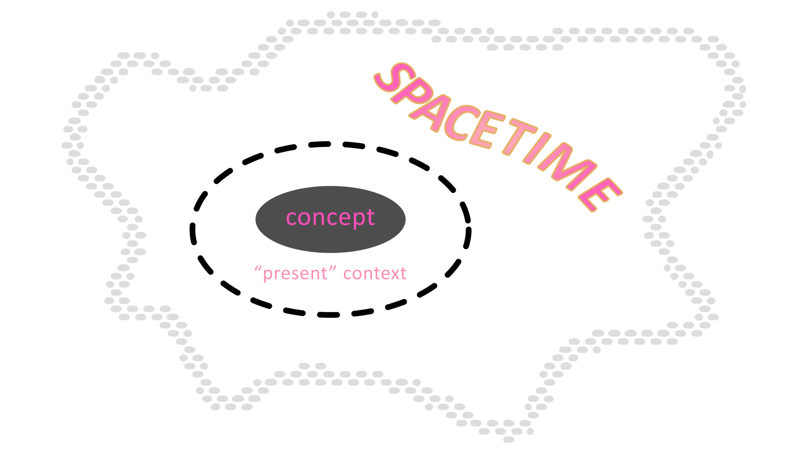
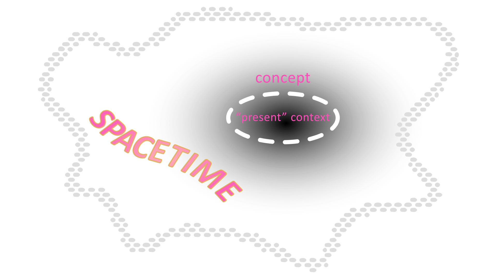
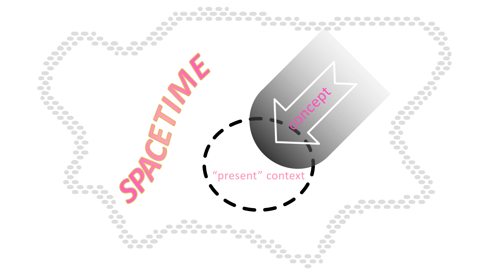
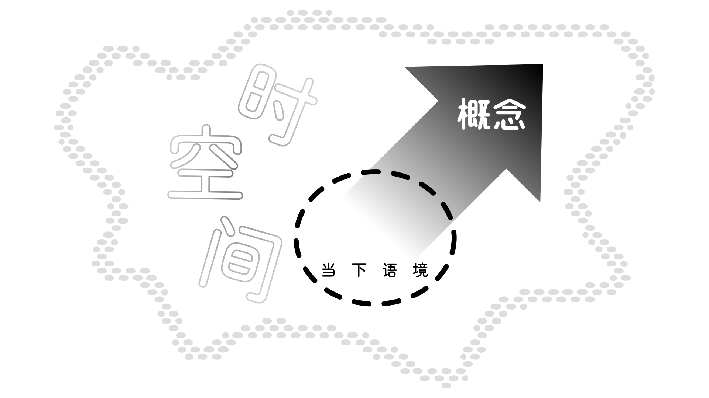
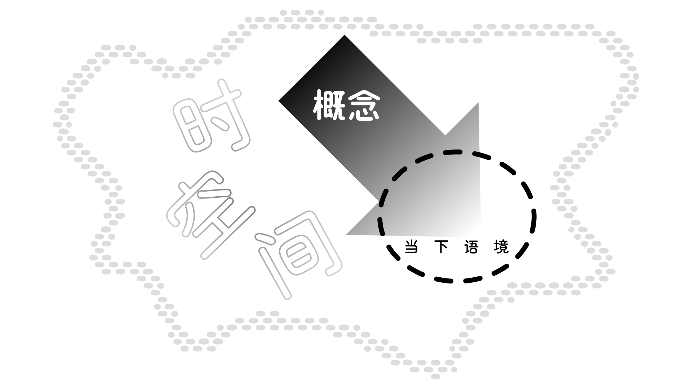

## 3.0 Basic Morphology {#Sec3}

In this chapter, we will discuss those morphological categories which are mandatory to a formative and which apply to both nominal and verbal formatives. In other words, those morphological slots from [Sec. 2.3](02#Sec2_3) above of a noun or verb which are grammatically required to be expressed by inflected affixes, rather than being optional. The specific categories we will discuss are **Configuration**, **Affiliation**, **Perspective**, **Extension**, **Essence**, **Version**, **Function**, and **Context**.

<!-- @include: struct.md{313-468} -->

## 3.1 Configuration {#Sec3_1}

To understand the concept of set relation and quantification of nouns in New Ithkuil (i.e., what other languages’ term *singular*, *plural*, etc.) one must analyze three separate but related grammatical categories termed **Configuration**, **Affiliation**, and **Perspective**. These concepts are alien to other languages. While they deal with semantic distinctions which are quantitative in nature, these distinctions are usually made at the lexical level (i.e., via word choice) in other languages, not at the morphological level as in New Ithkuil. In this section we will deal first with Configuration, followed by Affiliation in [Section 3.2](#Sec3_2) and Perspective in [Section 3.2](#Sec3_3).

Specifically, Configuration deals with the physical similarity or relationship between members of a noun referent within groups, collections, sets, assortments, arrangements, or contextual gestalts, as delineated by internal composition, separability, compartmentalization, physical similarity or componential structure. This is best explained and illustrated by means of analogies to certain English sets of words.

Consider the English word <q>tree</q>. In English, a single tree may stand alone out of context, or it may be part of a group of trees. Such a group of trees may simply be two or more trees considered as a plural category based on mere number alone, e.g., two, three, or twenty trees. However, it is the nature of trees to exist in more contextually relevant groupings than merely numerical ones. For example, the trees may be of like species as in a <q>grove</q> of trees. The grouping may be an assortment of different kinds of trees as in a <q>forest</q> or occur in patternless disarray such as a <q>jungle</q>.

As another example, we can examine the English word <q>person</q>. While persons may occur in simple numerical groupings such as <q>a (single) person</q> or <q>three persons</q> it is more common to find persons (i.e., people) referred to by words which indicate various groupings such as <q>group</q>, <q>gathering</q>, <q>crowd</q>, etc.

Segmentation and amalgamated componential structure are further configurative principles which distinguish related words in English. The relationships between *car* versus *convoy*, *hanger* versus *rack*, *chess piece* versus *chess set*, *sentry* versus *blockade*, *piece of paper* versus *sheaf*, *girder* versus *(structural) framework*, and *coin* versus *roll of coins* all exemplify these principles.

Another type of contextual grouping of nouns occurs in binary sets, particularly in regard to body parts. These binary sets can comprise two identical referents as in *a pair of eyes*, however they are more often opposed or “mirror-image” (i.e., complementary) sets as in *limbs*, *ears*, *hands*, *wings*, etc.

The semantic distinctions implied by the above examples as they relate to varying assortments of trees or persons would be accomplished by inflecting the word-stem for <q>tree</q> or <q>person</q> into one of twenty different configurations. Additional semantic distinctions on the basis of purpose or function between individual members of a set could then be made by means of Affiliation (see [Section 3.2](#Sec3_2) below) and by the use of specific affixes. For example, once the words for ‘forest’ or ‘crowd’ were derived from <q>tree</q> and <q>person</q> via Configuration, the words for <q>orchard</q>, <q>copse</q>, <q>team</q> or <q>mob</q> could easily be derived via affiliation and affixes. (Such derivations into new words using affixes are explored in detail in [Chapter 7: Affixes](07).)

The category of Configuration consists of the amalgamation of three separate factors: **Plexity**, **Separability**, and **Similarity**.

* **Plexity** is a three-way distinction as to whether an entity/event/act/state is single or internally unified, is binary or two-halved in nature, or has three or more components/pieces/parts/members. These three states of Plexity are termed **UNIPLEX**, **DUPLEX**, and **MULTIPLEX** (abbreviated as <abbr>U</abbr>, <abbr>D</abbr>, and <abbr>M</abbr>).

* **Similarity** is a three-way distinction as to whether a group of entities considered as a whole have individual members which are physically similar to each other, physically dissimilar to each other, or which together constitute a “fuzzy” category in terms of similarity (where the degree of similarity between individual members is subjective, unascertainable, irrelevant or not easily definable). These three states of Similarity are termed **SIMILAR**, **DISSIMILAR**, and **FUZZY** (abbreviated <abbr>S</abbr>, <abbr>D</abbr>, and <abbr>F</abbr> as the <del>third letter following the Plexity and Separability abbreviation letters</del> <ins>second letter following the Plexity abbreviation letter</ins>). Note that Similarity does not apply to UNIPLEX entities/events/acts/states.

* **Separability** is a three-way distinction as to whether a group of entities when considered as a whole have individual members which are physically separate from each other, connected to each other in some way (whether physically or abstractly or metaphorically), or fused together (whether physically or abstractly or metaphorically). These three states of Separability are termed **SEPARATE**, **CONNECTED**, and **FUSED** (abbreviated as <abbr>S</abbr>, <abbr>C</abbr>, and <abbr>F</abbr> as the <del>second letter following the Plexity abbreviation letter</del> <ins>third letter following the Plexity and Similarity abbreviation letters</ins>). Note that Separability does not apply to UNIPLEX entities/events/acts/states.

Based on the above, there are a total of twenty configurations, indicated via the `Ca` consonantal affix in Slot VI of the formative. Note that in addition to showing Configuration, this `Ca` affix also indicates the Affiliation, Perspective, Extension and Essence of the stem. The twenty configurations are shown below, each with its consonantal affix that appears in Slot VI of the formative:

::: tabs

@tab [UNI | MULTI]PLEX

<dl class="gloss">
    <dt>*</dt>
    <dd>UPX</dd>
</dl>
<dl class="gloss">
    <dt>t</dt>
    <dd>MSS</dd>
</dl>
<dl class="gloss">
    <dt>k</dt>
    <dd>MSC</dd>
</dl>
<dl class="gloss">
    <dt>p</dt>
    <dd>MSF</dd>
</dl>
<dl class="gloss">
    <dt>ţ</dt>
    <dd>MDS</dd>
</dl>
<dl class="gloss">
    <dt>f</dt>
    <dd>MDC</dd>
</dl>
<dl class="gloss">
    <dt>ç</dt>
    <dd>MDF</dd>
</dl>
<dl class="gloss">
    <dt>z</dt>
    <dd>MFS</dd>
</dl>
<dl class="gloss">
    <dt>ž</dt>
    <dd>MFC</dd>
</dl>
<dl class="gloss">
    <dt>ẓ</dt>
    <dd>MFF</dd>
</dl>

@tab DUPLEX

<dl class="gloss">
    <dt>s</dt>
    <dd>DPX</dd>
</dl>
<dl class="gloss">
    <dt>c</dt>
    <dd>DSS</dd>
</dl>
<dl class="gloss">
    <dt>ks</dt>
    <dd>DSC</dd>
</dl>
<dl class="gloss">
    <dt>ps</dt>
    <dd>DSF</dd>
</dl>
<dl class="gloss">
    <dt>ţs</dt>
    <dd>DDS</dd>
</dl>
<dl class="gloss">
    <dt>fs</dt>
    <dd>DDC</dd>
</dl>
<dl class="gloss">
    <dt>š</dt>
    <dd>DDF</dd>
</dl>
<dl class="gloss">
    <dt>č</dt>
    <dd>DFS</dd>
</dl>
<dl class="gloss">
    <dt>kš</dt>
    <dd>DFC</dd>
</dl>
<dl class="gloss">
    <dt>pš</dt>
    <dd>DFF</dd>
</dl>

:::

\* The UNIPLEX is shown by the absence of any Configuration affix; if all five `Ca` affixes have their “zero”/default values, the `Ca` form is -l-.

Note that a formative in <abbr>DPX</abbr> Configuration alone indicates that it constitutes a pair, without overtly specifying the similarity or separability between the two member-entities of the pair.

Examples of Various Configurations:

::: tabs

@tab Cat

<dl class="gloss">
    <dt>rrala</dt>
    <dd>“cat”-<b>UPX</b></dd>
</dl>

<q>a cat</q>

<dl class="gloss">
    <dt>rrasa</dt>
    <dd>“cat”-<b>DPX</b></dd>
</dl>

<q>a pair of cats</q>

<dl class="gloss">
    <dt>rraca</dt>
    <dd>“cat”-<b>DSS</b></dd>
</dl>

<q>a pair of similar cats</q>

<dl class="gloss">
    <dt>rraţsa</dt>
    <dd>“cat”-<b>DDS</b></dd>
</dl>

<q>a pair of dissimilar cats</q>

<dl class="gloss">
    <dt>rrata</dt>
    <dd>“cat”-<b>MSS</b></dd>
</dl>

<q>a group of similar cats</q>

<dl class="gloss">
    <dt>rraţa</dt>
    <dd>“cat”-<b>MDS</b></dd>
</dl>

<q>a group of dissimilar cats</q>

<dl class="gloss">
    <dt>rraza</dt>
    <dd>“cat”-<b>MFS</b></dd>
</dl>

<q>a group of what appear to be cats, some more than others</q>

@tab Sphere

<dl class="gloss">
    <dt>anzwil</dt>
    <dd>“spherical.shape”-OBJ-<b>UPX</b></dd>
</dl>

<q>a sphere</q>

<dl class="gloss">
    <dt>anzwit</dt>
    <dd>“spherical.shape”-OBJ-<b>MSS</b></dd>
</dl>

<q>a group of similar spheres</q>

<dl class="gloss">
    <dt>anzwik</dt>
    <dd>“spherical.shape”-OBJ-<b>MSC</b></dd>
</dl>

<q>a group of similar spheres touching each other/connected to one another</q>

<dl class="gloss">
    <dt>anzwip</dt>
    <dd>“spherical.shape”-OBJ-<b>MSF</b></dd>
</dl>

<q>a group of similar spheres fused together</q>

<dl class="gloss">
    <dt>anzwif</dt>
    <dd>“spherical.shape”-OBJ-<b>MDC</b></dd>
</dl>

<q>a group of dissimilar spheres touching each other/connected to one another</q>

<dl class="gloss">
    <dt>anzwiç</dt>
    <dd>“spherical.shape”-OBJ-<b>MDF</b></dd>
</dl>

<q>a group of dissimilar spheres fused together</q>

<dl class="gloss">
    <dt>anzwiž</dt>
    <dd>“spherical.shape”-OBJ-<b>MFC</b></dd>
</dl>

<q>a group of rounded objects touching each other/connected to one another, some of which appear to be spheres, others less so</q>

@tab Motion

<dl class="gloss">
    <dt>Blöfêi</dt>
    <dd>“curved.translative.motion”-DYN/OBJ-<b>MDC</b>-ASR/USP</dd>
</dl>
<dl class="gloss">
    <dt>onţlilu</dt>
    <dd>Stem.0-“automobile”-STA/OBJ-IND</dd>
</dl>

<q>The driver drove the car along a series of variously-sized curves.</q>

:::

::: warning The Revisor’s Comment

*anzwu-* changes to *anzwi-* because the gloss implies it.

:::

## 3.2 Affiliation {#Sec3_2}

While the category of Configuration from the preceding section distinguishes the relationships between the individual members of a set in terms of physical similarities, physical connections, and number of component-entities, the category of Affiliation operates to distinguish the member relationships in terms of subjective purpose, function, or benefit. Affiliation operates synergistically in conjunction with Configuration to describe the total contextual relationship between the members of a set. Like Configuration, the meanings of nouns or verbs in the various affiliations often involve lexical changes when translated into English.

Returning to our earlier example of the word *tree*, we saw how a group of trees of the same species becomes a grove in the <abbr>MSC</abbr> configuration. The word *grove* implies that the trees have grown naturally, with no specific purpose or function in regard to human design or utilization. On the other hand, groves of trees may be planted by design, in which case they become *an orchard*. We saw how trees occurring as a natural assortment of different kinds is termed *a forest*. However, such assortments can become wholly chaotic, displaying patternless disarray from the standpoint of subjective human design, thus becoming *a jungle*.

As another example, we saw how the word *person* becomes *group*, or *gathering*, both of which are neutral as to subjective purpose or function. However, applying a sense of purposeful design generates words such as *team*, while the absence of purpose results in *crowd*.

There are four affiliations: **CONSOLIDATIVE**, **ASSOCIATIVE**, **VARIATIVE**, and **COALESCENT**. Like Configuration, Affiliation is also indicated as part of the `Ca` affix-complex in Slot VI of the formative. An Affiliation affix constitutes the first affix shown in the `Ca` affix-complex in Slot VI, immediately before the Configuration affix. The details of the four affiliations are explained below along with their affixes.

### 3.2.1 <abbr>CSL</abbr> The Consolidative {#Sec3_2_1}

The **CONSOLIDATIVE** affiliation is shown by a null affix, i.e., it is the absence of an Affiliation affix in slot VI that indicates **CONSOLIDATIVE** affiliation. This affiliation indicates that the individual members of a configurational set are a naturally occurring set where the function, state, purpose or benefit of individual members is inapplicable, irrelevant, or if applicable, is shared. It differs from the **ASSOCIATIVE** affiliation below in that the role of individual set members is not subjectively defined by human design. Examples are *tree branches*, *a grove*, *a mound of rocks*, *some people*, *the clouds*.

The **CONSOLIDATIVE** is also the affiliation normally applied to nouns in the UNIPLEX configuration when spoken of in a neutral way, since a noun in the UNIPLEX specifies one single entity without reference to a set, therefore the concept of “shared” function would be inapplicable. Examples: *a man*, *a door*, *a sensation of heat*, *a leaf*. With verbs, the **CONSOLIDATIVE** would imply that the act, state, or event is occurring naturally, or is neutral as to purpose or design.

    <dl class="gloss">
      <dt>čväţa</dt>
    </dl>
    
<q>a bunch of tools</q>

    <dl class="gloss">
      <dt>arsweţ</dt>
    </dl>
    
<q>a group of planets</q>

    <dl class="gloss">
      <dt>zvata</dt>
    </dl>
    
<q>a set/group of similar dogs</q>

    <dl class="gloss">
      <dt>sřala</dt>
    </dl>
    
<q>a room</q>

::: warning The Revisor’s Comment

*čve-* changes to *čvä-* because it does not meet the lexicon definition.

*sřu-* changes to *sřa-* because its interpretation does not imply the meaning of <abbr>DYN</abbr>.

Note that the following examples also apply corrections.

:::

### 3.2.2 <abbr>ASO</abbr> The Associative {#Sec3_2_2}

The **ASSOCIATIVE** affiliation is shown by the Slot VI-initial affix -**l**-, immediately followed by the Configuration affix. Note that if this affix is the only affix shown in the entire Slot VI `Ca` affix-complex, then it is instead shown by the stand-alone affix -**nļ**-. **ASSOCIATIVE** affiliation indicates that the individual members of a configurational set share the same subjective function, state, purpose or benefit. Its use can be illustrated by taking the word for “soldier” in MULTIPLEX configuration and comparing its English translations when inflected for the **CONSOLIDATIVE** affiliation (= *a group of soldiers*) versus the **ASSOCIATIVE** (= *a troop, a platoon*). It is this **CONSOLIDATIVE** versus **ASSOCIATIVE** distinction, then, that would distinguish otherwise equivalent inflections of the word for tree by translating them respectively as *a grove* versus *an orchard*.

The **ASSOCIATIVE** affiliation can also be used with nouns in the **UNIPLEX** configuration to signify a sense of unity amongst one’s characteristics, purposes, thoughts, etc. For example, the word person inflected for the **UNIPLEX** and **ASSOCIATIVE** would translate as a single-minded person. Even nouns such as *rock*, *tree* or *work of art* could be inflected this way, subjectively translatable as *a well-formed rock*, *a tree with integrity*, *a “balanced” work of art*.

With verbs, the **ASSOCIATIVE** signifies that the act, state or event is by design or with specific purpose. The **CONSOLIDATIVE** versus **ASSOCIATIVE** distinction could be used, for example, with the verb *turn* in <q>I turned toward the window</q> to indicate whether it was for no particular reason or due to a desire to look outside.

    <dl class="gloss">
      <dt>čvälţa</dt>
    </dl>
    
<q>a well-designed set of tools</q>

    <dl class="gloss">
      <dt>arswelţ</dt>
    </dl>
    
<q>an alliance of planets</q>

    <dl class="gloss">
      <dt>zvalta</dt>
    </dl>
    
<q>a pack of similar dogs</q>

    <dl class="gloss">
      <dt>sřanļa</dt>
    </dl>
    
<q>the room with singular purpose</q>

### 3.2.3 <abbr>COA</abbr> The Coalescent {#Sec3_2_3}

The **COALESCENT** affiliation is shown by the Slot VI-initial affix -**r**-, immediately followed by the Configuration affix. Note that if this affix is the only affix shown in the entire Slot VI `Ca` affix-complex, then it is instead shown by the stand-alone affix -**rļ**-. The **COALESCENT** affiliation indicates that the members of a configurational set share in a complementary relationship with respect to their individual functions, states, purposes, benefits, etc. This means that, while each member’s function is distinct from those of other members, each serves in furtherance of some greater unified role. For example, the word translating English *toolset* would be the word for *tool* in the <abbr>MDS</abbr> (**MULTIPLEX-DISSIMILAR-SEPARATE**) configuration (due to each tool’s distinct physical appearance) and the **COALESCENT** affiliation to indicate that each tool has a distinct but complementary function in furtherance of enabling construction or repair activities. Another example would be the word for *finger* inflected for the <abbr>MSC</abbr> (**MULTIPLEX-SIMILAR-CONNECTED**) configuration and the **COALESCENT** affiliation, translatable as *the fingers on one’s hand* (note the use of the MSC configuration to imply the physical connection between each finger via the hand). A further example would be using the **COALESCENT** with the word for *(piece of) food* to signify *a well-balanced meal*.

The **COALESCENT** naturally appears most often in conjunction with the DUPLEX configuration since binary sets tend to be complementary. It is used, for example, to signify symmetrical binary sets such as body parts, generally indicating a lefthand/righthand mirror-image distinction, e.g., *one’s ears*, *one’s hands*, *a pair of wings*. Pairs that do not normally distinguish such a complementary distinction (e.g., *one’s eyes*) can nevertheless be optionally placed in the **COALESCENT** affiliation to emphasize bilateral symmetry (e.g., *one’s left and right eye functioning together*).

With verbs, the **COALESCENT** signifies that related, synergistic nature of the component acts, states, and events which make up a greater holistic act, state, or event. It imposes a situational structure onto an act, state, or event, where individual circumstances work together in complementary fashion to comprise the total situation. It would be used, for example, to distinguish the sentences <q>He traveled in the Yukon</q> from <q>He ventured in the Yukon</q>, or <q>I came up with a plan</q> versus <q>I fashioned a plan</q>.

    <dl class="gloss">
      <dt>čvärţa</dt>
    </dl>
    
<q>a toolset</q>

    <dl class="gloss">
      <dt>arswerţ</dt>
    </dl>
    
<q>a confederation of planets</q>

    <dl class="gloss">
      <dt>zvarta</dt>
    </dl>
    
<q>a dog team</q>

    <dl class="gloss">
      <dt>sřarļa</dt>
    </dl>
    
<q>a room whose purposes are interrelated</q>

### 3.2.4 <abbr>VAR</abbr> The Variative {#Sec3_2_4}

The **VARIATIVE** affiliation is shown by the Slot VI-initial affix -**ř**-, immediately followed by the Configuration affix. Note that if this affix is the only affix shown in the entire Slot VI `Ca` affix-complex, then it is instead shown by the stand-alone affix -ň-. The **VARIATIVE** affiliation indicates that the individual members of a configurational set differ as to subjective function, state, purpose or benefit. The differences among members can be to varying degrees (i.e., constituting a fuzzy set in regard to function, purpose, etc.) or at complete odds with one another, although it should be noted that the **VARIATIVE** would not be used to signify opposed but complementary differences among set members (see the **COALESCENT** affiliation <del>below</del> <ins>above</ins>). It would thus be used to signify *a jumble of tools*, *odds-and-ends*, *a random gathering*, *a rag-tag group*, *a dysfunctional couple*, *a cacophony of notes*, <del>of</del> *a mess of books*, *a collection in disarray*. It operates with nouns in the UNIPLEX to render meanings such as *a man at odds with himself*, *an ill-formed rock*, *a chaotic piece of art*, *a “lefthand-righthand” situation*.

With verbs, the **VARIATIVE** indicates an act, state, or event that occurs for more than one reason or purpose, and that those reasons or purposes are more or less unrelated. This sense can probably be captured in English only through paraphrase, as in <q>She bought the house for various reasons</q> or <q>My being at the party served several purposes</q>. With non-UNIPLEX configurations, the use of the **VARIATIVE** affiliation can describe rather complex phenomena; for example, a sentence using the <abbr>MSS</abbr> configuration such as <q>The light is blinking</q> in conjunction with the **VARIATIVE** would mean that each blink of the light signals something different from the preceding or following blinks.

  <dl class="gloss">
    <dt>čväřţa</dt>
  </dl>
  
<q>a mishmash of various tools</q>

  <dl class="gloss">
    <dt>arsweřţ</dt>
  </dl>
  
<q>a disorganized group of planets</q>

  <dl class="gloss">
    <dt>zvařta</dt>
  </dl>
  
<q>a rag-tag group of dogs</q>

  <dl class="gloss">
    <dt>sřaňa</dt>
  </dl>
  
<q>a room with disparate purposes</q>

## 3.3 Perspective {#Sec3_3}

Perspective is the closest New Ithkuil equivalent to the Number category of most natural languages (i.e., singular, plural, collective, etc.). There are four perspectives: **MONADIC**, **AGGLOMERATIVE**, **NOMIC**, and **ABSTRACT**, shown respectively by the Slot VI affixes \[null\] (with stand-alone alternate of -**l**), -**r**-, -**w**- (with stand-alone alternate of -**v**), and -**y**- (with stand-alone alternate of -**j**-). The Perspective affix comes last in the sequence of affixes contained in the Slot VI `Ca` affix-complex. The four perspectives are described below:

### 3.3.1 <abbr>M</abbr> The Monadic {#Sec3_3_1}

The **MONADIC** is unmarked in terms of an affix (i.e., a null affix), unless it is the only affix in the Slot VI `Ca` affix-complex, in which case its affix is -**l**-. It signifies a single embodiment of a particular configuration, meaning a contextual entity which, though possibly numerous in membership or multifaceted in structure, or spread out through a duration of time, is nevertheless being contextually viewed and considered as a “monad,” a single, unified whole. This is important, since configurations other than the UNIPLEX technically imply more than one discrete entity/instance being present or taking place. For nouns, this corresponds to what in Western languages would usually be singular number. For verbs, this can be thought of as a single instance/occurrence/manifestation of an act, event, or state.

Thus, using the word tree for example, while there might be many trees present in terms of number, the **MONADIC** means they form only one embodiment of whatever particular Configuration category is manifested. Using the <abbr>MDC</abbr> configuration as an example, the **MONADIC** would mean there is only one <abbr>MDC</abbr> set of trees, i.e., *one forest*.

::: info Singulative Equivalent

In natural languages, nouns differ between those that can be counted and pluralized (e.g., *one apple*, *four boys*, *several nations*), and those which cannot be counted or pluralized (e.g., *water*, *sand*, *plastic*, *air*, *laughter*). All nouns are countable in New Ithkuil in that all nouns can exist as contextual monads. As a result, **MONADIC** nouns in New Ithkuil which refer to what are non-count nouns in other languages (or “collective” nouns such as <q>leaves</q> or <q>hair</q>) must be translated into what linguists call the “singulative” mode, referring to the smallest salient single manifestation of the entity in question, e.g., <q>a drop of water</q>, <q>a speck of dust</q>, <q>a single hair</q>, <q>a single leaf</q>, <q>a puff/whiff of air</q>, <q>a single step/stride (of a walk/stroll)</q>, etc., whereas the more usual ways in which English and other languages express manifestations of non-count nouns as vague amounts are expressed in New ithkuil by the **AGGLOMERATIVE** perspective in [Sec. 3.3.2](#Sec3_3_2) below, e.g., <q>some water</q>, <q>some dust</q>, <q>(one’s) hair</q>, <q>some leaves</q>, <q>the air (here)</q>.

:::

  <dl class="gloss">
    <dt>avsal</dt>
  </dl>
  
<q>a season</q>

  <dl class="gloss">
    <dt>ţrala</dt>
  </dl>
  
<q>a drop of water</q>

  <dl class="gloss">
    <dt>elzaţ</dt>
  </dl>
  
<q>different rivers</q>

::: warning The Revisor’s Comment

*elze-* changes to *elza-* because it does not meet the lexicon definition.

Note that the following examples also apply corrections.

:::

### 3.3.2 <abbr>G</abbr> The Agglomerative {#Sec3_3_2}

The **AGGLOMERATIVE** is marked by the affix -**r**- as the last (or only) affix in Slot VI. It indicates a neutral or fuzzy meaning in terms of number: ‘at least one X / one or more X / any number of X’. It is used when the specific number of an entity is irrelevant or the context of the utterance applies to either one or more than one of an entity. It also is used to create mass nouns from non-count nouns, as stated in the previous paragraph, e.g., <q>some rice / an amount of rice</q>, <q>(some) hair</q>, <q>(some / an amount of) water</q>, <q>the leaves</q>.

For verbs, the **AGGLOMERATIVE** distinguishes the same fuzzy “non-count” distinction as for nouns: ‘some X-ing occurs/manifests / there’s some X-ing going on’ versus **MONADIC** ‘a single instance of X occurs/manifests’.

::: note

New Ithkuil does not have a Perspective corresponding to the plural ‘two or more’ meaning found in most Western languages. If needed, plural number can be conveyed by Degrees 5 or 6 of the <abbr>XX2</abbr> affix (see the accompanying [Affixes](http://ithkuil.net/newithkuil_affixes.pdf) document).

:::

  <dl class="gloss">
    <dt>avsar</dt>
  </dl>
  
<q>one or more seasons</q> / <q>any number of seasons</q>

  <dl class="gloss">
    <dt>ţrara</dt>
  </dl>
  
<q>some water</q>

  <dl class="gloss">
    <dt>elzaţra</dt>
  </dl>
  
<q>at least one set of different rivers</q>

### 3.3.3 <abbr>N</abbr> The Nomic {#Sec3_3_3}

The **NOMIC** is marked by the affix -**w**- in final position of Slot VI, unless it is the only affix in Slot VI, in which case the affix is -**v**-. The **NOMIC** refers to a generic collective entity or archetype, containing all members or instantiations of a configurative set throughout space and time (or within a specified spatio-temporal context). Since it is all members being spoken of, and no individual members in particular, this category is mutually exclusive from the **MONADIC** or **AGGLOMERATIVE**. For nouns, the **NOMIC** corresponds approximately to the several constructions used for referring to collective nouns in English, as seen in the sentences <q><strong>The dog</strong> is a noble beast</q>, <q><strong>Clowns</strong> are what children love most</q>, <q>There is nothing like <strong>a tree</strong></q>.

With verbs, the **NOMIC** designates an action, event, or situation which describes a general law of nature or a persistently true condition or situation spoken of in general, without reference to a specific instance or occurrence of the activity (it is, in fact, all possible instances or occurrences that are being referred to). English has no specialized way of expressing such generic statements, generally using the simple present tense. Examples of usage would be <q>The sun doesn’t set on our planet</q>, <q>Mr. Okotele is sickly</q>, <q>In winter it snows a lot</q>, <q>That girl sings well</q>.

  <dl class="gloss">
    <dt>avsav</dt>
  </dl>
  
“a season” (as a generic concept)

  <dl class="gloss">
    <dt>ţrava</dt>
  </dl>
  
“water” (as a generic concept)

  <dl class="gloss">
    <dt>elzaţwa</dt>
  </dl>
  
“different rivers” (as a generic concept)

### 3.3.4 <abbr>A</abbr> The Abstract {#Sec3_3_4}

The **ABSTRACT** is marked by the affix -**y**- in final position of Slot VI, unless it is the only affix in Slot VI, in which case the affix is -**j**-. Similar to the formation of English abstract nouns using suffixes such as -*hood* or -*ness*, the **ABSTRACT** transforms a configurative category into an abstract concept considered in a non-spatial, timeless, numberless context. While only certain nouns in English can be made into abstracts via suffixes, all Ithkuil nouns in all Configurative categories can be made into abstracts, the translations of which must often be periphrastic in nature, e.g., *grove* → *the idea of being a grove* or *“grovehood”*; *book* → *everything about books*, *having to do with books*, *involvement with books*.

With verbs, the **ABSTRACT** is used in verbal constructions to create a temporal abstraction, where the temporal relationship of the action, event, or state to the present is irrelevant or inapplicable, similar to the way in which the English infinitive or gerund form (used as substitutes for a verb phrase) do not convey a specific tense in the following sentences:

* <q>Singing is not his strong suit</q>;
* <q>It makes no sense to worry about it</q>;
* <q>I can’t stand her pouting</q>.

As a result, the **ABSTRACT** acts as a “timeless” verb form which, much like these English infinitives and gerunds, operates in conjunction with a separate main verb in one of the other three perspectives. The **ABSTRACT** is often used in conjunction with certain moods of the verb (and [Sec. 5.2](#Sec5_2)) as well as the use of various “Modality” affixes (see the accompanying [Affixes](http://ithkuil.net/newithkuil_affixes.pdf) document) which convey hypothetical or unrealized situations, in which the temporal relationship to the present is arbitrary, inapplicable, or unknowable.

  <dl class="gloss">
    <dt>avsaj</dt>
  </dl>
  
<q>everything about a season / “season-hood”</q>

  <dl class="gloss">
    <dt>ţraja</dt>
  </dl>
  
<q>everything having to do with water</q>

  <dl class="gloss">
    <dt>elzaţya</dt>
  </dl>
  
<q>different rivers as an idea</q>

## 3.4 Extension {#Sec3_4}

Extension is another morphological category for which there is no exact equivalent in other languages. It applies to all formatives and indicates the manner in which the noun or verb is being considered in terms of spatial or temporal extent or boundaries. Another way to put it is that Extension indicates what “part” of an entity/act/event/state is being addressed or focused on. Extension is shown as part of a formative’s `Ca` affix in Slot VI which also indicates Configuration, Affiliation, Perspective and Essence. There are six extensions: **DELIMITIVE**, **PROXIMAL**, **INCEPTIVE**, **ATTENUATIVE**, **GRADUATIVE**, and **DEPLETIVE**.

### 3.4.1 <abbr>DEL</abbr> The Delimitive {#Sec3_4_1}

The **DELIMITIVE** extension indicates that a noun is being spoken of in its contextual entirety as a discrete entity with clear spatio-temporal boundaries, with no emphasis on any particular portion, edge, boundary, limit, or manifestation beyond the context at hand. It can be considered the neutral or default view, e.g., *a tree*, *a grove*, *a set of books*, *an army*. To illustrate a contextual example, the English sentence <q>He climbed the ladder</q> would be translated with the word *ladder* in the **DELIMITIVE** to show it is being considered as a whole. With verbs, this extension indicates that the act, state, or event is being considered in its entirety, from beginning to end, e.g., <q>She diets every winter</q> (i.e., she starts and finishes each diet).

The **DELIMITIVE** can be thought of as an expanse of spacetime that has definite beginning and ending points, beyond which the noun or verb does not exist or occur. The figure below illustrates the spatio-temporal relationship of a concept in the **DELIMITIVE** to the context at-hand (i.e., the spatio-temporal “present”).

<!--  -->

The **DELIMITIVE** is shown by a null affix, i.e., it is the absence of an Extension affix in the `Ca` affix-complex that indicates **DELIMITIVE** extension.

  <dl class="gloss">
    <dt>elzal</dt>
  </dl>
  
<q>a river</q>

  <dl class="gloss">
    <dt>psulça</dt>
  </dl>
  
<q>a situation</q>

  <dl class="gloss">
    <dt>uẓfäl</dt>
  </dl>
  
<q>a tunnel</q>

  <dl class="gloss">
    <dt>erbräl</dt>
  </dl>
  
<q>an explanation</q>

### 3.4.2 <abbr>PRX</abbr> The Proximal {#Sec3_4_2}

The **PROXIMAL** extension indicates that a noun is being spoken of not in its entirety, but rather only in terms of the portion, duration, subset, or aspect which is relevant to the context at hand. It would be used to translate the words *tree*, *journey*, and *ladder* in the sentences <q>That tree is hard there</q> (e.g., in the spot where I hit against it), <q>She lost weight during her journey</q>, or <q>He climbed on the ladder</q> (i.e., it is not relevant to the context to know if he made it all the way to the top).

::: note

In these sentences, the **PROXIMAL** does not refer to a specific or delineated piece, part, or component of the tree or ladder, but rather to the fact that delineated boundaries such as the ends of the ladder or the entirety of the tree are not relevant or applicable to the context at hand.

:::

With verbs, this extension signifies that it is not the entirety of an act, state, or event which is being considered, but rather the spatial extent or durational period of the act, state, or event relevant to the context, e.g., <q>She’s on a diet every winter</q> (i.e., focus on “having to live on” a diet, not the total time spent dieting from start to finish). The figure below illustrates the spatio-temporal relationship of a noun or verbal concept in the **PROXIMAL** to the context at-hand (i.e., the spatio-temporal “present”).

<!--  -->

The **PROXIMAL** is shown by the affix -**t**-, placed between the Configuration affix and the Perspective affix in the `Ca` affix-complex. However, if the Configuration affix is null (i.e., the Configuration of the word is **UNIPLEX**), then the **PROXIMAL** affix is -**d**-.

  <dl class="gloss">
    <dt>elzad</dt>
  </dl>
  
<q>a section/stretch of (a) river</q>

  <dl class="gloss">
    <dt>psulçta</dt>
  </dl>
  
<q>the midst of a situation</q>

  <dl class="gloss">
    <dt>ujrarft</dt>
  </dl>
  
<q>an area/section of a transportation system</q>

  <dl class="gloss">
    <dt>erbräd</dt>
  </dl>
  
<q>a portion of an explanation</q>

### 3.4.3 <abbr>ICP</abbr> The Inceptive {#Sec3_4_3}

The **INCEPTIVE** extension focuses on the closest boundary, the beginning, initiation, or the immediately accessible portion of a noun or verb, without focusing on the boundaries of the remainder. It would be used in translating the nouns *tunnel*, *song*, *desert*, *daybreak* and *plan* in the following sentences: <q>We looked into (the mouth of) the tunnel</q>, <q>He recognizes that song</q> (i.e., from the first few notes), <q>They came upon (an expanse of) desert</q>, <q>Let’s wait for daybreak</q>, <q>I’m working out a plan</q> (i.e., that I just thought of). In verbal contexts it would correspond to the English ‘to begin (to)…’ or ‘to start (to)…’ as in <q>He began reading</q>, <q>It’s starting to molt</q>, <q>She goes on a diet every winter</q>, or <q>He initiated a process of seduction</q>.

The figure below illustrates the spatio-temporal relationship of a noun or verbal concept in the **INCEPTIVE** to the context at-hand (i.e., the spatio-temporal “present”).

<!--  -->

The **INCEPTIVE** is shown by the affix -**k**-, placed between the Configuration affix and the Perspective affix in the `Ca` affix-complex. However, if the Configuration affix is null (i.e., the Configuration of the word is **UNIPLEX**), then the **INCEPTIVE** affix is -**g**-.

  <dl class="gloss">
    <dt>elzag</dt>
  </dl>
  
<q>the source of a river</q>

  <dl class="gloss">
    <dt>psulçka</dt>
  </dl>
  
<q>the beginning of a situation</q>

  <dl class="gloss">
    <dt>ujrarfk</dt>
  </dl>
  
<q>the initial part of a transportation system</q>

  <dl class="gloss">
    <dt>erbräg</dt>
  </dl>
  
<q>the start of an explanation</q>

### 3.4.4 <abbr>ATV</abbr> The Attenuative {#Sec3_4_4}

The **ATTENUATIVE** extension focuses on the end, termination, last portion, or trailing boundary of a noun, without focusing on the preceding or previously existing state of the noun. It would be used in translating the words *water*, *story*, and *arrival* in the sentences <q>There’s no water</q> (i.e., we ran out), <q>I like the end of that story</q>, and <q>We await your arrival</q>. With verbs, it is illustrated by the sentences <q>It finished molting</q> or <q>She’s come off her diet</q>.

The figure below illustrates the spatio-temporal relationship of a noun or verbal concept in the **ATTENUATIVE** to the context at-hand (i.e., the spatio-temporal “present”).

<!--  -->

The **ATTENUATIVE** is shown by the affix -**p**-, placed between the Configuration affix and the Perspective affix in the `Ca` affix-complex. However, if the Configuration affix is null (i.e., the Configuration of the word is UNIPLEX), then the **ATTENUATIVE** affix is -**b**-.

  <dl class="gloss">
    <dt>elzab</dt>
  </dl>
  
<q>the end of a river</q>

  <dl class="gloss">
    <dt>psulçpa</dt>
  </dl>
  
<q>a situation’s end</q>

  <dl class="gloss">
    <dt>ujrarfpa</dt>
  </dl>
  
<q>end of a transportation system</q>

  <dl class="gloss">
    <dt>erbräb</dt>
  </dl>
  
<q>the end of an explanation</q>

### 3.4.5 <abbr>GRA</abbr> The Graduative {#Sec3_4_5}

The **GRADUATIVE** extension focuses on a diffuse, extended “fade-in” or gradual onset of a noun. It would be used in translating the words *darkness*, *wonder*, and *music* in the following sentences: <q>Darkness came upon us</q>, <q>I felt a growing sense of wonder</q>, <q>The music was very soft at first</q>. With verbs it is illustrated by verbs and phrases such as *to fade in*, *to start gradually*, *to build up*, and similar notions, e.g., <q>She’s been eating more and more lately</q>.

The figure below illustrates the spatio-temporal relationship of a noun in the **GRADUATIVE** to the context at-hand (i.e., the spatio-temporal “present”).

<!--  -->

The **GRADUATIVE** is shown by the affix -**g**-, placed between the Configuration affix and the Perspective affix in the `Ca` affix-complex. However, if the Configuration affix is null (i.e., the Configuration of the word is UNIPLEX), then the **GRADUATIVE** affix is -**gz**-.

  <dl class="gloss">
    <dt>elzagz</dt>
  </dl>
  
<q>the headwaters of a river</q>

  <dl class="gloss">
    <dt>psulçga</dt>
  </dl>
  
<q>an evolving situation</q>

  <dl class="gloss">
    <dt>ujrarfga</dt>
  </dl>
  
<q>a developing transportation system</q>

  <dl class="gloss">
    <dt>erbrägz</dt>
  </dl>
  
<q>a gradual explanation</q>

### 3.4.6 <abbr>DPL</abbr> The Depletive {#Sec3_4_6}

The **DEPLETIVE** extension is the inverse of the GRADUATIVE above, focusing on the terminal boundary or “trailing” edge of a noun, where this terminus is ill-defined, “diffuse” or extended to some degree, (i.e. the at-hand context of the noun “peters out” or terminates gradually). Essentially, it applies to any context involving actual or figurative fading. It would be used in translating the words *water*, *strength*, and *twilight* in the sentences <q>He drank the last of the water</q>, <q>I have little strength left</q>, <q>She disappeared into the twilight</q>. With verbs, it is exemplified by the phrases *to wind down*, *to fade out*, *to disappear gradually* and similar notions, e.g., <q>She’s eating less and less these days</q>.

The figure below illustrates the spatio-temporal relationship of a noun or verbal concept in the **DEPLETIVE** to the context at-hand (i.e., the spatio-temporal “present”).

<!--  -->

The **DEPLETIVE** is shown by the affix -**b**-, placed between the Configuration affix and the Perspective affix in the `Ca` affix-complex. However, if the Configuration affix is null (i.e., the Configuration of the word is UNIPLEX), then the **DEPLETIVE** affix is -**bz**-.

  <dl class="gloss">
    <dt>elzabz</dt>
  </dl>
  
<q>the mouth of a river</q>

  <dl class="gloss">
    <dt>psulçba</dt>
  </dl>
  
<q>last vestiges of a situation</q>

  <dl class="gloss">
    <dt>ujrarfba</dt>
  </dl>
  
<q>decline of a transportation system</q>

  <dl class="gloss">
    <dt>erbräbz</dt>
  </dl>
  
<q>the unraveling of an explanation</q>

## 3.5 Essence {#Sec3_5}

**Essence** refers to a two-fold morphological distinction which has no counterpart in Western languages. It is best explained by reference to various English language illustrations. Compare the following pairs of English sentences:

(1a) <em>The boy ran off to sea.</em>
(1b) <em>The boy who ran off to sea didnʼt run off to sea.</em>
(2a) <em>The dog you saw is to be sold tomorrow.</em>
(2b) <em>The dog you saw doesnʼt exist.</em>

Sentences (1a) and (2a) appear to be straightforward sentences in terms of meaning and interpretation. However, at first blush, sentences (1b) and (2b) appear nonsensical, and it is not until we consider specialized contexts for these sentences that they make any sense. For example, (1b) would make sense if being spoken by an author reporting a change of mind about the plot for a story, while (2b) makes sense when spoken by a puzzled pet store owner in whose window you earlier saw a dog that is no longer there.

Why sentences such as (1b) and (2b) can have possible real-world meaning is because they in fact do not make reference to an actual boy or dog, but rather to hypothetical representations of a real-world boy and dog, being used as references back to those real-world counterparts from within an “alternative mental space” created psychologically (and implied linguistically) where events can be spoken about that are either unreal, as-yet-unrealized, or alternative versions of what really takes place. This alternative mental space, then, is essentially the psychological realm of both potential and imagination. In Western languages, such an alternative mental space is implied by context or indicated by certain lexical signals. One such group of lexical signals are the so-called “modal” verbs of English, e.g., must, can, should, etc. as seen in the following:

(3) <em>You must come home at once.</em>
(4) <em>That girl can sing better than anybody.</em>
(5) <em>We should attack at dawn.</em>

Each of the above three sentences describe potential events, not actual real-world happenings that are occurring or have occurred. For example, in Sentence (3) no one has yet come home nor do we know whether coming home is even possible, in Sentence (4) the girl may never sing a single note ever again for all we know, and Sentence (5) gives us no information as to whether any attack will actually occur.

### 3.5.1 <abbr>NRM</abbr> The Normal & <abbr>RPV</abbr> The Representative {#Sec3_5_1}

The morphological category of Essence explicitly distinguishes real-world actualities from their alternative, imagined or potential counterparts. The two essences are termed **NORMAL** and **REPRESENTATIVE**, the former being the default essence denoting real-world nouns and verbs, the latter denoting alternative counterparts. By marking such counterparts explicitly, a speaker can express any noun or verb as referring to a real-world versus alternative manifestation, without having the listener infer such from an explanatory context.

Essence is as part of the `Ca` affix-complex which also indicates Configuration, Affiliation and Perspective and Extension. **NORMAL** essence is unmarked (i.e., it is the absence of any Essence affix that indicates **NORMAL** essence). **REPRESENTATIVE** essence is shown by changing the value of the Perspective affix at the end of the `Ca` affix-complex: change the **MONADIC** affix from null to -**l**-, unless all other `Ca` affixes are null, in which case change the **MONADIC** affix to the standalone value of -**tļ**-; change the **AGGLOMERATIVE** affix from -**r**- to -**ř**-; change the **NOMIC** affix from -**w**- to -**m**- unless immediately preceded by a consonant + **t**, a consonant + **p**, or a consonant + **k**, in which case change the **NOMIC** affix to -**h**-; change the **ABSTRACT** affix from -**y**- to -**n**-, unless immediately preceded by a consonant + **t**, a consonant + **p**, or a consonant + **k**, in which case change the **NOMIC** affix to -**ç**-.

    <dl class="gloss">
      <dt>Ẓalá</dt>
      <dd>“see”-<b>NRM</b></dd>
    </dl>
    <dl class="gloss">
      <dt>kšili</dt>
      <dd>“clown”-<b>NRM</b>-AFF</dd>
    </dl>
    <dl class="gloss">
      <dt>ežḑatļëi.</dt>
      <dd>“ghost”-<b>RPV</b>-STM</dd>
    </dl>
    
<q>The clown sees what he thinks is/imagines to be ghost.</q>

    <dl class="gloss">
      <dt>Ẓatļá</dt>
      <dd>“see”-<b>RPV</b></dd>
    </dl>
    <dl class="gloss">
      <dt>kšili</dt>
      <dd>“clown”-<b>NRM</b>-AFF</dd>
    </dl>
    <dl class="gloss">
      <dt>wežḑëi.</dt>
      <dd>“ghost”-<b>NRM</b>-STM</dd>
    </dl>
    
<q>The clown imagines he is seeing a ghost.</q>

## 3.6 The `Ca` Affix-Complex {#Sec3_6}

As described in Sections 3.1 through 3.5 above, the `Ca` affix-complex constitutes a single agglutinative mass of consonant affixes conveying five different morphological categories in a single morphological Slot (Slot VI). The initial consonant-form indicates Affiliation, the second indicates Configuration, the third Extension, and the fourth indicates both Perspective and Essence. These four consonant-forms are strung together in sequential fashion to form the `Ca` complex as a whole. Note that all but one of the four consonant-forms has a default form of zero, meaning that in most cases, the `Ca` complex will manifest fewer than four consonant-forms. In fact, the most commonly occurring `Ca` form is <abbr>CSL/UPX/DEL/M/NRM</abbr> shown simply by the lone affix -**l**-.

<!-- @include: struct.md{469-624} -->

Due to the agglutinative nature of the `Ca` affix-complex, it is helpful to illustrate its phonological structure of in table form, as shown below. Note that, due to the large number of consonant combinations that can exist within this affix-complex, it is inevitable that certain consonant combinations will either be difficult to pronounce, give rise to ambiguities with other affix combinations, or even violate the phonotactic rules of the language. For these reasons, there are 19 consonantal `Ca` combinations that must be replaced by different consonant combinations. These replacement combinations are known as **allomorphic substitutions** and are listed within the table below. (Note that within the listing of allomorphic substitutions, the symbol \[C\] means “any consonant”.)

    <table>
        <thead>
        <tr>
            <th colspan="3"><code>Ca</code> complex — Affiliation + Configuration + Extension + Perspective + Essence</th>
        </tr>
        </thead>
        <tbody>
        <tr>
            <th rowspan="4">AFFILIATION</th>
            <th><abbr>CSL</abbr></th>
            <th><abbr>ASO</abbr></th>
        </tr>
        <tr>
            <td>∅</td>
            <td>l (nļ)</td>
        </tr>
        <tr>
            <th><abbr>COA</abbr></th>
            <th><abbr>VAR</abbr></th>
        </tr>
        <tr>
            <td>r (rļ)</td>
            <td>ř (ň)</td>
        </tr>
        <tr>
            <th rowspan="2">CONFIGURATION</th>
            <th><abbr>UPX</abbr></th>
            <th><abbr>DPX</abbr></th>
        </tr>
        <tr>
            <td>∅</td>
            <td>s</td>
        </tr>
        <tr>
            <th><abbr>(M/D)SS</abbr></th>
            <th><abbr>(M/D)SC</abbr></th>
            <th><abbr>(M/D)SF</abbr></th>
        </tr>
        <tr>
            <td>t</td>
            <td>k</td>
            <td>p</td>
        </tr>
        <tr>
            <td>c</td>
            <td>ks</td>
            <td>ps</td>
        </tr>
        <tr>
            <th><abbr>(M/D)DS</abbr></th>
            <th><abbr>(M/D)DC</abbr></th>
            <th><abbr>(M/D)DF</abbr></th>
        </tr>
        <tr>
            <td>ţ</td>
            <td>f</td>
            <td>ç</td>
        </tr>
        <tr>
            <td>ţs</td>
            <td>fs</td>
            <td>š</td>
        </tr>
        <tr>
            <th><abbr>(M/D)FS</abbr></th>
            <th><abbr>(M/D)FC</abbr></th>
            <th><abbr>(M/D)FF</abbr></th>
        </tr>
        <tr>
            <td>z</td>
            <td>ž</td>
            <td>ẓ</td>
        </tr>
        <tr>
            <td>č</td>
            <td>kš</td>
            <td>pš</td>
        </tr>
        <tr>
            <th colspan="3">EXTENSION</th>
        </tr>
        <tr>
            <th><abbr>DEL</abbr></th>
            <th><abbr>ICP</abbr></th>
            <th><abbr>GRA</abbr></th>
        </tr>
        <tr>
            <td>∅</td>
            <td>k / g¹</td>
            <td>g / gz¹</td>
        </tr>
        <tr>
            <th><abbr>PRX</abbr></th>
            <th><abbr>ATV</abbr></th>
            <th><abbr>DPL</abbr></th>
        </tr>
        <tr>
            <td>t / d¹</td>
            <td>p / b¹</td>
            <td>b / bz¹</td>
        </tr>
        <tr>
            <th>PERSPECTIVE + ESSENCE</th>
            <th><abbr>NRM</abbr></th>
            <th><abbr>RPV</abbr></th>
        </tr>
        <tr>
            <th><abbr>M</abbr></th>
            <td>∅ (l)</td>
            <td>l (tļ)</td>
        </tr>
        <tr>
            <th><abbr>G</abbr></th>
            <td>r</td>
            <td>ř</td>
        </tr>
        <tr>
            <th><abbr>N</abbr></th>
            <td>w (v)</td>
            <td>m / h²</td>
        </tr>
        <tr>
            <th><abbr>A</abbr></th>
            <td>y (j)</td>
            <td>n / ç²</td>
        </tr>
        <tr>
            <td colspan="3">Forms in parentheses are standalone forms</td>
        </tr>
        <tr>
            <th colspan="3">Allomorphic Substitutions</th>
        </tr>
        <tr>
            <td>pp &gt; mp</td>
            <td>rr &gt; ns</td>
            <td>(C)gm &gt; [C]x</td>
        </tr>
        <tr>
            <td>tt &gt; nt</td>
            <td>rř &gt; nř</td>
            <td>[C]gn &gt; [C]ň</td>
        </tr>
        <tr>
            <td>kk &gt; nk</td>
            <td>řr &gt; ňs</td>
            <td>ngn &gt; ňn</td>
        </tr>
        <tr>
            <td>pb &gt; mb</td>
            <td>řř &gt; ňš</td>
            <td>[C]çx &gt; [C]xw</td>
        </tr>
        <tr>
            <td>kg &gt; ng</td>
            <td></td>
            <td>[C]bm &gt; [C]v</td>
        </tr>
        <tr>
            <td>çy &gt; nd</td>
            <td></td>
            <td>[C]bn &gt; [C]ḑ</td>
        </tr>
        <tr>
            <td>ll &gt; pļ</td>
            <td></td>
            <td>fbm &gt; (fv) &gt; vw</td>
        </tr>
        <tr>
            <td></td>
            <td></td>
            <td>ţbn &gt; (tḑ) &gt; ḑy</td>
        </tr>
        </tbody>
    </table>

[¹]: Use the alternate form if the Configuration of the word is <abbr>UPX</abbr>

[²]: Use the alternate form when preceded by \[C\]t-, \[C\]k-, or \[C\]p-

### 3.6.1 Gemination of `Ca` when `CsVx` affixes are present in Slot V {#Sec3_6_1}

If Slot V of a formative contains any affixes, it becomes necessary to show where Slot V ends and Slot VI begins. This is accomplished by gemination of the `Ca` form as per the rules below. (This is why no Slot V/VII `Cs` affix increment can be a geminated consonant.)

NOTE: When geminating a `Ca` consonant-form, first apply all required allomorphic substitutions to the `Ca` form as per the above table. Then apply the following rules:

1. For `Ca` forms consisting of a single consonant, geminate the consonant, e.g., **p → pp**, **t → tt**, **m → mm**, **c → cc**, **ẓ → ẓẓ**, **r → rr**, **s → ss**.

2. The standalone form **tļ** becomes **ttļ** (although if it is in word-final position, it is actually pronounced **tļļ** as per the rule for gemination of affricates in [Sec. 1.4](01#Sec1_4)).

3. For forms beginning with a stop (**t, k, p, d, g, b**) followed by a liquid or an approximant (**l, r, ř, w, y**), geminate the stop, e.g., **pl → ppl**, **gw → ggw**.

4. For forms containing a sibilant fricative or affricate (**s, š, z, ž, ç, c, č**) in any position, geminate the sibilant fricative or affricate, e.g., **kst → ksst**, **gz → gzz**, **çkl → ççkl**, **čtw → ččtw**.

5. For forms beginning with either a non-sibilant fricative (**f, ţ, v, ḑ**) or a nasal (**n, m, ň**), geminate it unless previous rule No. 4 pertaining to sibilant fricatives (**s, š, z, ž, ç, c, č**) applies, e.g., **fk → ffk**, **mpw → mmpw**.

6. For forms beginning with a voiceless stop (t, k, p) followed by a fricative (s, š, f, ţ, ç), geminate the fricative, e.g., **pf → pff**, **tçkl → tççkl**, **kst → ksst**.

7. For `Ca` forms ending in two stops, for which the previous six rules are inapplicable, use the following substitutions:

    * **pt → bbḑ**
    * **pk → bbv**
    * **kt → ggḑ**
    * **kp → ggv**
    * **tk → ḑvv**
    * **tp → ddv**

8. For `Ca` forms ending in a stop (**t, k, p, d, g, b**) plus nasal (**n, m, ň**) for which the previous seven rules are inapplicable, use the following substitutions:

    * **pm → vvm**
    * **pn → vvn**
    * **km → xxm**
    * **kn → xxn**
    * **tm → ḑḑm**
    * **tn → ḑḑn**
    * **bm → mmw**
    * **bn → mml**
    * **gm → ňňw**
    * **gn → ňňl**
    * **dm → nnw**
    * **dn → nnl**

9. For forms beginning with (**l-, r-, ř-**) apply one of the above eight rules as if they were not present; if the resulting form including the initial (**l-, r-, ř-**) is not phonotactically permissible or is euphonically awkward, geminate the (**l-, r-, ř-**) instead.

::: danger Revisor’s Comment

All available Ca forms as well as their geminated forms are subject to evaluation. Kindly exercise patience and await the outcome.

:::

## 3.7 Version {#Sec3_7}

**Version** refers to a two-way distinction known in linguistics as “telicity”, i.e., whether or not an entity, act, event, or state is goal- or result-oriented. Version addresses semantic distinctions which are usually rendered by lexical differentiation (i.e., word choice) in languages such as English. The two Versions are **PROCESSUAL** and **COMPLETIVE**, as described below.

<!-- @include: struct.md{625-780} -->

### 3.7.1 <abbr>PRC</abbr> The Processual {#Sec3_7_1}

The **PROCESSUAL** is the default version and is unmarked. It describes all objects, entities, acts, conditions, or events which are ends in themselves and not goal-oriented, i.e., are not focused on an anticipated outcome or final purpose toward which a progressive effort is being made.

### 3.7.2 <abbr>CPT</abbr> The Completive {#Sec3_7_2}

The **COMPLETIVE** version describes acts, conditions, or events which achieve, or are intended to achieve, an anticipated outcome, i.e., which are oriented toward the achievement of some purpose, outcome, or final state. Such a distinction is usually handled by word choice in Western languages. The dynamism of Version can be seen in the following comparisons:

    
PROCESSUAL → COMPLETIVE

    <li><tooltip label="to hunt">to hunt</tooltip> → <tooltip label="to hunt down">to hunt down</tooltip></li>
    <li><tooltip label="to be losing">to be losing</tooltip> → <tooltip label="to lose">to lose</tooltip></li>
    <li><tooltip label="to study">to study</tooltip> → <tooltip label="to learn">to learn</tooltip></li>
    <li><tooltip label="to be winning">to be winning</tooltip> → <tooltip label="to win">to win</tooltip></li>
    <li><tooltip label="to strive for">to strive for</tooltip> → <tooltip label="to accomplish, achieve">to accomplish, achieve</tooltip></li>
    <li><tooltip label="to risk">to risk</tooltip> → <tooltip label="to defeat the odds; win">to defeat the odds; win</tooltip></li>
    <li><tooltip label="to work">to work</tooltip> → <tooltip label="to build, construct, make">to build, construct, make</tooltip></li>
    <li><tooltip label="to displace; infiltrate">to displace; infiltrate</tooltip> → <tooltip label="infest, to take over; vanquish">infest, to take over; vanquish</tooltip></li>
    <li><tooltip label="to pour out">to pour out</tooltip> → <tooltip label="to drain">to drain</tooltip></li>
    <li><tooltip label="to remove (incrementally)">to remove (incrementally)</tooltip> → <tooltip label="to eliminate">to eliminate</tooltip></li>
    <li><tooltip label="to increase">to increase</tooltip> → <tooltip label="to maximize">to maximize</tooltip></li>
    <li><tooltip label="to read">to read</tooltip> → <tooltip label="to read to the end; finish reading">to read to the end; finish reading</tooltip></li>
    <li><tooltip label="to decrease">to decrease</tooltip> → <tooltip label="to minimize">to minimize</tooltip></li>
    <li><tooltip label="to flank">to flank</tooltip> → <tooltip label="to surround">to surround</tooltip></li>
    <li><tooltip label="to enlarge">to enlarge</tooltip> → <tooltip label="to make gigantic">to make gigantic</tooltip></li>
    <li><tooltip label="to spread upon or over">to spread upon or over</tooltip> → <tooltip label="to cover, engulf, envelop">to cover, engulf, envelop</tooltip></li>
    <li><tooltip label="to shrink">to shrink</tooltip> → <tooltip label="to miniaturize">to miniaturize</tooltip></li>
    <li><tooltip label="to chase">to chase</tooltip> → <tooltip label="to catch up to">to catch up to</tooltip></li>
    <li><tooltip label="to eat">to eat</tooltip> → <tooltip label="to eat all up">to eat all up</tooltip></li>
    <li><tooltip label="to pursue">to pursue</tooltip> → <tooltip label="to capture">to capture</tooltip></li>
    <li><tooltip label="to compete">to compete</tooltip> → <tooltip label="to win">to win</tooltip></li>
    <li><tooltip label="to be pregnant">to be pregnant</tooltip> → <tooltip label="to give birth">to give birth</tooltip></li>
    <li><tooltip label="to throw at">to throw at</tooltip> → <tooltip label="to hit (with a throw)">to hit (with a throw)</tooltip></li>
    <li><tooltip label="to run low on">to run low on</tooltip> → <tooltip label="to run out of, deplete">to run out of, deplete</tooltip></li>
    <li><tooltip label="to grow">to grow</tooltip> → <tooltip label="to grow up">to grow up</tooltip></li>
    <li><tooltip label="to use">to use</tooltip> → <tooltip label="to use up">to use up</tooltip></li>
    <li><tooltip label="to possess, hold">to possess, hold</tooltip> → <tooltip label="to keep">to keep</tooltip></li>
    <li><tooltip label="to tear/ rip">to tear/ rip</tooltip> → <tooltip label="to tear/rip up or to pieces">to tear/rip up or to pieces</tooltip></li>
    <li><tooltip label="to join together">to join together</tooltip> → <tooltip label="to unify">to unify</tooltip></li>
    <li><tooltip label="to accelerate, speed up">to accelerate, speed up</tooltip> → <tooltip label="to achieve maximum speed">to achieve maximum speed</tooltip></li>
    <li><tooltip label="to pour into">to pour into</tooltip> → <tooltip label="to fill (up)">to fill (up)</tooltip></li>
    <li><tooltip label="to bleed">to bleed</tooltip> → <tooltip label="to bleed to death">to bleed to death</tooltip></li>
    <li><tooltip label="to run">to run</tooltip> → <tooltip label="to run all the way">to run all the way</tooltip></li>
    <li><tooltip label="to descend, go down">to descend, go down</tooltip> → <tooltip label="to get to the bottom">to get to the bottom</tooltip></li>
    <li><tooltip label="to brighten">to brighten</tooltip> → <tooltip label="to illuminate">to illuminate</tooltip></li>
    <li><tooltip label="to decelerate, slow down">to decelerate, slow down</tooltip> → <tooltip label="to stop">to stop</tooltip></li>
    <li><tooltip label="to search for, seek">to search for, seek</tooltip> → <tooltip label="to find">to find</tooltip></li>
    <li><tooltip label="to polish">to polish</tooltip> → <tooltip label="to burnish">to burnish</tooltip></li>
    <li><tooltip label="to practice">to practice</tooltip> → <tooltip label="to perfect">to perfect</tooltip></li>
    <li><tooltip label="to darken">to darken</tooltip> → <tooltip label="to make dark">to make dark</tooltip></li>
    <li><tooltip label="to ascend, rise">to ascend, rise</tooltip> → <tooltip label="to reach the top">to reach the top</tooltip></li>
    <li><tooltip label="to explore">to explore</tooltip> → <tooltip label="to discover">to discover</tooltip></li>

**COMPLETIVE** version is shown by modifying the Stem vowel-form in Slot II of the Formative. Change the Stem 1 vowel from -**a**- to -**ä**-. Change the Stem 2 Vowel from -**e**- to -**i**-. Change the Stem 3 vowel from -**u**- to -**ü**-. The Stem Zero vowel -**o**- changes to -**ö**-.

The following pair of sentences illustrates the distinction between **PROCESSUAL** and **COMPLETIVE** version.

    <dl class="gloss">
      <dt>Arţtulawá</dt>
      <dd>PRC-“study”-DYN-RTR-OBS</dd>
    </dl>
    <dl class="gloss">
      <dt>ulhiliolu</dt>
      <dd>Stem.3-“cousin”-OBJ-GEN/1m-IND</dd>
    </dl>
    <dl class="gloss">
      <dt>wiosaḑca</dt>
      <dd>Stem.2/N-[carrier]-CLG₁/1-THM</dd>
    </dl>
    <dl class="gloss">
      <dt>Iţkuil.</dt>
      <dd>“Ithkuil”</dd>
      <dd>「Ithkuil」</dd>
    </dl>
    
<q>My cousin studied the Ithkuil language.</q>

    <dl class="gloss">
      <dt>Ärţtulawá</dt>
      <dd>CPT-“study”-DYN-RTR-OBS</dd>
    </dl>
    <dl class="gloss">
      <dt>ulhiliolu</dt>
      <dd>Stem.3-“cousin”-OBJ-GEN/1m-IND</dd>
    </dl>
    <dl class="gloss">
      <dt>wiosaḑca</dt>
      <dd>Stem.2/N-[carrier]-CLG₁/1-THM</dd>
    </dl>
    <dl class="gloss">
      <dt>Iţkuil.</dt>
      <dd>“Ithkuil”</dd>
    </dl>
    
<q>My cousin learned the Ithkuil language.</q>

## 3.8 Function {#Sec3_8}

**Function** refers to a two-way distinction as to whether the meaning of a formative refers to a static existential or psychological state, or a dynamic action or event. The distinction between **STATIVE** vs. **DYNAMIC** function is both objective and subjective. Certain contextual situations require one or the other, while for other contextual situations, either **STATIVE** or **DYNAMIC** Function can be used with each having a different meaning/interpretation.

Function is marked by the `Vr` affix in Slot IV of the formative. Note that this `Vr` affix is a triple-purposed affix; besides Function it also indicates one of four Specifications (see [Sec. 2.4.4](02#Sec2_4_4)), as well as one of four Contexts (see [Sec. 3.9](03#Sec3_9)). The full array of the 32 different `Vr` affixes is shown in the table in [Sec. 3.9](03#Sec3_9).

<!-- @include: struct.md{781-936} -->

### 3.8.1 The Stative {#Sec3_8_1}

As a general rule, **STATIVE** function indicates that the formative refers to a static unchanging entity (at least within the duration of the contextual situation being referred to). The following would be marked for **STATIVE** function:

* Nouns (i.e., formatives having `Vc` case-marking in Slot IX) denoting physically tangible objects/entities being referred to only as a means of identifying them (i.e., any motion or change or usage being undergone by the object/entity is irrelevant to the speaker’s intent), e.g., *a ball*, *a tree*, *a rock*, *a person*, *a cloud*, etc.

* Nouns referring to collective, affective, intangible or abstract entities being referred to only as a means of identifying them (i.e., any change, motion or usage associated with the object/entity is irrelevant to the speaker’s intent), e.g., *a crowd*, *a thought*, *an emotional state*, *a situation*, *a monarchical form of government*, *beauty as a concept*, *an aesthetic experience*, *an affective sensation*, etc.

* Nouns referring to tangible actions/movements/motions/changes that the speaker is only referencing as a gestalt-like bounded entity (having an implied duration or spatial boundary) where the fact that the entity involves change/motion/movement/action/growth is irrelevant, e.g., *(an instance/state of) laughter*, *(a pattern of) ocean waves*, *a conversation*, *(being out) fishing*, *(being out for) a walk*, *(an instance of) reading*, *(an instance/state of) hammering (going on)*, *a meal [as an event, not a process]*, etc.

* Verbs (i.e., unframed formatives marked for `Vk` Illocution/Expectation/Validation or framed formatives) which naturally refer to a non-dynamic unchanging state (at least within the duration/scope of the speaker’s intended context), including states of identification, denotation, description. Examples:

    * <q>She is a dancer</q>;
    * <q>The sky is/appears orange</q>;
    * <q>The sunset is beautiful</q>;
    * <q>My name is Joe/I am called Joe</q>;
    * <q>The box contains nails</q>;
    * <q>You look terrible</q>;
    * <q>I am reading</q>;
    * <q>Money symbolizes evil</q>;
    * <q>Unhappiness indicates failure</q>;
    * <q>Disease is rampant in that city</q>;
    * <q>Proper nutrition goes hand in hand with healthy children</q>.

### 3.8.2 The Dynamic {#Sec3_8_2}

As a general rule, **DYNAMIC** function indicates that the formative refers to an action/movement/motion/change or a state involving change/motion/movement/action in which the change/motion/movement/action is relevant to the speaker’s intended meaning. For contexts in which a grammatical patient is involved (marked by **INDUCIVE**, **AFFECTIVE**, or **ABSOLUTIVE** case), the **DYNAMIC** function implies a tangible effect/impact/change undergone by the patient as a result. the following would be marked for **DYNAMIC** Function:

* Nouns referring to states involving change/motion/movement/action in which the change/motion/movement/action is relevant to the speaker’s intended meaning. Translations of such **DYNAMIC**-marked nouns into English will often involve a gerund form or a paraphrastic form emphasizing the verbal derivation (in English) of such a noun. Examples: *the (raging of the) storm*; *dancing*; *problem-solving*; *a meal [as a process]*, etc.

* Verbs involving change/motion/movement/action in which the change/motion/movement/action is relevant to the speaker’s intended meaning, especially those involving an agent/enabler and a patient.

::: note

In many cases, a particular formative may take either **STATIVE** or **DYNAMIC** Function, resulting in subtly different meanings/translations as shown in the following examples. (Note that several of these examples contain the Slots IV and VI morpho-phonological “shortcuts” described in [Sec. 3.10](03#Sec3_10)).

:::

::: tabs

@tab STATIVE

<dl class="gloss">
    <dt>Byalá pa.</dt>
</dl>

<q>He has/shows/is showing common sense.</q>

<dl class="gloss">
    <dt>Vvralá mi wurçpi.</dt>
</dl>

<q>Her passion is dance / She feels passionate about dance.</q>

<dl class="gloss">
    <dt>Tlasatřá çkava.</dt>
</dl>

<q>Disease is rampant there.</q>

<dl class="gloss">
    <dt>Txasá ku.</dt>
</dl>

<q>They are having a meal.</q>

<dl class="gloss">
    <dt>Waltlá wele lo.</dt>
</dl>

<q>I make the child wear a jacket.</q>

<dl class="gloss">
    <dt>Malá welu wiosaḑcä espanya.</dt>
</dl>

<q>The child is speaking (in) Spanish.</q>

<dl class="gloss">
    <dt>Yeg arrlalu.</dt>
</dl>

<q>The cheetah is running.</q> [The implication being merely to highlight the current state of the animal, e.g., to focus on its speed or grace, that running is characteristic of the species, etc.]

@tab DYNAMIC

<dl class="gloss">
    <dt>Byulá pa.</dt>
</dl>
<dl class="gloss">
    <dt>（Byulá pu.*）</dt>
</dl>

<q>He uses/exercises/is demonstrating common sense.</q> [*if emphasizing the resulting beneficial change in state]

<dl class="gloss">
    <dt>Vvralá mi urçpuli.</dt>
</dl>

<q>Her passion is dancing / She feels passionate about dancing.</q>

<dl class="gloss">
    <dt>Tlusatřá çkava.</dt>
</dl>

<q>Disease runs rampant there.</q>

<dl class="gloss">
    <dt>Txusá ku.</dt>
</dl>

<q>They are eating a meal.</q>

<dl class="gloss">
    <dt>Altlúl wele lo.</dt>
</dl>

<q>I put a jacket on the child / I dress the child in a jacket.</q>

<dl class="gloss">
    <dt>Mulá welu wiosaḑcä espanya.</dt>
</dl>

<q>The child is saying something in Spanish.</q> [*This meaning can also be conveyed by using <abbr>CTE</abbr> Specification: <strong>mülá</strong>]

<dl class="gloss">
    <dt>Egúd arrlalu.</dt>
</dl>

<q>The cheetah is running.</q> [The implication being to highlight that it is acting to chase prey, to reach a destination, to flee a predator, etc.]

:::

## 3.9 Context {#Sec3_9}

**Context** is another morphological category with no equivalent in other languages. It indicates what tangible or intangible features or aspects of a formative are being psychologically implied in any given utterance. There is no way to show this in translation other than by paraphrase. There are four contexts: the **EXISTENTIAL**, the **FUNCTIONAL**, the **REPRESENTATIONAL**, and the **AMALGAMATIVE**, explained in Sections 3.9.1 through 3.9.4 below.

Context is shown by modification of the Slot II Vowel-form. This is the vowel-form that also indicates Specification (see [Sec. 2.4.4](02#Sec2_4_4)) and Function (see [Sec. 3.8](03#Sec3_8)). The vowel-forms for all three of these morphological categories are shown in the table below.

    <table>
        <thead>
            <tr>
                <th colspan="6">Slot IV <code>Vr</code> values</th>
            </tr>
        </thead>
        <tbody>
            <tr>
                <th rowspan="2">Function </th>
                <th rowspan="2">Specification</th>
                <th colspan="4">Context</th>
            </tr>
            <tr>
                <th><abbr>EXS</abbr></th>
                <th><abbr>FNC</abbr></th>
                <th><abbr>RPS</abbr>*</th>
                <th><abbr>AMG</abbr></th>
            </tr>
            <tr>
                <th rowspan="4"><abbr>STA</abbr></th>
                <th><abbr>BSC</abbr></th>
                <td>a</td>
                <td>ai</td>
                <td>ia / uä</td>
                <td>ao</td>
            </tr>
            <tr>
                <th><abbr>CTE</abbr></th>
                <td>ä</td>
                <td>au</td>
                <td>ie / uë</td>
                <td>aö</td>
            </tr>
            <tr>
                <th><abbr>CSV</abbr></th>
                <td>e</td>
                <td>ei</td>
                <td>io / üä</td>
                <td>eo</td>
            </tr>
            <tr>
                <th><abbr>OBJ</abbr></th>
                <td>i</td>
                <td>eu</td>
                <td>iö / üë</td>
                <td>eö</td>
            </tr>
            <tr>
                <th rowspan="4"><abbr>DYN</abbr></th>
                <th><abbr>BSC</abbr></th>
                <td>u</td>
                <td>ui</td>
                <td>ua / iä</td>
                <td>oa</td>
            </tr>
            <tr>
                <th><abbr>CTE</abbr></th>
                <td>ü</td>
                <td>iu</td>
                <td>ue / ië</td>
                <td>öa</td>
            </tr>
            <tr>
                <th><abbr>CSV</abbr></th>
                <td>o</td>
                <td>oi</td>
                <td>uo / öä</td>
                <td>oe</td>
            </tr>
            <tr>
                <th><abbr>OBJ</abbr></th>
                <td>ö</td>
                <td>ou</td>
                <td>uö / öë</td>
                <td>öe</td>
            </tr>
        </tbody>
    </table>

\* For the four <abbr>RPS</abbr> beginning with -**i**-, the alternate forms shown are used when immediately preceded by -**y**-; For the four <abbr>RPS</abbr> beginning with -**u**-, the alternate forms shown are used when immediately preceded by -**w**-;

### 3.9.1 <abbr>EXS</abbr> The Existential {#Sec3_9_1}

This **EXISTENTIAL** is the default Context and focuses on those features of a noun or verb which are ontologically objective, i.e., those that exist irrespective of any observers, opinions, interpretations, beliefs or attitudes. Similarly excluded from consideration in the **EXISTENTIAL** is any notion of a noun’s use, function, role or benefit. The **EXISTENTIAL** serves only to point out the mere existence of a noun as a tangible, objective entity under discussion. It is thus used to offer mere identification of a noun or verb.

For example, consider the sentence <q>A cat ran past the doorway</q>. If the words corresponding to *cat*, *run*, and *doorway* are in the **EXISTENTIAL**, then the sentence merely describes an objective scene. No implication is intended concerning the subjective nature of the two entities or the action involved. The sentence is merely stating that two entities currently have a certain dynamic spatial relationship to each other; those two entities happen to be a cat and a doorway, and the running merely conveys the nature of the spatial relationship.

<dl class="gloss">
    <dt>Frulawá</dt>
    <dd>“parallel.translative.motion”-DYN/<b>EXS</b>-RTR-OBS</dd>
</dl>
<dl class="gloss">
    <dt>warru</dt>
    <dd>“cat”-STA/<b>EXS</b>-IND</dd>
</dl>
<dl class="gloss">
    <dt>přeluʼa.</dt>
    <dd>“doorway”-STA/<b>EXS</b>-NAV</dd>
</dl>

<q>The cat ran past the doorway.</q> [ = neutral description of physical scene only]

### 3.9.2 <abbr>FNC</abbr> The Functional {#Sec3_9_2}

The **FUNCTIONAL** context focuses on those features of a formative that are defined socially by ideas, attitudes, beliefs, opinions, convention, cultural status, use, function, benefit, etc. It serves to identify not what a noun existentially is, but to show that the noun has specific (and subjective) contextual meaning, relevance or purpose.

For example, in our previous sentence <q>A cat ran past the doorway</q>, if we now place the *cat*, *doorway*, and *act of running* each into the **FUNCTIONAL**, the ‘cat’ no longer simply identifies a participant, it makes its being a cat (as opposed to say, a dog) significant, e.g., because the speaker may fear cats, or because the cat could get into the room and ruin the furniture, or because cats are associated with mystery, or because a neighbor has been looking for a lost cat, etc. The ‘doorway’ now conveys its purpose as an entry, reinforcing what the cat may do upon entering. Likewise, the verb ‘ran’ in the **FUNCTIONAL** now implies the furtive nature of the cat.

<dl class="gloss">
    <dt>Fruilawá</dt>
    <dd>“parallel.translative.motion”-DYN/<b>FNC</b>-RTR-OBS</dd>
</dl>
<dl class="gloss">
    <dt>rrailu</dt>
    <dd>“cat”-STA/<b>FNC</b>-IND</dd>
</dl>
<dl class="gloss">
    <dt>přeʼilua.</dt>
    <dd>“doorway”-STA/<b>FNC</b>-NAV</dd>
</dl>

<q>The cat ran past the doorway.</q> [ = focus on the personal or social meaning/significance of the cat, the running past, and the doorway]

### 3.9.3 <abbr>RPS</abbr> The Representational {#Sec3_9_3}

The **REPRESENTATIONAL** context focuses on a formative as a symbol, metaphor, or metonym[^1], in that it indicates that the formative is serving as a representation or substitute for some other concept or entity which is abstractly associated with it. For example, the metaphorical connotations of the English sentence <q>That pinstripe-suited dog is checking out a kitty</q>, can be equally conveyed in Ithkuil by inflecting the words for ‘dog’ and ‘kitty’ into the **REPRESENTATIONAL** context. The **REPRESENTATIONAL** is one of several ways that Ithkuil overtly renders all metaphorical, symbolic, or metonymic usages (from a grammatical standpoint).

<ins>For example, in our previous sentence <q>A cat ran past the doorway</q>, if we now place the <em>cat</em>, <em>doorway</em>, and <em>act of running</em> each into the <strong>REPRESENTATIONAL</strong>, What is meant is no longer that the cat ran away past the doorway. Perhaps on the surface, this matter did not happen at all, and the speaker just wanted to metaphor something, for example, an ominous omen.</ins>

[^1]: Metonymy is the use of a word or phrase of one type to refer to an associated word or phrase of a different type (usually a person), such as place-for-person in ‘The orders came from the White House,’ object-for-person in ‘Tell the cook the ham-and-cheese wants fries with his order’ or phrase-for-person as in ‘You-know-who just showed up.’

<dl class="gloss">
    <dt>Frualawá</dt>
    <dd>“parallel.translative.motion”-DYN/<b>RPS</b>-RTR-OBS</dd>
</dl>
<dl class="gloss">
    <dt>rrialu</dt>
    <dd>“cat”-STA/<b>RPS</b>-IND</dd>
</dl>
<dl class="gloss">
    <dt>přiʼolua.</dt>
    <dd>“doorway”-STA/<b>RPS</b>-NAV</dd>
</dl>

<q>The cat ran past the doorway.</q> [ = connotes that the cat, the running past, and the doorway are metaphors]

### 3.9.4 <abbr>AMG</abbr> The Amalgamative {#Sec3_9_4}

The **AMALGAMATIVE** context is the most abstract and difficult to understand from a Western linguistic perspective. It focuses on the systemic, holistic, gestalt-like, componential nature of a formative, implying that its objective and subjective totality is derived synergistically from (or as an emergent property of) the interrelationships between all of its parts, not just in terms of a static momentary appraisal, but in consideration of the entire developmental history of the noun and any interactions and relationships it has (whether past, present or potential) within the larger context of the world. Its use indicates the speaker is inviting the hearer to subjectively consider all the subjective wonder, emotional nuances, psychological ramifications and/or philosophical implications associated with the noun’s existence, purpose, or function, as being a world unto itself, intrinsically interconnected with the wider world beyond it on many levels.

Thus, the **AMALGAMATIVE** version of our sentence <q>A cat ran past the doorway</q> would take on quite melodramatic implications, with the cat being representative of everything about cats and all they stand for, the doorway as being representative of the nature of doorways as portals of change, thresholds of departure, and the juncture of past and the future, while the act of running becomes representative of flight from enemies, rapidity of movement, the body at maximum energy expenditure, etc.

<dl class="gloss">
    <dt>Froalawá</dt>
    <dd>“parallel.translative.motion”-DYN/<b>AMG</b>-RTR-OBS</dd>
</dl>
<dl class="gloss">
    <dt>rraolu</dt>
    <dd>“cat”-STA/<b>AMG</b>-IND</dd>
</dl>
<dl class="gloss">
    <dt>přaʼölua.</dt>
    <dd>“doorway”-STA/<b>AMG</b>-NAV</dd>
</dl>

<q>The cat ran past the doorway.</q> [ = connotes a focus on the emotional impact plus cultural significance of the event]

## 3.10 Restructuring of Slots I and II as a “Short-Cut” for Slots IV and VI {#Sec3_10}

In certain circumstances, it is possible to shorten the number of syllables in a formative by eliminating the display of Slot IV and Slot VI and instead showing their morphological information by means of Slots I and II. Formatives containing this Slot IV/VI elision are termed “short-cut” formatives. This is explained below.

Slot I of a formative carries a consonantal prefix, `Cc`, that serves two functions: (1) to indicate whether the formative is a concatenated formative (explained in Chapter 8), and (2) to indicate whether certain `Vr+Ca` forms from Slots IV and VI have been elided (thus being instead indicated by the Slot I `Cc` affix and Slot II `Vv` affix).

The default value of Slot I is a glottal stop (**’**), which is unwritten in the language’s romanization scheme whenever in word-initial position. (Note that this means that no formative begins with a vowel-sound; any formative written with an initial vowel in the romanized writing system is to be pronounced with a preceding glottal-stop.) This unwritten glottal-stop signifies that (1) the formative is not concatenated (see Chapter 8), and (2) Slot II of the formative displays no Slot IV or VI information and Slots IV and VI of the formative have not been elided.

On the other hand, if Slot I contains either the value **w**- or the value **y**-, then this means that Slots IV and VI of the formative have been elided, and that Slot II, in addition to carrying its usual Stem + Version information for the formative, also conveys <abbr>STA</abbr> Function, <abbr>BSC</abbr> Specification, and <abbr>EXS</abbr> Context (i.e., the equivalent of a Slot IV `Vr` affix value of -**a**-), as well as one of eight possible `Ca` permutations from Slot VI, four of which are indicated by the Slot I value of **w**-, and four others by a Slot I value of **y**-. The specific `Ca` values are indicated in the table below. (Note that all `Ca` values are default <abbr>CSL</abbr> Affiliation, <abbr>UPX</abbr> Configuration, <abbr>DEL</abbr> Extension, <abbr>M</abbr> Perspective, and <abbr>NRM</abbr> Essence except as shown.)

<b>

Slot II `Vv` if Slot I `Cc` is w- or y- (i.e., the formative contains a Slot IV/VI a+`Ca` shortcut)

</b>

    <table>
        <thead>
        <tr>
            <th>Stem</th>
            <th>Version</th>
            <th colspan="4"><code>Vv</code></th>
        </tr>
        </thead>
        <tbody>
        <tr>
            <th rowspan="2">Stem 1</th>
            <th><abbr>PRC</abbr></th>
            <td>(a)</td>
            <td>ai</td>
            <td>ia / uä</td>
            <td>ao</td>
        </tr>
        <tr>
            <th><abbr>CPT</abbr></th>
            <td>ä</td>
            <td>au</td>
            <td>ie / uë</td>
            <td>aö</td>
        </tr>
        <tr>
            <th rowspan="2">Stem 2</th>
            <th><abbr>PRC</abbr></th>
            <td>e</td>
            <td>ei</td>
            <td>io / üä</td>
            <td>eo</td>
        </tr>
        <tr>
            <th><abbr>CPT</abbr></th>
            <td>i</td>
            <td>eu</td>
            <td>iö / üë</td>
            <td>eö</td>
        </tr>
        <tr>
            <th rowspan="2">Stem 3</th>
            <th><abbr>PRC</abbr></th>
            <td>u</td>
            <td>ui</td>
            <td>ua / iä</td>
            <td>oa</td>
        </tr>
        <tr>
            <th><abbr>CPT</abbr></th>
            <td>ü</td>
            <td>iu</td>
            <td>ue / ië</td>
            <td>öa</td>
        </tr>
        <tr>
            <th rowspan="2">Stem 0</th>
            <th><abbr>PRC</abbr></th>
            <td>o</td>
            <td>oi</td>
            <td>uo / öä</td>
            <td>oe</td>
        </tr>
        <tr>
            <th><abbr>CPT</abbr></th>
            <td>ö</td>
            <td>ou</td>
            <td>uö / öë</td>
            <td>öe</td>
        </tr>
        <tr>
            <th colspan="2">w-form + <abbr>Ca</abbr></th>
            <th>[default]</th>
            <th><abbr>G</abbr></th>
            <th><abbr>N</abbr></th>
            <th><abbr>G</abbr> + <abbr>RPV</abbr></th>
        </tr>
        <tr>
            <th colspan="2">y-form + <abbr>Ca</abbr></th>
            <th><abbr>PRX</abbr></th>
            <th><abbr>RPV</abbr></th>
            <th><abbr>A</abbr></th>
            <th><abbr>PRX</abbr> + <abbr>RPV</abbr></th>
        </tr>
        </tbody>
    </table>

The following examples illustrate the distinction between using a Slot I/II shortcut and not using one:

    <dl class="gloss">
      <dt>Yedpéi mmoi. / Edpadéi mmoi.</dt>
    </dl>
    
<q>Where’s the thumping sound coming from?</q>

    <dl class="gloss">
      <dt>Weinţdâ. / Enţdarâ.</dt>
    </dl>
    
<q>I recall at least one motorcyclist going by.</q>

