::: danger

DRAFT

:::

## Morphosyntactic Terminology

### Dependency Grammar

New Ithkuil syntax is easy to be analyzed thru [Dependency Grammar](https://en.wikipedia.org/wiki/Dependency_grammar).

> Dependency is a one-to-one correspondence: for every element (e.g. word or morph) in the sentence, there is exactly one node in the structure of that sentence that corresponds to that element. The result of this one-to-one correspondence is that dependency grammars are word (or morph) grammars. All that exist are the elements and the dependencies that connect the elements into a structure.

### Parts of speech

In New Ithkuil, there are three parts of speech (abbr. PoS): Formative, Adjunct, and Referential.

This is based on the definition of morphological slots. If defined according to syntax, we can make some subdivisions.

### Nominal vs Verbal

The Unframed Verbal Formative (abbr. UnV) bears ultimate stress and serves as the parent node of the highest-level clause within the sentence.

A formative exhibiting penultimate stress is classified as a Nominal Formative (abbr. NoF), whereas one displaying antepenultimate stress is categorized as a Framed Verbal Formative (abbr. FrV).

Nominal and Framed Verbal Formatives frequently serve as arguments to a Verbal Formative within the same clause, facilitated by Case and Case-Scope mechanisms. However, they also have the capacity to stand alone as complete sentences, devoid of an UnV.

Referentials and Suppletive Adjuncts serve the same syntactic function as (Nominal) Formatives; Although, they can only convey <abbr>CCN</abbr> case-scope (or <abbr>CCP/CCV</abbr> when in any Appositive/Associative/Relational case). Should their Slot lack the capacity to convey the necessary morphological information, it is recommended to utilize alternative Formatives or to apply Affix(ual Adjunct)s to meet the requirements.

The Unframed Verbal Formative and the Framed Verbal Formative are both types of Verbal Formative that can be utilized in constructing a clause.

A Verbal Formative (VeF) governs <abbr>CCA/CCS</abbr>-marked Formatives within the same clause. In the absence of <abbr>CCA/CCS</abbr>-marked Formatives, it governs <abbr>CCN</abbr>-marked Formatives. If there are adjacent Formatives marked with <abbr>CCP/CCV</abbr>, VeF also governs them. Note that the Case-Scope of a FrV interacts with the outside, not with the inside of the frame.

A term *Declined PoS* (DeP) refers to a PoS embodying `Vc`, namely, Nominal, Framed Verbal Formative, Referential and Suppletive Adjunct. Note that an UnV with Case-Stacking Affix is not regarded as a DeP.

::: tabs

@tab UnV

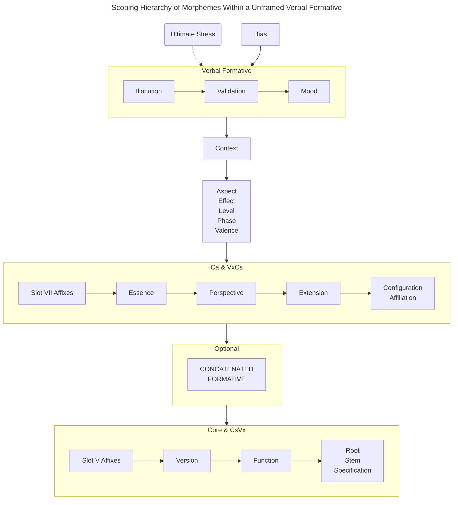

@tab NoF

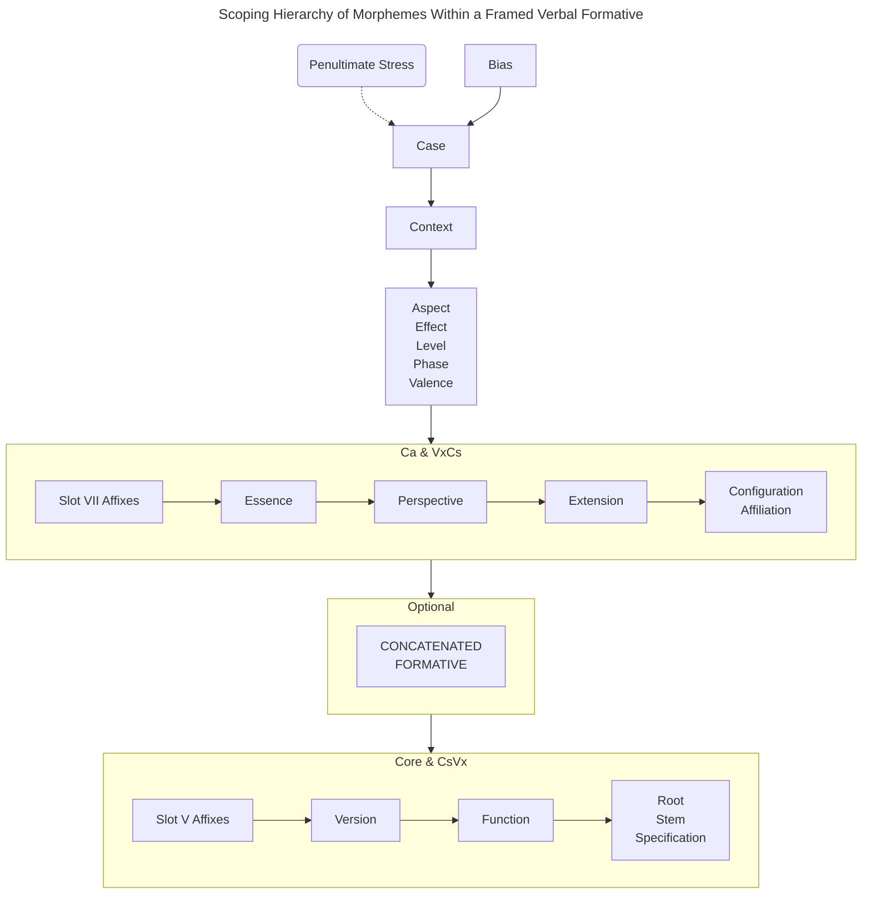

@tab FrV

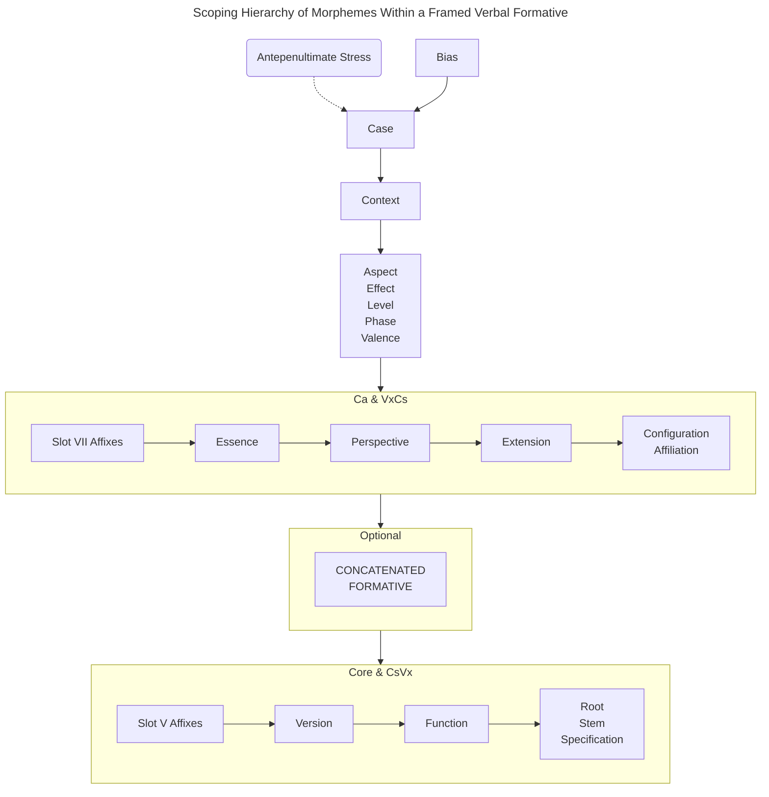

@tab Adjunct on morphemes within a formative

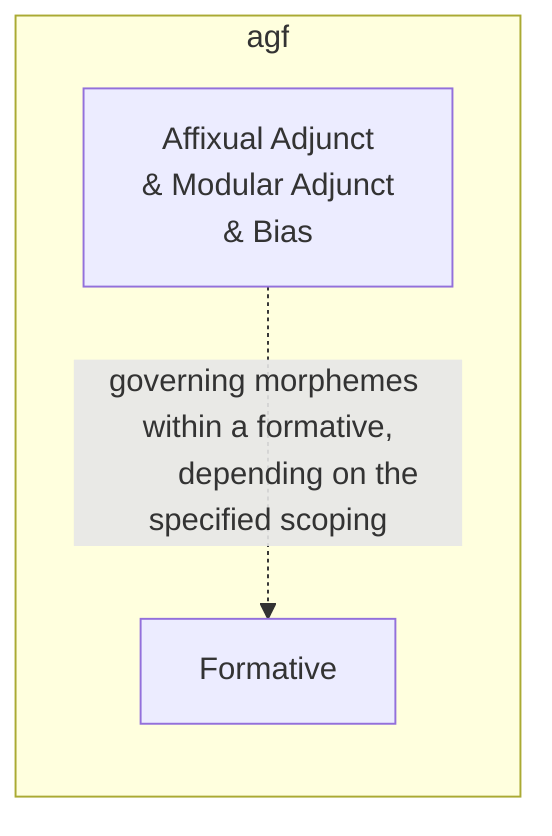

:::

### Case-Scope

Case-Scope constitutes a syntactic category of a DeP.

* A <abbr>CCA</abbr>-marked DeP governs every <abbr>CCN</abbr>-marked DeP within the same clause.
* A <abbr>CCS</abbr>-marked DeP governs every <abbr>CCQ</abbr>-marked DeP within the same clause.
* A <abbr>CCP/CCV</abbr>-marked DeP modifies the adjacent formative.

Zero Case-Scope represents a distinctive instance of Case-Scope, wherein its presence suggests solely <abbr>CCN/CCP/CCV</abbr>, contingent upon the Case with which a DeP is marked. Typically, if a DeP marked with zero Case-Scope is assigned any Appositive/Associative/Relational case, it assumes <abbr>CCP/CCV</abbr> Case-Scope; conversely, if not, it assumes <abbr>CCN</abbr> Case-Scope.

The interplay between Zero Case-Scope and Case-Stacking Affix(es) unfolds thus: The application of a Case-Stacking Affix facilitates the addition of another case onto a formative, allowing it to bear multiple Case markings. When one of these Cases is of the Appositive/Associative/Relational variety while the other is not, it denotes that the formative carries both <abbr>CCN</abbr> and <abbr>CCP/CCV</abbr> Case-Scopes. However, when a DeP is marked with non-Zero Case-Scope and Case-Stacking Affix(es), it retains only a singular Case-Scope.

Notably, No Case-Scope diverges from Zero Case-Scope. It denotes a specialized instance of UnV, indicating the absence of Case-Scope, thereby permitting an UnV to govern any formative designated with any Case-Scope (excluding <abbr>CCQ</abbr>, which necessitates a formative marked with <abbr>CCS</abbr>) within the same clause.

The following situations are worth noting

* A <abbr>CCP/CCV</abbr>-marked DeP outside a frame can potentially modify both the initial formative (FrV) and the terminal DeP (the end of frame) within the frame. In this case, it should be considered dependent on a DeP within the frame but syntactically exterior to it.
* A <abbr>CCP/CCV</abbr> chain (aka P0) is a modifying group of multiple DeP’s marked with <abbr>CCP/CCV</abbr>.
* A pairing of [CCP] [CCV] denotes an incongruous combination wherein two DeP’s mutually modify and govern each other.
* FrV is not compatible with <abbr>CCP</abbr>, unless the frame itself concludes with the same FrV. However, it is not obligatory for the FrV to be both the initial and final element of a frame, as this condition is equivalent to a NoF.

### Phrase vs Frame

These two terms are used to distinguish syntactic units composed of NoF and FrV.

A phrase refer to a syntactic unit consisting of a NoF as the head.

Phrase 0 deviates from conventional phrases, serving as a succession of modifiers, with its head being a non-<abbr>CCP/CCV</abbr> formative.

A frame signifies a clause constructed by a FrV.

::: tabs

@tab Phrases

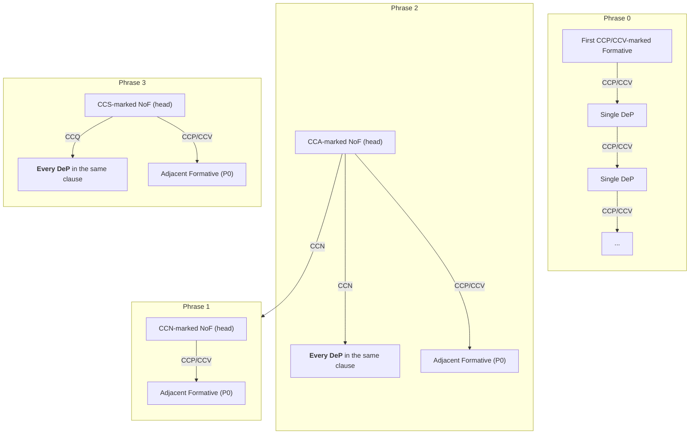

@tab Frames

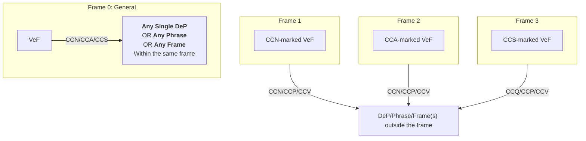

:::

## Register and Sentence-Initial Bias

Register Adjuncts have the ability to govern any designated noun, single Formative, phrase, clause, or sentence, including Register clauses. Register Initial Adjunct and Final Adjunct encapsulate the governed content. A Register clause frequently imparts semantic insights to an adjoining formative (verbal or nominal); however, it should not be assumed that these words hold scope over the Register clause. Given that a Register clause functions as a parenthetical and self-contained sentence, its removal does not disrupt the overall message conveyed by the original sentence. These clauses have the flexibility to be situated at any point within a sentence, and may even function as standalone sentences. A typical illustration of this is the <abbr>NRR</abbr> Register, which, being the default  Register, is frequently disregarded; thus, it is prudent to presume that any sentence, including sentences enclosed by Non-<abbr>NNR</abbr>, is <abbr>NNR</abbr>-marked. It is advisable to consider every sentence as being governed by the <abbr>NNR</abbr> Register. As <abbr>NNR</abbr> is signified by the zero marker, a <abbr>NNR</abbr> clause is inherently autonomous, not subject to subordination by other Register clauses, yet capable of exerting influence over each one individually.

A Sentence-Initial Bias governs the entirety of the sentence, except for the <abbr>NRR</abbr> Register. Bias(es) can form a sentence, but should still be <abbr>NNR</abbr>-marked.

<dl class="gloss">
    <dt>∅</dt>
    <dd>NRR</dd>
</dl>
<dl class="gloss">
    <dt>(Çë)rral.</dt>
    <dd>([sentence:]​-)“cat”-OBS</dd>
</dl>
<dl class="gloss">
    <dt>∅</dt>
    <dd>NRR_END</dd>
</dl>

A simple sentence composed of single UnV

<dl class="gloss">
    <dt>∅</dt>
    <dd>NRR</dd>
</dl>
<dl class="gloss">
    <dt>(Çë)hi</dt>
    <dd>([sentence:]​-)SPF</dd>
</dl>
<dl class="gloss">
    <dt>...</dt>
    <dd>...</dd>
</dl>
<dl class="gloss">
    <dt>hiu.</dt>
    <dd>SPF_END</dd>
</dl>
<dl class="gloss">
    <dt>∅</dt>
    <dd>NRR_END</dd>
</dl>

A sentence composed of single Register clause

<dl class="gloss">
    <dt>∅</dt>
    <dd>NRR</dd>
</dl>
<dl class="gloss">
    <dt>(Çë)lf</dt>
    <dd>([sentence:]​-)ACC</dd>
</dl>
<dl class="gloss">
    <dt>lst.</dt>
    <dd>ANP</dd>
</dl>
<dl class="gloss">
    <dt>∅</dt>
    <dd>NRR_END</dd>
</dl>

A sentence composed of Biases

Simple Sentence

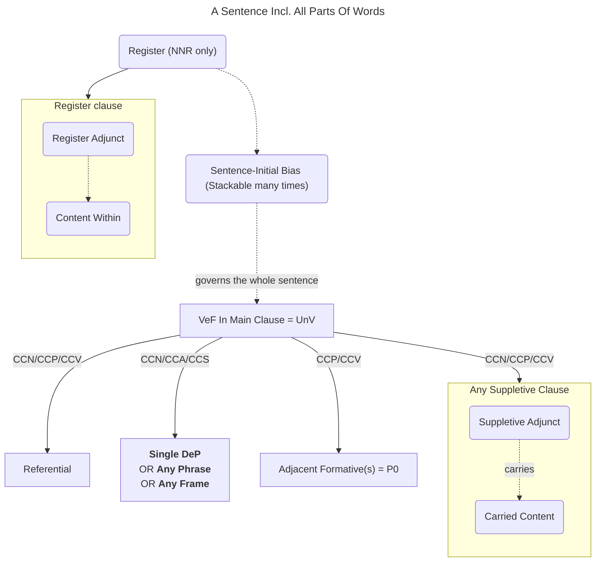

## PoS & Coordinative/Connective Affixes

The Coordinative and Connective Affixes, employed in the formation of a Coordination Structure, serve the purpose of linking formatives, phrases, frames, or clauses within sentences. Analogous to the conjunctions and conjunctional phrases found in natural languages, they facilitate the seamless integration of linguistic elements.

The use of Coordinative and Connective Affixes is restricted to cases where the superordinate clauses of the joined constituents are identical. For instance:

1. I simultaneously _cherish_ **and abhor** you. [sharing the same arg]
2. I _adore you_ **yet despise him**. [sharing partial arg]
3. I hold affection for both you and him. [the same role]
4. The knowledge _from his instruction_, **and on the functioning of the world**. [different roles]
5. Presently, you grasp that about which both _my sentiments_ **and his dissent** are. [within a frame]

Therefore, the conjunction of clauses across different levels is proscribed. “I love and that which you love” necessitates revision to “I love something, and there exists that which you love.”

::: tabs

@tab DeP-COO

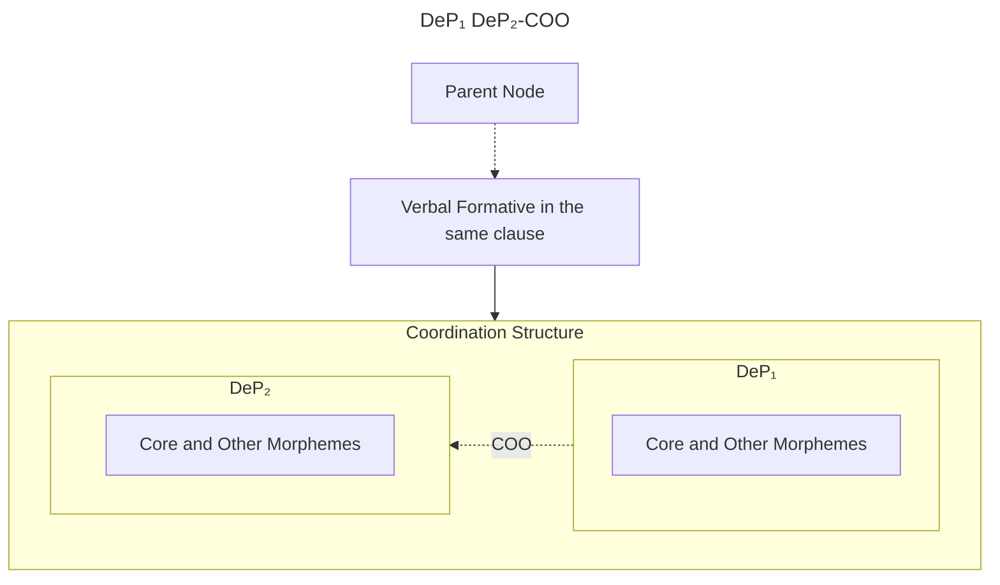

@tab UnV-COO

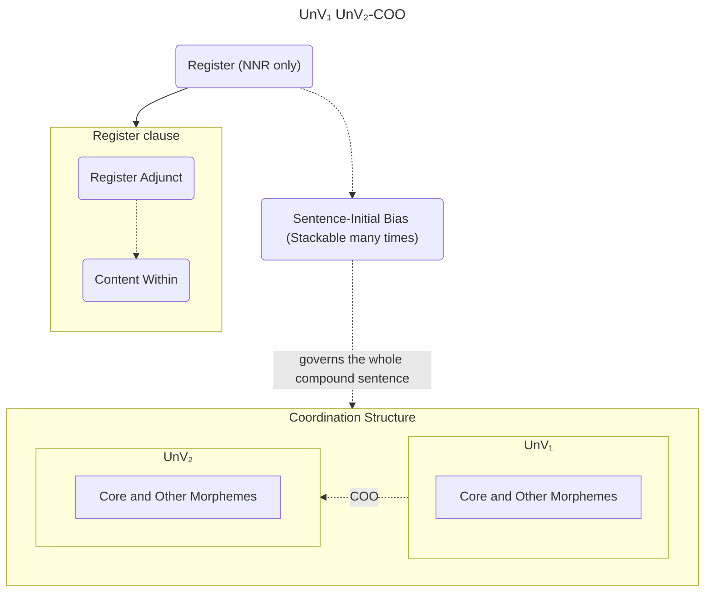
:::

## Scoping In Affixual Slots Of Formative

The application of Type-1 and -2 affixes to a Formative encompasses all preceding morphemes within the Formative.

The morphosyntactic behavior of Type-3 affix is to modify the preceding affix, unless it is the first affix in an affixual slot.

We can make the following analogy: a T3 affix is similar to a DeP marked <abbr>CCP/CCV</abbr>, whose head is the adjacent affix. We can also generate a T3 affix chain similar to P0.

While this concept is readily comprehensible, the utilization of Type-3 affix(es) remains contentious due to inconsistencies in their definitions.

As evidenced, disparities in English definitions of affixes are present in the Affix document:

1. Attributives, including adjectives, adjectival phrases, adverbs, adverbial phrases, prepositional phrases, etc., for instance, the <abbr>EXN</abbr> affix.
2. Heads, including nouns, noun phrases, verbs, verb phrases, etc., exemplified by the <abbr>NPE</abbr> affix.
3. Grammatical descriptions or others.

Given their potential impact on the scoping of Type-3 affix(es), it is imperative to elucidate these variations.

An affix may undergo transformation into a Cs-root, thereby generating a formative derived from said Cs-root.

* <abbr>EXN/3</abbr>: to a small degree
* <abbr>NPE/1</abbr>: the extent/degree of X; the degree to which X is present

Consequently, the <abbr>EXN/3</abbr> affix can transform into a VeF, signifying ‘for there to be something to a small degree’, while the <abbr>NPE/1</abbr> affix can do so, denoting ‘for there to be the extent/degree of something’.

“cat”-<abbr>AFT/2</abbr>: a cute cat = *a cute one/being of cat* = *a cat of cuteness/being cute* = *a cat which manifests cuteness*

1. “cat”-<abbr>AFT/2</abbr>-<abbr>EXN/3</abbr>: (an existence of) a cute cat to a small degree
2. “cat”-<abbr>AFT/2</abbr>-<abbr>EXN/3₃</abbr>: a cat which manifests cuteness to a small degree
3. “cat”-<abbr>AFT/2</abbr>-<abbr>NPE/1</abbr>: the degree to which a cute cat is present
4. “cat”-<abbr>AFT/2</abbr>-<abbr>NPE/1₃</abbr>: a cat which manifests cuteness to a degree (of being present)

For head-defined affixes, a general method of designating the head as a modifier is to put an expression such as ‘in terms of ...,’ ‘in relation to ...,’ ‘of ...,’ ‘in association with ...,’ and others prior to the head. E.g.

1. “cat”-<abbr>AFT/2</abbr>-<abbr>MAK/7</abbr>: the making of cute cat.
2. “cat”-<abbr>AFT/2</abbr>-<abbr>MAK/7₃</abbr>: a cat which manifests cuteness in association with the making/construction of something.

Inteplay of attributive-defined affix and head-defined affix:

1. “cat”-<abbr>MAK/7</abbr>-<abbr>AFT/2</abbr>: the cat-making which manifests cuteness
2. “cat”-<abbr>MAK/7</abbr>-<abbr>AFT/2₃</abbr>: the making, which manifests cuteness, of a cat

The above use also applies to Type-3 Case-Accessor Affixes.

Type-3 Coordinative/Connective Affixes are used to link an affix to another affix preceding.

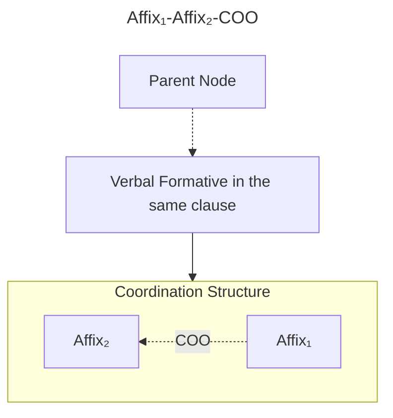

## Case-Scope on Concatenated Formative in Concatenated Chain

In a Concatenated Pair, the Case-Scope of a Concatenated Formative may be disregarded, as it functions as a whole participating in the internal morpheme scoping of the Parent Formative. Conversely, in a Concatenated Chain, the Case-Scope of Concatenated Formatives holds significance. Analogous to formatives within a frame, concatenated formatives in a concatenated chain have the capacity to comprise phrases, with the exception of frames. The scoping mechanism remains similar and thus requires no further elaboration.

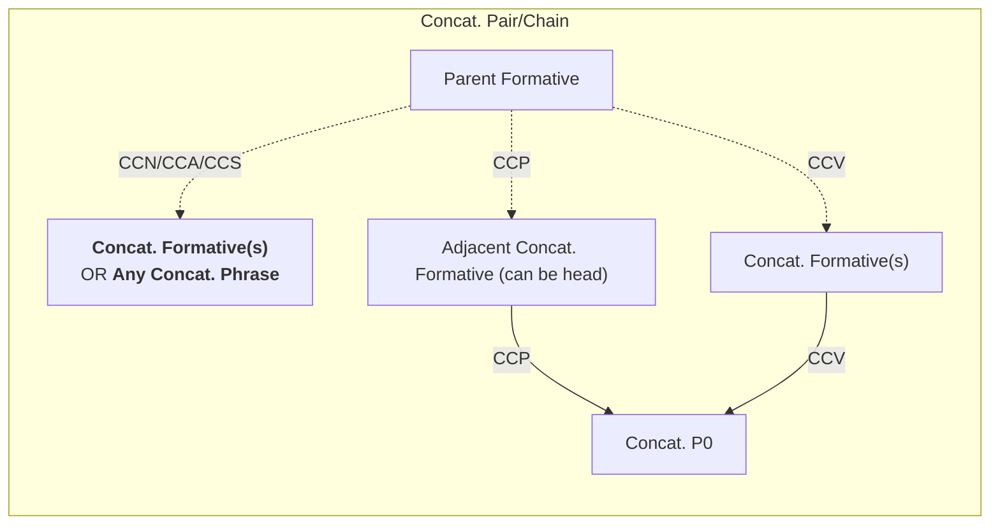