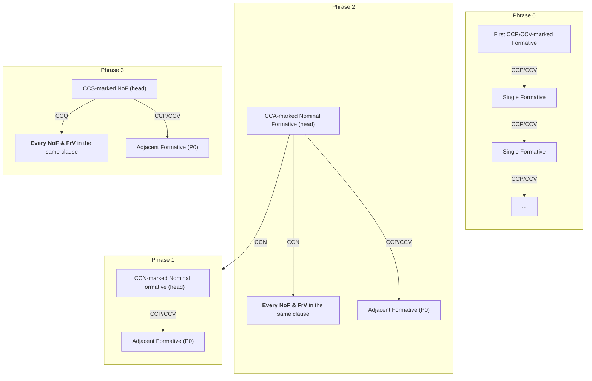
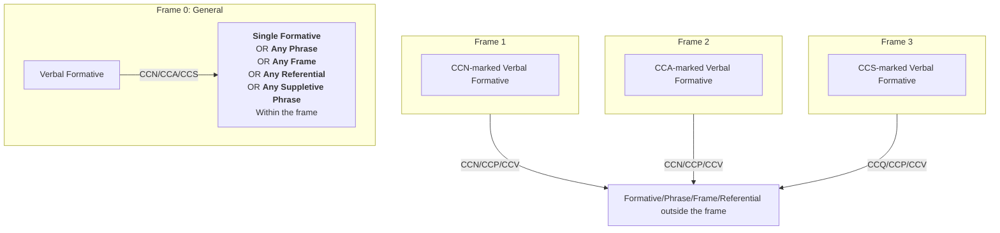
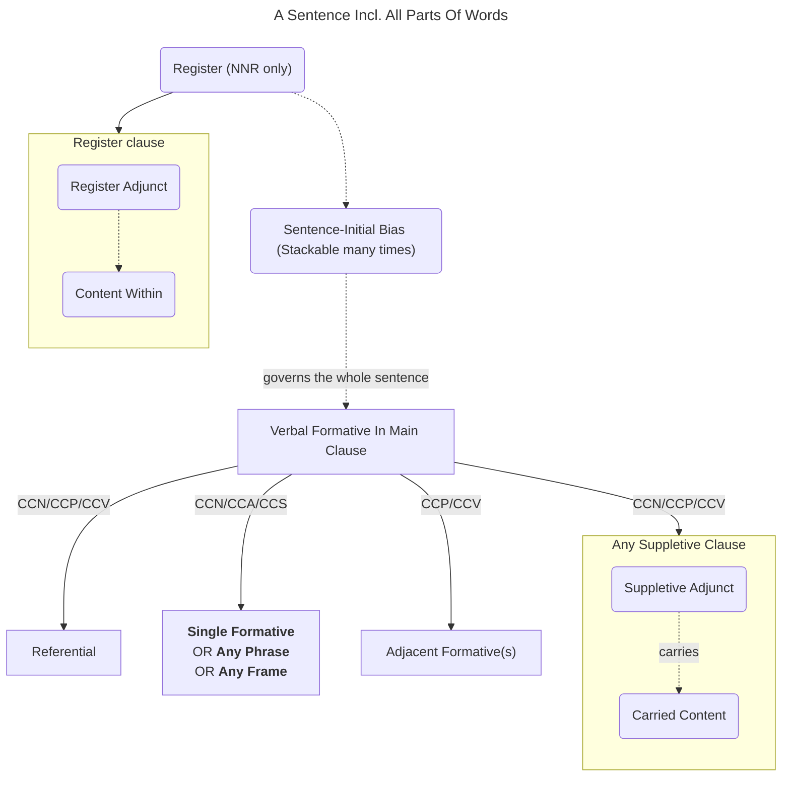
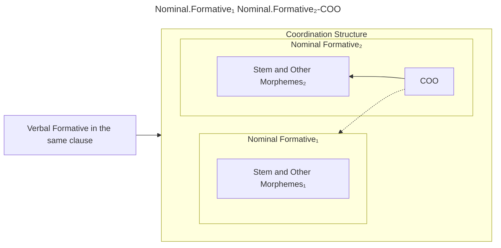

## Syntactic Terminology

### Nominal vs Verbal

The Unframed Verbal Formative (abbr. UnV)  bears ultimate stress and serves as the parent node of the highest-level clause within the sentence.

A formative exhibiting penultimate stress is classified as a Nominal Formative (abbr. NoF), whereas one displaying antepenultimate stress is categorized as a Framed Verbal Formative (abbr. FrV).

Nominal and Framed Verbal Formatives frequently serve as arguments to a Verbal Formative within the same clause, facilitated by Case and Case-Scope mechanisms. However, they also have the capacity to stand alone as complete sentences, devoid of a verb.

The Unframed Verbal Formativeand the Framed Verbal Formative are both types of Verbal Formative that can be utilized in constructing a clause.

A Verbal Formative (VeF) governs <abbr>CCA/CCS</abbr>-marked Formatives within the same clause. In the absence of <abbr>CCA/CCS</abbr>-marked Formatives, it governs <abbr>CCN</abbr>-marked Formatives. If there are adjacent Formatives marked with <abbr>CCP/CCV</abbr>, VeF also governs them.

Referentials and Suppletive Adjuncts serve the same syntactic function as (Nominal) Formatives (Although they can only convey <abbr>CCN</abbr> case-scope and <abbr>CCP/CCV</abbr> when in any Appositive/Associative/Relational case). Should their Slot lack the capacity to convey the necessary morphological information, it is recommended to utilize alternative Formatives or to apply Affix(ual Adjunct)s to meet the requirements.

### Phrase vs Frame

These two terms are used to distinguish syntactic units composed of NoF and FrV.

A phrase refer to a syntactic unit consisting of a NoF as the head.

Phrase 0 deviates from conventional phrases, serving as a succession of modifiers, with its head being a non-<abbr>CCP/CCV</abbr> formative.

A frame signifies a clause constructed by a FrV.

::: tabs

@tab Phrase

@tab Frame

:::

## Register and Sentence-Initial Bias

Register Adjuncts have the ability to govern any designated noun, single Formative, phrase, clause, or sentence, including Register clauses. Register Initial Adjunct and Register Final Adjunct encapsulate the governed content. A Register clause frequently imparts semantic insights to an adjoining verb or noun; however, it should not be assumed that these words hold scope over the Register clause. Given that a Register clause functions as a parenthetical and self-contained sentence, its removal does not disrupt the overall message conveyed by the original sentence. These clauses have the flexibility to be situated at any point within a sentence, and may even function as standalone sentences. A typical illustration of this is the <abbr>NRR</abbr> Register, which, being the default  Register, is frequently disregarded; thus, it is prudent to presume that any sentence, including sentences enclosed by Non-<abbr>NNR</abbr>, is <abbr>NNR</abbr>-marked. It is advisable to consider every sentence as being governed by the Register, typically the <abbr>NNR</abbr>. As <abbr>NNR</abbr> is signified by the zero marker, a <abbr>NNR</abbr> clause is inherently autonomous, not subject to subordination by other Register clauses, yet capable of exerting influence over each one individually.

A Sentence-Initial Bias governs the entirety of the sentence, rather than the <abbr>NRR</abbr> Register. Bias(es) can form a sentence, but should still be <abbr>NNR</abbr>-marked.

<dl class="gloss">
    <dt>∅</dt>
    <dd>NRR</dd>
</dl>
<dl class="gloss">
    <dt>(Çë)rral.</dt>
    <dd>([sentence:]​-)“cat”-OBS</dd>
</dl>
<dl class="gloss">
    <dt>∅</dt>
    <dd>NRR_END</dd>
</dl>

A simple sentence

<dl class="gloss">
    <dt>∅</dt>
    <dd>NRR</dd>
</dl>
<dl class="gloss">
    <dt>(Çë)hi</dt>
    <dd>([sentence:]​-)SPF</dd>
</dl>
<dl class="gloss">
    <dt>...</dt>
    <dd>...</dd>
</dl>
<dl class="gloss">
    <dt>hiu.</dt>
    <dd>SPF_END</dd>
</dl>
<dl class="gloss">
    <dt>∅</dt>
    <dd>NRR_END</dd>
</dl>

A sentence composed of single Register clause

<dl class="gloss">
    <dt>∅</dt>
    <dd>NRR</dd>
</dl>
<dl class="gloss">
    <dt>(Çë)lf</dt>
    <dd>([sentence:]​-)ACC</dd>
</dl>
<dl class="gloss">
    <dt>lst.</dt>
    <dd>ANP</dd>
</dl>
<dl class="gloss">
    <dt>∅</dt>
    <dd>NRR_END</dd>
</dl>

A sentence composed of Biases

Simple Sentence

The parts of speech and Coordinative Affix

