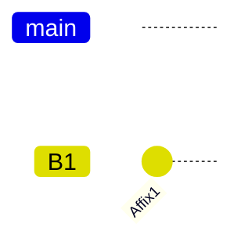
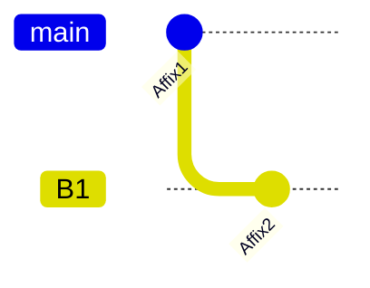
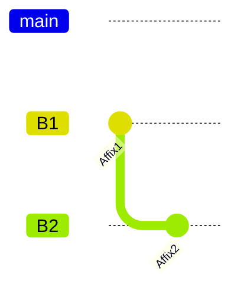
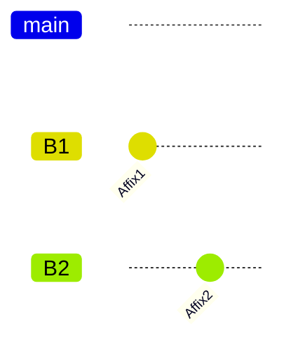
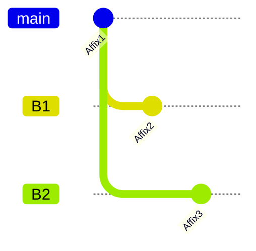
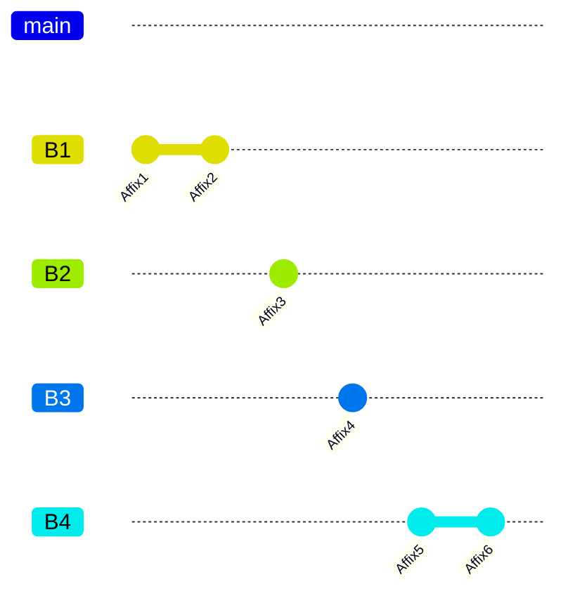
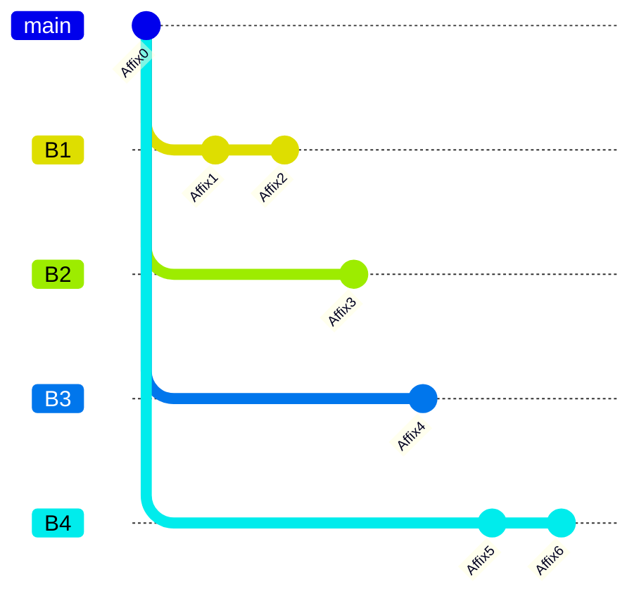
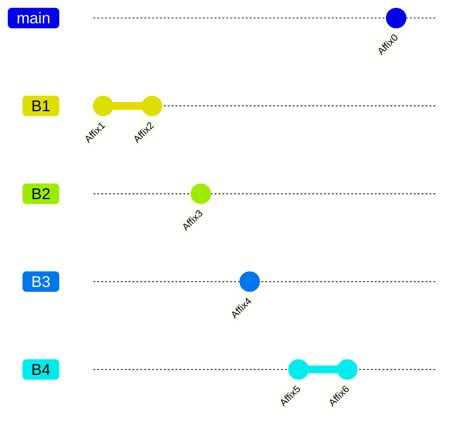
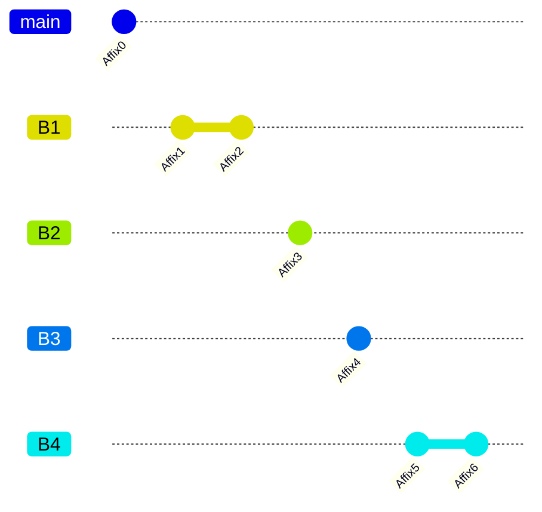
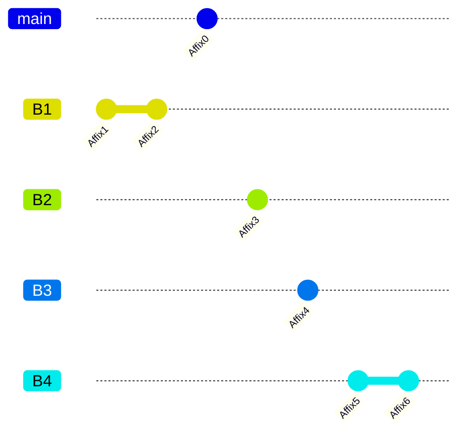

> [!caution]
> This document is currently being drafted

<table>
   <tr>
      <td colspan="5">
         <h5><strong>-? <abbr>MSH</abbr> Morphosyntactic Helper & Accessor</strong></h5>
      </td>
   </tr>
   <tr>
      <td>
         <p style="text-align: right">
            <strong>D</strong>
         </p>
      </td>
      <td><strong>Type-1: Helper</strong>
      </td>
      <td colspan="2"><strong>Type-2: Accessor for Type-1 or Type 2</strong>
      </td>
      <td><strong>Type-3: Accessor for Type-3 </strong>
      </td>
   </tr>
   <tr>
      <td>
         <p style="text-align: right">
            <strong>1</strong>
         </p>
      </td>
      <td>This affix creates a new Branch so that new affixes can be put in. (When creating multiple Branches at once,
         the subsequent affixes will be passed to the first Branch first.) \
         Note that a new Branch is at the level after the level of an Element before this affix.
      </td>
      <td colspan="2">This affix returns x = f(INPUT^): a participant of a governed affix/Group/brackets; where INPUT =
         Stem.
      </td>
      <td rowspan="9">[same as that of Type-2, but only for Type-3]
      </td>
   </tr>
   <tr>
      <td>
         <p style="text-align: right">
            <strong>2</strong>
         </p>
      </td>
      <td>This affix sets a next Branch as the current Branch so that new affixes can be put in. If the current branch
         is already the last branch, it will loop back to the Main Branch (Depending on the number of D1s before the new
         D2, what the “last branch” refers to may vary). [This affix uses a relative positioning system by default. If
         one wants an absolute positioning system, apply Type-3 <abbr>XX#/3</abbr> to this affix for specifying the number of
         Branches created by D1, e.g, XX0 for the Main Branch, XX1 for the Branch created by first D1, etc.]
      </td>
      <td colspan="2">This affix returns y = f(INPUT): an output of a governed affix/Group/brackets; where INPUT = Stem.
      </td>
   </tr>
   <tr>
      <td>
         <p style="text-align: right">
            <strong>3</strong>
         </p>
      </td>
      <td>This affix merges a Branch created by the nearest preceding D1 creates onto the current Branch [using Type-3
         <abbr>$1</abbr>, specify the number of Branches created by D1, e.g, XX0 for the Main Branch, XX1 for the Branch created
         by first D1, etc.]
      </td>
      <td colspan="2">This affix returns z = R(x,y): a relationship between both x and y of a governed
         affix/Group/brackets; where INPUT = S.
      </td>
   </tr>
   <tr>
      <td>
         <p style="text-align: right">
            <strong>4</strong>
         </p>
      </td>
      <td>This affix creates a Group for what it governs (in the same Branch), containing only one or more affixes,
         which cannot contain Subgroups.
      </td>
      <td colspan="2">This affix returns “x in association to S” (the association specifiable optionally with any
         Case-Stacking affix): where INPUT = unspecified referent
      </td>
   </tr>
   <tr>
      <td>
         <p style="text-align: right">
            <strong>5</strong>
         </p>
      </td>
      <td>This affix creates a Group for what it governs (in the same Branch), containing only multiple D4 Subgroups,
         which cannot contain affixes.
      </td>
      <td colspan="2">This affix returns “y in association to S” (the association specifiable optionally with any
         Case-Stacking affix): where INPUT = unspecified referent
      </td>
   </tr>
   <tr>
      <td>
         <p style="text-align: right">
            <strong>6</strong>
         </p>
      </td>
      <td>This affix creates a Group for what it governs (in the same Branch), containing only multiple Subgroups (by
         either D4 or D5), which cannot contain affixes and D6 Subgroups.
      </td>
      <td colspan="2">This affix returns “z in association to S” (the association specifiable optionally with any
         Case-Stacking affix): where INPUT = unspecified referent
      </td>
   </tr>
   <tr>
      <td>
         <p style="text-align: right">
            <strong>7</strong>
         </p>
      </td>
      <td>This affix functions as an opening bracket for a Parentheme (if there is an opening bracket, there has to be a
         closing bracket in the same Branch)
      </td>
      <td colspan="2">This affix returns “S in association to x” (the association specifiable optionally with any
         Case-Stacking affix): where INPUT = unspecified referent
      </td>
   </tr>
   <tr>
      <td>
         <p style="text-align: right">
            <strong>8</strong>
         </p>
      </td>
      <td>This affix indicates that a governed affix does not belong to a Parentheme, but to the content outside the
         brackets (in the same Branch), even if it is within the brackets.
      </td>
      <td colspan="2">This affix returns “S in association to y” (the association specifiable optionally with any
         Case-Stacking affix): where INPUT = unspecified referent
      </td>
   </tr>
   <tr>
      <td>
         <p style="text-align: right">
            <strong>9</strong>
         </p>
      </td>
      <td>This affix functions as an closing bracket for a Parentheme (if there is an closing bracket, there has to be
         an opening bracket in the same Branch)
      </td>
      <td colspan="2">This affix returns z = R(x,y): a relationship between both x and y of a governed
         affix/Group/brackets; where INPUT = unspecified, & S "in association to" the returned value (the association
         specifiable optionally with any Case-Stacking affix);
      </td>
   </tr>
</table>

An Affix, a Group, or a Parentheme, aka _parenthetical expression_, (all optionally with a Type-2 <abbr>MSH</abbr>) counts as an Element.

A Group is like a Parentheme. However, Type-1 <abbr>MSH</abbr> D5-7 belong to a kind of postfix operator, not a circumfix operator like D7 and D9. If there are brackets in the affixual expression, you must do the part inside the brackets first. Brackets help express some nuances.

The MSA affix is similar to Type-2/3 <abbr>MSH</abbr>, so it is impossible for them to be connected without other affixes.

## On Branch

In the affixual slot formation, Branches function like pathways that help avoid repeating the same information and connect previously mentioned content. It allows us to create different paths or choices within the lexical structure in order to organize and manage lexeme relations more flexibly. Each branch represents a possible lexical structure and the user can switch or merge between branches as needed to achieve the desired semantic and morphosyntactic goals. Think of Branches as a way to organize and expand your language structure, making it more efficient and clear.

Purpose:

* Avoid Repetition: Branches allow you to reference the same content in different contexts without repeating it. This makes your language structure concise and clear, while ensuring consistency in your expression.
* Establish Connections: By using Branches, you can create relationships between different parts of your content, helping readers understand the overall logic and structure of your text or language template.
* Expand Meaning: Branches can extend the semantic relationships between elements, giving a word or phrase different meanings in various contexts. This enriches the expressive capability of your language structure, adding flexibility and depth to the language.

How to Use:

* Create branch: Use an <abbr>MSH/1₁</abbr> affix to create a new branch in the affixual slot, so that you can reference related content, distinguishing and organizing different parts within the overall structure.
* Switch branch: Use an <abbr>MSH/2₁</abbr> affix to locate the current operation to a specific branch, so that you can add or modify affixes on that branch.
* Merge branch: Use an<abbr> MSH/3₁</abbr> affix to merge affixes from different branches into the current branch, so that you can achieve interaction and fusion between different branches.

### Illustration with Examples of the Role of Branch

In the affixual slot formation, using Branches allows us to organize and reference previously mentioned content more effectively, enabling the reuse of effects and avoiding redundancy. Let’s illustrate the role of Branch using the examples below:

Example 1: Without New Branches

1. `“cat”-‘X’s odor’` represents a cat’s odor.
2. `“cat”-‘cute’` represents a cute cat.
3. `“cat”-‘natural habitat of X’` represents the habitat of a cat.
4. `“cat”-‘the originating source of X’` represents the originating source of a cat.

In this scenario, each set of affixes is within the same main branch, expressing different aspects of the cat without the need for additional branches to differentiate.

Example 2: With New Branches

The following provides two kinds of visualizations

1. Plain text, which represents every branch by a line and every level by indentations.
2. Git graph, which represents every branch by a line and every level by connections between related nodes. Unlike that of plain text, the indentation indicates the order of the affixes.

`“cat”-MSH/1₁-‘X’s odor’` represents [a cat and the cat’s odor].

```
"cat"-[void]
     -'X's odor'
```

Here, branch zero, the main branch, is not filled.

`“cat”-MSH/1₁-‘natural habitat of X’` represents [a cat and the habitat of the cat].

```
"cat"-[void]
     -'natural habitat of X'
```



`“cat”-‘cute’-MSH/1₁-‘X’s odor’` represents [a cute cat and the cat’s odor]

`“cat”-‘cute’-MSH/1₁-‘natural habitat of X’` represents [a cute cat and the habitat of the cat]

```
"cat"-AFFIX1
            -AFFIX2
```



`“cat”-MSH/1₁-‘X’s odor’-MSH/1₁-‘the originating source of X’` represents [a cat, the cat’s odor, and ‘the originating source of the cat’s odor]

```
"cat"-[void]
     -AFFIX1
            -AFFIX2
```



`“cat”-MSH/1₁-MSH/1₁-‘natural habitat of X’-MSH/2₁-‘the originating source of X’` represents [a cat, the natural habitat of the cat, and the originating source of the cat]

```
"cat"-[void]
     -AFFIX1
     -AFFIX2
```



`“cat”-‘cute’-MSH/1₁-MSH/1₁-‘natural habitat of X’-MSH/2₁-‘the originating source of X’` represents [a cute cat, the natural habitat of the cute cat, and the originating source of the cute cat]

`“cat”-‘X’s odor’-MSH/1₁-MSH/1₁-‘the originating source of X’-MSH/2₁-‘cute’` represents [a cat’s odor, the originating source of the cat’s odor, and the cat’s cute odor]

```
"cat"-AFFIX1
            -AFFIX2
            -AFFIX3
```



With the introduction of new branches, it is possible to combine different attributes more flexibly to express more complex and detailed concepts.

The advantage of using branches is that they allow you to combine existing information in a flexible way, avoiding redundancy, while maintaining the simplicity and coherence of your statements.

Note that the outputs of multiple branches will be combined into a whole, which is why ‘and’ is used in the translation to connect each output, and square brackets are used to enclose them, as they will be applied as a whole by the semantic/grammatical information in other slots that follows that affixual slot. The order of the expression represented by branches in the output is not important because they have the same status. The conjunction relationship could be modified through Type-3 coordinative affix adjacent to the <abbr>MSH/1₁</abbr>.

##### Create a Sub-branch

Consecutive <abbr>MSH/1₁</abbr> affixes mean that these branches are at the same level, and do not mean that the latter branch is a sub-branch of the previous one.

If there’s a branch structure like

```
STEM-[void]
    -AFFIX1-AFFIX2
    -AFFIX3
    -AFFIX4
    -AFFIX5-AFFIX6
```

It can be easily written as `S-MSH/1₁-MSH/1₁-MSH/1₁-MSH/1₁-A1-A2-MSH/2₁-A3-MSH/2₁-A4-MSH/2₁-A5-A6`;



However, if there’s a branch structure like

```
STEM-AFFIX0
    -AFFIX1-AFFIX2
    -AFFIX3
    -AFFIX4
    -AFFIX5-AFFIX6
```

One can’t write it as `S-A0-<abbr>MSH</abbr>/1₁-MSH/1₁-MSH/1₁-MSH/1₁-A1-A2-MSH/2₁-A3-MSH/2₁-A4-MSH/2₁-A5-A6`, which denotes

```
STEM-AFFIX0
           -AFFIX1-AFFIX2
           -AFFIX3
           -AFFIX4
           -AFFIX5-AFFIX6
```



Instead, by the <abbr>MSH/2₁</abbr> with Type-3 <abbr>XX0/3</abbr>, one can commit subsequent affixes onto the main branch. Thus, write it as `S-MSH/1₁-MSH/1₁-MSH/1₁-MSH/1₁-A1-A2-MSH/2₁-A3-MSH/2₁-A4-MSH/2₁-A5-A6-MSH/2₁(-XX0/3₃)`, where since the last branch has been reached, a new <abbr>MSH/2₁</abbr> will indicate a return to the main branch, and it is feasible to omit XX0/3₃ here.



However, through Type-3 <abbr>$1</abbr>, one can arbitrarily specify a branch to set as the current branch. For example, these following examples are also semantically equivalent and have the same structure in the plain text visualization, but git graph visualization provides different structures:

* `S-MSH/1₁-MSH/1₁-MSH/1₁-MSH/1₁-MSH/2₁-XX0/3₃-A0-XX1/3₃-A1-A2-MSH/2₁-A3-MSH/2₁-A4-MSH/2₁-A5-A6-MSH/2₁`



* `S-MSH/1₁-MSH/1₁-MSH/1₁-MSH/1₁-A1-A2-MSH/2₁-XX0/3₃-A0-MSH/2₁-XX2/3₃-A3-MSH/2₁-A4-MSH/2₁-A5-A6-MSH/2₁`



