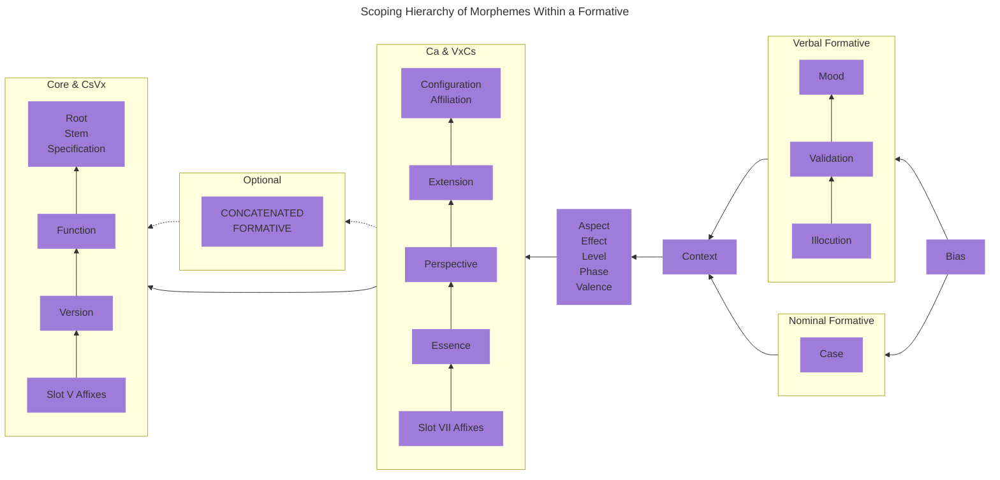

## 2.0 Morpho-Phonology {#Sec2}

Morpho-phonology refers to how a language uses its phonemes (meaningful sounds) and phonological features (e.g., syllabic stress, gemination, tone, etc.) to generate patterns for word-formation and for morphological categories (e.g., singular versus plural, verb tense, etc.) to be applied to words.

::: info Parts of Speech

There are three types of words in New Ithkuil: **formatives**, **adjuncts**, and **referentials**. Formatives constitute a class of words which generally correspond to both nouns and verbs in natural human languages. (In [Sec. 2.4.2](02#Sec2_4_2) below, we will see why it makes sense to combine nouns and verbs into a single word-type in New Ithkuil grammar.) Adjuncts are “helper” words which operate in association with formatives to provide further semantic information about the adjoining formative. Referentials are a type of word that operates similarly to pronouns in natural human languages, although we will see that they are more dynamic and expansive in their usage than the usual range of pronouns in other languages.

:::

::: info Grammatical Typology

New Ithkuil is primarily an agglutinative language and secondarily a synthetic language. This means that the manner in which morpho-semantic stems, inflections and derivations are formed, and how those elements combine meaningfully into words, is primarily via the joining of one or more affixes (including prefixes, suffixes, and infixes) to a semantic root, where the affixes themselves are highly synthetic (i.e., combining numerous morphological categories together into a single phonological form). Essentially, this means that New Ithkuil words are formed by joining multiple affixes to a core stem, where each affix can pack multiple elements of meaning within it.

:::

## 2.1 The Standard Vowel-Form Sequence {#Sec2_1}

As we examine how New Ithkuil words are structured, we will see that word-structure operates via a series of sequential “slots”, where each slot is filled with an affix. We will then see that many of the component affixes used to fill these slots contain frequently-recurring patterns of nine vowels, or are a matrix of multiple values where one axis of the matrix carries nine vowel-forms. Consequently, the language employs a standard generalized pattern of nine vocalic forms in multiple series, which can then be utilized to populate each of these various Slots. This standard generalized pattern of vowels facilitates memorization of the myriad number of affixes by persons who wish to attempt actually learning the language.

The chart below displays the various patterns of this “Standard Vowel-Form Sequence”. Readers will find it useful to refer back to this chart when examining many of the different morphological slots used in New Ithkuil word-formation. Despite the number of vowel-forms, the sequence structure is fairly systematic if one analyzes it closely.

    <table>
        <caption>The Standard Vowel-Form Sequence</caption>
        <thead>
            <tr>
                <th>Form</th>
                <th>Series 1</th>
                <th>Series 2</th>
                <th>Series 3&#42;</th>
                <th>Series 4</th>
            </tr>
        </thead>
        <tbody>
            <tr>
                <th>1</th>
                <td>a</td>
                <td>ai</td>
                <td>ia / uä</td>
                <td>ao</td>
            </tr>
            <tr>
                <th>2</th>
                <td>ä</td>
                <td>au</td>
                <td>ie / uë</td>
                <td>aö</td>
            </tr>
            <tr>
                <th>3</th>
                <td>e</td>
                <td>ei</td>
                <td>io / üä</td>
                <td>eo</td>
            </tr>
            <tr>
                <th>4</th>
                <td>i</td>
                <td>eu</td>
                <td>iö / üë</td>
                <td>eö</td>
            </tr>
            <tr>
                <th>5</th>
                <td>ëi</td>
                <td>ëu</td>
                <td>eë</td>
                <td>oë</td>
            </tr>
            <tr>
                <th>6</th>
                <td>ö</td>
                <td>ou</td>
                <td>uö / öë</td>
                <td>öe</td>
            </tr>
            <tr>
                <th>7</th>
                <td>o</td>
                <td>oi</td>
                <td>uo / öä</td>
                <td>oe</td>
            </tr>
            <tr>
                <th>8</th>
                <td>ü</td>
                <td>iu</td>
                <td>ue / ië</td>
                <td>öa</td>
            </tr>
            <tr>
                <th>9</th>
                <td>u</td>
                <td>ui</td>
                <td>ua / iä</td>
                <td>oa</td>
            </tr>
        </tbody>
    </table>

\* When preceded by **y**-, Series 3 forms beginning with -**i** use their alternate forms instead (e.g., **yuä**, not **yia**), while Series 3 forms beginning with -**u** use their alternate forms if preceded by **w**- (e.g., **wiä**, not **wua**).

## 2.2 Rules for Inserting a Glottal-Stop Into a Vowel-Form {#Sec2_2}

As we examine word-formation, we will see that some of the morpho-phonological slots which constitute the structure of a formative in the language call for the infixing of a glottal-stop into a vowel-form V. To do so, follow the rules below:

1. If **V** is a single vowel or diphthong, the glottal-stop is placed after **V**, e.g., -**a** becomes -**a’**, -**ai** becomes -**ai’**.
2. If **V** is a disyllabic conjunct, place the infix between the two syllables of **V**, e.g., -**ua** becomes -**u’a**.
3. When applying Rule 1 above, if the infix results in a phonotactically impermissible or euphonically undesirable conjunct, or results in a glottal-stop being in word-final position, then an epenthetic vowel must be added as follows:
    * If **V** is a single vowel, reduplicate this vowel following the glottal-stop; e.g., -**a** becomes -**a’a**.
    * If **V** is a diphthong, then place the glottal-stop between the two vowels of the diphthong (as an exception to Rule 1 above); e.g., -**ai** becomes -**a’i** instead of the usual -**ai’**.
4. The [Special Note in Sec. 4.6](04#Sec4_6) will explain how, in certain circumstances, a glottal stop in the Slot IX `Vc` affix can be shifted to a different Slot of the word entirely, in order to shorten the number of syllables in the word.

## 2.3 The Structure of Formatives {#Sec2_3}

The morphological structure of a formative can be shown by the following formula:

::: center

<code>(Cc + Vv) + Cr + Vr + ( CsVx ... ) + Ca + ( VxCs ... ) + ( VnCn ) + Vc / Vk + [STRESS]</code>

:::

Where, with the exception of `Cr` and [STRESS], each term refers to an affix composed of either a consonant-form (shown in the formula as **C**), a vowel-form (shown as **V**), or a combination thereof (e.g., <code>CsVx</code> or <code>VnCn</code>). The term `Cr` refers to the word-root itself, a consonantal-form comprised of from one to five consonants. As shown by the various sets of parentheses, several of the terms in the formula are optional, so that some formatives consist of a minimal five terms: <code>Cr + Vr + Ca + Vc / Vk + [STRESS]</code>. These various morphological elements must appear in a given sequential order, and thus may be analyzed as filling ten morphological “slots”. These Slots are labeled sequentially as Slot I through Slot X, as shown in the following chart.

<!-- @include: struct.md{1-156} -->

The specific morphological structures and semantic function of each of these slots will be discussed individually in dedicated sections of this document. Below is offered a preliminary overview of each slot.

::: tabs

@tab I

`Cc`

This slot is filled either by a glottal stop **’**-, **h**-, or a biconsonantal form beginning with **h**- (e.g., **hw**-, **hr**-, **hm**-, etc.). It indicates whether or not the formative is a standalone (unconcatenated) formative, a Type-1 concatenated formative, or a Type-2 concatenated formative. Concatenation of formatives is discussed in [Sec. 10.1](10#Sec10_1). It also indicates whether Slot II below contains “shortcut” information for Slots IV and VI (so that Slots IV and VI can be elided, thus shortening the word).

@tab II

`Vv`

Contains one of 32 different vowel-forms indicating the Stem and Version of the formative. There are four stems associated with each word-root; stems are discussed in [Sec. 2.4.3.](02#Sec2_4_3). There are two Versions for each formative, PROCESSUAL and COMPLETIVE, which are discussed in [Sec. 3.7](03#Sec3_7). Additionally, this slot may contain “shortcut” information for Slots IV and VI (so that Slots IV and VI can be elided, thus shortening the word). This slot also functions in certain circumstances as a “shortcut” means for conveying one of three pre-selected Slot VII affixes.

@tab III

`Cr`

This is a consonant-form comprising from one to five consonants, indicating the semantic root of the formative, discussed in [Sec. 2.4](02#Sec2_4).

@tab IV

`Vr`

Contains one of 32 vowel-forms indicating the Function, Specification and Context of the Formative. There are two Functions: STATIVE and DYNAMIC, discussed in [Sec. 3.8](03#Sec3_8). There are four Specifications: BASIC, CONTENTIAL, CONSTITUTIVE, and OBJECTIVE, discussed in [Sec. 2.4.4](02#Sec2_4_4). There are four Contexts: EXISTENTIAL, FUNCTIONAL, REPRESENTATIONAL, and AMALGAMATIVE, discussed in [Sec. 3.9](03#Sec3_9).

@tab V

(`CsVx` ... )

Contains one or more descriptive affixes of the form consonant-form + vowel-form that apply to the word-stem itself (as opposed to the word as a whole). Each affix comes in three types: circumstantial, derivational, or limited. There are well over 400 such affixes available, described in [Chapter 7](07).

@tab VI

`Ca`

A mandatory consonantal portmanteau affix indicating the following five categories: Configuration, Affiliation, Extension, Perspective and Essence. These categories are all discussed in [Chapter 3](03). The formation of the <code>Ca</code> affix-complex itself is discussed in [Sec. 3.6](03#Sec3_6).

@tab VII

`Cr`

Contains one or more descriptive affixes of the form vowel-form + consonant-form that apply to the combination of word-stem and its Slot VI <abbr>Ca</abbr> categories (as opposed to only the word-stem). Except for the reversal of consonant-form and vowel-form, these are the same affixes used in Slot V.

@tab VIII

`Vr`

An affix comprising a vowel-form + consonant-form which conveys Mood or Case-Scope, plus either Aspect, Phase, Level, or Effect. The explanation of all these categories is the subject of [Chapter 5](05).

@tab IX

`Vc` / `Vf` / `Vk`

A vowel-form affix which, depending on the stress pattern shown in Slot X, conveys either the Case of the formative, the Format of the formative, or a combination of two categories: Illocution + Validation. Case is discussed in [Chapter 4](04); Format in [Sec. 10.1](10#Sec10_1), and Illocution and Validation in [Chapter 6](06).

@tab X

`[STRESS]`

The syllabic stress pattern of the word determines which kind of affix is shown in preceding Slot IX. This is discussed in [Sec. 6.2.1](06#Sec6_2_1).

:::

### Scoping Hierarchy of Morphemes Within a Formative

The Slot structure of formatives more or less reflects the hierarchy of morphemes within a formative, i.e., the order in which each morpheme’s semantic information has scope over the preceding morphology as the word sequentially unfolds in speech or writing. This scoping order is shown below:

Before analyzing the details of each individual Slot of the above morphological formula, it is important to first understand how the root and stem of each formative operates. This is detailed in the next section below.

## 2.4 Root and Stem Formation {#Sec2_4}

All words in <ins>New</ins> Ithkuil which translate into English as nouns or verbs are based on a stem, which in turn derives from a semantically abstract root. This process is explained in the sections below.

<!-- @include: struct.md{157-312} -->

### 2.4.1 The Root {#Sec2_4_1}

The root forms the semantic basis from which actual noun/verb stems are derived. The root consists of a consonantal form, `Cr`, which occupies Slot III in the above morphological formula. It comprises one to five consonants (e.g., -**k**-, -**st**-, -**ntr**-, -**pstw**-, -**rmzgl**-). The phonotactic constraints (see [Sec. 1.5](01#Sec1_5)) of the language allow for over 33,000 possible roots.

The root is the basic semantic unit. For example, the root -**DN**- is a root whose semantic referent is ‘NAME/DESIGNATION/LABEL’. Functional word-stems (or simply stems) are generated from the root via instantiation of the `Vv`- vocalic affix in Slot II, as described in Sec. 2.4.3 below. However, before we can discuss Stems, it is necessary to first understand the notion of the “formative”, so that readers will understand why all stems in the language function equally as both nouns and verbs, and have both nominal and verbal meanings.

### 2.4.2 The Notion of the “Formative” {#Sec2_4_2}

The grammatical parts of speech known in other languages as nouns and verbs are combined in New Ithkuil into a single part of speech termed the formative. All formatives, without exception, can function as both nouns or verbs, and the distinction as to whether a formative is to be interpreted as a noun or a verb is made by analyzing its morpho-phonological structure and morpho-syntactic relationship to the rest of the sentence. Consequently, there are no formatives that refer only to nouns or only to verbs as in Western languages. So, for example, the first stem of the root -**DN**- mentioned above means both ‘a name’ and ‘to name’ with neither meaning being seen as more intrinsic nor fundamental nor derived from the other. Such hierarchies of nominal over verbal meaning (or vice-versa) arise only when translating to English or other Western languages, where such nominal versus verbal lexical constraints are inherent.

The reason why nouns and verbs can function as morphological derivatives of a single part of speech is because New Ithkuil morpho-semantics do not see nouns and verbs as being cognitively distinct from one another, but rather as complementary manifestations of an idea existing in a common underlying semantic continuum whose components are space and time. As in physics, the holistic continuum containing these two components can be thought of as spacetime. It is in this continuum of spacetime that New Ithkuil instantiates semantic ideas into lexical roots, giving rise to the part of speech termed the formative. The speaker then chooses to either *spatially “reify”* this formative into an object or entity (i.e., a noun) or to *temporally “activize”* it into an act, event, or state (i.e., a verb). This complementary process can be diagrammed as follows:

 {.inverted}

### 2.4.3 Stems {#Sec2_4_3}

Each root has three stems, shown by the vowel-form `Vv` in Slot II of the morphological formula in [Sec. 2.3](#Sec2_3) above. It is at the level of stem that roots become actual words with instantiated meaning. For example, the first stem of our root -**DN**- would be -**adn**-, meaning “(to be) a name [plus the entity named]; [for something/someone] to be named/called something”. The second stem of this root would be -**edn**-, meaning “(to be) a designation or reference [plus the entity so designated]; [for an entity] to (be) refer(ed) to as”, and the third stem of the root would be -**udn**-, meaning “(to be) a label [plus the entity so labeled]; [for an entity] to (be) label(ed) as”.

In addition to these three stems shown by the Slot II vowel-forms -**a**-, -**e**-, and -**u**-, there is a fourth form shown by the Slot II vowel-form -**o**-, known as “Stem Zero”. This stem-form is specialized and refers to the “stemless” overall conceptual meaning of the raw root, irrespective of a particular stem, the particular meaning being pragmatically determined based on the root itself. So, for root -**DN**-, the Stem Zero form -**odn**- would essentially be an amalgamation of the three stem meanings, thus “(to be) what something is (to be) called/referred to as or labelled [plus the entity called/labeled/referred to as such]”. This allows for a speaker to use stems to create a deliberate semantic ambiguity when they do not wish to make a distinction between, say, an adult human and a human child.

### 2.4.4 Specification {#Sec2_4_4}

To further distinguish the basic semantic idea of a word, there is an additional morphological category termed **Specification**. Each of the three stems, as well as the fourth “Stem Zero” form, has four Specifications. These Specifications serve to indicate how the stem is to be interpreted semantically within the context of the rest of the sentence. This is best explained by describing the purpose of each Specification individually below, along with examples. The four Specifications are BASIC, CONTENTIAL, CONSTITUTIVE, and OBJECTIVE.

::: tabs

@tab BSC

<dl>
    <dt>BASIC</dt>
    <dd>A holistic instantiation of a stem, prior to the application of one of the other three Specifications,
        essentially encompassing the meanings of the <abbr>CTE</abbr> and <abbr>CSV</abbr> specifications below. For roots representing naturally
        “activized”, “time-unstable”, dynamic, or psychologically verb-like notions, the BASIC nominal formative would
        mean “an instance/occurrence of X”, while the BASIC verbal formative would mean “(an instance/occurrence of)
        X(-ing) happens”. For stems representing naturally “reified”, “time-stable”, stative, or psychologically
        noun-like notions, the BASIC nominal formative would mean “an X (being present)” or for “non-count” entities,
        “an (unspecified/certain) amount/volume of X”, whereas the BASIC verbal formative would carry a STATIVE
        interpretation meaning “(an) X be present” / “[there] be (an) X”; the expansion of this meaning verbally would
        be accomplished using other Specifications.</dd>
</dl>

@tab CTE

<dl>
    <dt>CONTENTIAL</dt>
    <dd>This specification complements the <abbr>CSV</abbr> specification below. The physical or non-physical “content” or essence or
        purposeful function or idealized/abstract/platonic form thereof, as opposed to its mere physical form/shape,
        e.g., <em>the content of a piece of art</em> [what it represents or is an image/statue of]; <em>the water within
            a river</em> [regardless of its channel or course]; <em>the communicative content of a message</em>
        [regardless of the means/medium by which it is conveyed]; <em>something (made of/in) iron</em> [its form/shape
        as opposed to merely being an example of the substance]; <em>a room as a functional/habitable space, established
            by its socially communicated purpose or discernible by its design, furnishings, decor, etc.</em></dd>
</dl>

@tab CSV

<dl>
    <dt>CONSTITUTIVE</dt>
    <dd>This Specification indicates the form (physical or non-physical) in which an entity/state/act actually expresses
        itself, is shaped, or is realized, as opposed to its functional/purposeful content, i.e., "what constitutes X",
        e.g., <em>a work of art</em> [as constituted by it being a painted canvas, sculpted marble, etc., irrespective
        of what the image is or what/who the statue is of]; <em>the course of a river</em>; <em>the form/medium
            (written, spoken, recorded, etc.) of a message</em> [irrespective of what it communicates], <em>something
            iron</em> (focus on it being of a particular material/substance regardless of its form/shape), <em>a room as
            a contained volume of space established by conjoined walls and ceiling</em> [regardless of its purpose,
        dimensions, layout, design, furnishings, or decor].</dd>
</dl>

@tab OBJ

<dl>
    <dt>OBJECTIVE</dt>
    <dd>This Specification indicates whichever of the following is most salient to the semantics of the particular stem:
        (1) the tangible tool/instrument/means by which a state act/state/event occurs, or if inapplicable, then (2) the
        third-party object/entity associated with the interaction between two parties (e.g., the object being given in a
        dative interaction), or if inapplicable then (3) the resulting tangible object/product/situation, or if
        inapplicable, then (4) the semantic patient or experiencer of the state/act/event. E.g., <em>the musical
            instrument being played during a live musical performance</em>, <em>the book containing a story being read,
            an object being given to someone</em>, <em>what an artist creates (i.e., a work of art)</em>, <em>the
            entity/person/institution that forms the object/source of one’s belief</em>, <em>the resulting measurement
            from an act of measuring</em>.</dd>
</dl>

:::

The category of Specification is shown by the vocalic affix `Vr` in Slot IV of the formative (as shown in [Sec. 2.3](#Sec2_3) above). The default affixes for the four Specifications are <abbr>BSC</abbr> = -**a**-, <abbr>CTE</abbr> = -**ä**-, <abbr>CSV</abbr> = -**e**-, and <abbr>OBJ</abbr> = -**i**-.

Thus, to illustrate how Specification operates with the three stems of a root, we can break down the meanings of the three stems for our example root -**DN**- for each of the four Specifications, as follows:

::: tabs

@tab -DN-

-**DN**- <tooltip label="NAME / DESIGNATION / LABEL">NAME / DESIGNATION / LABEL</tooltip>

    
Stem 1

    

        <dl>
            <dt><abbr>BSC</abbr>: -adna-</dt>
            <dd>(to be) a name [plus the entity named]; to be named/called something</dd>
        </dl>
        <dl>
            <dt><abbr>CTE</abbr>: -adnä-</dt>
            <dd>(to be) an entity having a name</dd>
        </dl>
        <dl>
            <dt><abbr>CSV</abbr>: -adne-</dt>
            <dd>(to have) a name; to bear a name</dd>
        </dl>
        <dl>
            <dt><abbr>OBJ</abbr>: -adni-</dt>
            <dd>(to be) the name that an entity has</dd>
        </dl>
    

    
Stem 2

    

        <dl>
            <dt><abbr>BSC</abbr>: -edna-</dt>
            <dd>(to be) a designation or reference [plus the entity so designated]; to refer to as</dd>
        </dl>
        <dl>
            <dt><abbr>CTE</abbr>: -ednä-</dt>
            <dd>(to be) an entity having a designation or reference</dd>
        </dl>
        <dl>
            <dt><abbr>CSV</abbr>: -edne-</dt>
            <dd>(to have) a designation or reference; to bear a designation or reference</dd>
        </dl>
        <dl>
            <dt><abbr>OBJ</abbr>: -edni-</dt>
            <dd>(to be) the designation or reference that an entity has</dd>
        </dl>
    

    
Stem 3

    

        <dl>
            <dt><abbr>BSC</abbr>: -udna-</dt>
            <dd>(to be) a label [plus the entity so labeled]; to label as</dd>
        </dl>
        <dl>
            <dt><abbr>CTE</abbr>: -udnä-</dt>
            <dd>(to be) an entity having a label</dd>
        </dl>
        <dl>
            <dt><abbr>CSV</abbr>: -udne-</dt>
            <dd>(to have) a label; to bear a label</dd>
        </dl>
        <dl>
            <dt><abbr>OBJ</abbr>: -udni-</dt>
            <dd>(to be) the label that an entity has</dd>
        </dl>
    

The “Stem Zero” forms would be -**odna**-, -**odnä**-, -**odne**-, and -**odni**-.

@tab -LK-

-**LK**- <tooltip label="MUSIC/ PLAY MUSIC / COMPOSE MUSIC">MUSIC/ PLAY MUSIC / COMPOSE MUSIC</tooltip>

    
Stem 1

    

        <dl>
            <dt><abbr>BSC</abbr>: -alka-</dt>
            <dd>(to be) a state/act of music playing (whether recorded or live)</dd>
        </dl>
        <dl>
            <dt><abbr>CTE</abbr>: -alkä-</dt>
            <dd>(to be) the state of there being music to be heard (playing)</dd>
        </dl>
        <dl>
            <dt><abbr>CSV</abbr>: -alke-</dt>
            <dd>(to be) a state/act of hearing/listening to music</dd>
        </dl>
        <dl>
            <dt><abbr>OBJ</abbr>: -alki-</dt>
            <dd>(to be) the sound of music, the particular (piece of) music being heard</dd>
        </dl>
    

    
Stem 2

    

        <dl>
            <dt><abbr>BSC</abbr>: -elka-</dt>
            <dd>(to be) a state/act of playing/making music (i.e., on a musical instrument)</dd>
        </dl>
        <dl>
            <dt><abbr>CTE</abbr>: -elkä-</dt>
            <dd>(to be) the state of music being made by the playing of a musical instrument</dd>
        </dl>
        <dl>
            <dt><abbr>CSV</abbr>: -elke-</dt>
            <dd>(to be) an act of playing music on a musical instrument; to (be) play(ing) a musical instrument</dd>
        </dl>
        <dl>
            <dt><abbr>OBJ</abbr>: -elki-</dt>
            <dd>(to be) a particular musical instrument (used to play music)</dd>
        </dl>
    

    
Stem 3

    

        <dl>
            <dt><abbr>BSC</abbr>: -ulka-</dt>
            <dd>(to be) a state/act of composing a passage of music, a musical phrase, a melody, a tune; to compose a
                melody/tune/musical phrase or passage</dd>
        </dl>
        <dl>
            <dt><abbr>CTE</abbr>: -ulkä-</dt>
            <dd>(to be) the state of there being a musical phrase/passage/tune or melody in one’s mind; to be a
                melody/tune/musical phrase or passage one hears in one’s mind when composing</dd>
        </dl>
        <dl>
            <dt><abbr>CSV</abbr>: -ulke-</dt>
            <dd>(to be) a state/act of composing music; to compose (a passage/piece) of music</dd>
        </dl>
        <dl>
            <dt><abbr>OBJ</abbr>: -ulki-</dt>
            <dd>(to be) the particular melody/tune/musical phrase or passage being composed or played from one’s mind
            </dd>
        </dl>
    

The “Stem Zero” forms would be -**olka**-, -**olkä**-, -**olke**-, and -**olki**-.

:::

### 2.4.5 The Lexicon {#Sec2_4_5}

The Roots and Stems of the language (plus their Specifications) are listed in a separate [Lexicon](http://ithkuil.net/newithkuil_lexicon.pdf) document.

::: tip

Please consult [the computerized database](14) as your primary reference, as it offers rectifications and supplementary information for the errors found in the original document.

:::

<PDF url="../assets/newithkuil_lexicon.pdf" />

## 2.5 Adjuncts {#Sec2_5}

Besides formatives, another part of speech in New Ithkuil is the **adjunct**. Adjuncts are so named because they operate in conjunction with adjacent formatives to provide additional grammatical information about the formative, somewhat like auxiliary verbs in English (e.g., “may, will, would, do, have”) or like noun determiners (e.g., “the, this, those”). Adjuncts are formed from one or more consonantal and/or vocalic affixes, combined agglutinatively. There are several different types of adjuncts, described in detail in [Chapter 8](08).

## 2.6 Referentials {#Sec2_6}

Referentials are words that operate similarly to pronouns in natural languages, identifying the personal referent associated with a formative. The structure and operation of referentials, however, is more complex and dynamic than the pronouns of natural languages. Referentials will be discussed in [Chapter 9](09).

## 2.7 A Self-Segregating Morphology {#Sec2_7}

The language employs a pitch accent system as the means by which word boundaries may be parsed. The details of this pitch accent system are given below:

1. All unstressed syllables of a word prior to the stressed syllable carry neutral (MID-toned) pitch. Beginning with the stressed syllable, the remainder of the word must carry a single non-MID pitch contour, as described in Rule 2 below.

2. Beginning with the stressed syllable of the word, a word may carry ANY of the following pitch contours at the speaker’s discretion: FALLING, HIGH, RISING-FALLING, FALLING-RISING. Additional pitch contours may be used in the following circumstances:

    * If the sentence carries VERIFICATIVE Illocution (equivalent to a yes/no question), the speaker may optionally utilize RISING pitch on the last word of the interrogative clause.
    * For clauses with non-NARRATIVE Register, the first and last word of the register clause may optionally be marked by LOW tone (in which case it is not necessary to utilize the end-register adjunct).

In general, the choice of pitch may match what the speaker is naturally comfortable with using from their own native language, subject to these rules.

3. Once a pitch has been chosen for the stressed syllable, it must be pronounced continuously through to the end of the word without change to a different contour (i.e., each word will have only one non-MID pitch contour).

4. If a word carries word-initial stress (i.e., it does not begin with neutral MID pitch) or is monosyllabic, and is not at the beginning of a breath group, then it must carry a pitch whose initial tone is different from the final tone of the previous word, so that two identical tones are not juxtaposed at the boundary between two words. In practice, this means the following rules apply between two adjacent words within the same breath group (i.e., they are not separated from each other by a pause in speech), where the second word carries word-initial stress or is monosyllabic:

    * When preceded by a word with either FALLING, RISING-FALLING, or LOW pitch, a monosyllabic word or word with word-initial stress must have either FALLING, FALLING-RISING, or HIGH pitch.
    * When preceded by a word with either HIGH, RISING, or FALLING-RISING pitch, a monosyllabic word or word with word-initial stress must have either RISING, RISING-FALLING, or LOW pitch.

5. In unusual situations (e.g., singing a song) when pitch-accent is unavailable or undesirable as a means of parsing word boundaries and the placement of pauses between words is unrealistic, then a special **parsing adjunct** of the form **’V’** may be placed before any word to be parsed, where **’V’** represents a single vowel between two glottal stops, the particular vowel indicating the syllabic stress of the following word, as follows:

    * **ʼaʼ** indicates the following word is monosyllabic
    * **ʼeʼ** indicates the following word bears ultimate stress
    * **ʼoʼ** indicates the following word bears penultimate stress
    * **ʼuʼ** indicates the following word bears antepenultimate stress

See [Sec. 11.8](11#Sec11_8) regarding how to indicate juncture between sentences.
