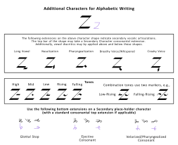
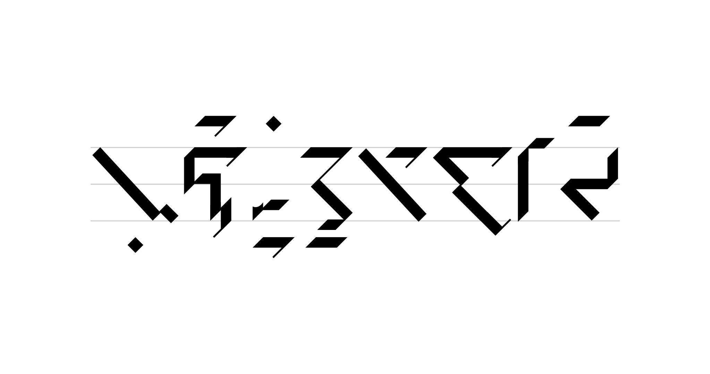

## 12.0 书写系统 {#Sec12}

本网站采用了罗马化系统以书写 New Ithkuil，以方便那些希望更容易了解该语言在<tooltip label="morpho-phonology">形态-语音</tooltip>及<tooltip label="lexico-morphology">词汇-形态</tooltip>方面如何运作的人。然而，New Ithkuil 的原生书写系统很独特，它既不是<tooltip label="alphabet">全音素文字</tooltip>，也不是<tooltip label="syllabary">音节文字</tooltip>，更不是<tooltip label="ideographic">表意文字</tooltip>，而是<tooltip label="morpho-phonemic">形态-音位文字</tooltip>系统；也就是说，用于显示书面语言的图形字符同时传达了语音和形态（即语法）信息，读者可以根据语言语法知识构建所要表达的词语。

下面这个简单粗暴的罗马字母类比可以说明这一形态-音位原则：假设英语中动词<q>go</q>的过去时书写形式是<q>gø</q>（读作<q>went</q>），元音字母上的斜杠表示从现在时到过去时的切换。这就是形态音位文字的一个例子，其中的字符传达了任何无法预测的语音信息，但可预测的形式（例如，英语使用者知道<q>gø</q>的过去时形式是<q>went</q>）是通过符号或图形修饰传达的，只表示预期的形态变化（例如，将动词变为过去时），而没有任何图形表示所产生的单词本身的语音。

因此，New Ithkuil 文字系统提供了一些字符来表达基本辅音，以显示一个词的不可预知的部分，无论是词根、`VxCs` 词缀的 `Cs` 部分，还是一个特定的指代范畴；但除此以外，只提供类似变音符的附加符、语音字符的模式化变体、专用字形，每个都传达形态（即语法）上的形变，读者可利用语法知识进行语音化以得出正确单词。

构形词书写字符之序

::: tabs

@tab 甲字

* 关系
* 联态
* 词干
* 详述
* 功能
* 版本
* 构数
* `Ca`：构型、系属、限域、视界、本质

@tab 乙字

`Cr` 主词根

@tab 乙字：可多个

`Cs` 词缀 （列位 V）

@tab 顺转乙字：可多个

`Cs` 词缀（列位 VII）

【字符侧向旋转 180 度】

@tab 丙字

* 配价
* 相位
* 效果
* 时体
* 级别

@tab 丁字

`Vc` / `Vf`【格·格式】或 `Vk`【语为&言据】 + 语式 以及/或者 格辖

:::

对于构形词的联对，每个构形词都单独书写，先写联构词，再写主构词。这两种构形词之间没有区别，只是于联构词的词首甲字下标符号表示联态（见下文）

## 12.1 甲字 {#Sec12_1}

甲字是为词首字符，其所提供形态信息包括 `Vr` 的**详述、功能、语境** + `Vv` 的**版本、词干** + `Ca` 的**构型、系属、限域、视界、本质**。它也指示构形词的**关系/联态**。下图展示如何书写甲字：

<figure data-mode="lightmode-only">
    
    <figcaption>甲字表示详述、语境、关系、联态、视界、限域、构型、系属、本质、词干、功能、版本、构数</figcaption>
</figure>

<figure data-mode="darkmode-only">
    
    <figcaption>甲字表示详述、语境、关系、联态、视界、限域、构型、系属、本质、词干、功能、版本、构数</figcaption>
</figure>

::: tip 注意

注意：如果该词处于句首位置，任何由普通斜线组成的词首字符（即「默认范畴」的 <abbr>CSL/UPX/DEL/M/NRM/PRC/STA/BSC/EXS/S1</abbr>）都可以省略。

如果该词是非联态动词，斜线本身也可以省略，而显示动词性状态的下置点或横线将被放在首字符（即乙字）左侧的中线上，但前提是该词在句首位置。

:::

## 12.2 乙字 {#Sec12_2}

乙字紧随着甲字，为列位 III `Vr` 及列位 V/VII `VxCs` 词缀群提供辅音信息。下列 28 种形式是<tooltip label="core">字干</tooltip>，其中「顶」端与「底」端可用于前缀或后缀额外辅音，这些扩展见下文。手写形式以非黑白色显示。

<figure data-mode="lightmode-only">
    
    <figcaption></figcaption>
</figure>

<figure data-mode="darkmode-only">
    
    <figcaption></figcaption>
</figure>

### 12.2.1 乙字辅音扩展 {#Sec12_2_1}

下图显示了对乙字上下两端的各种「<tooltip label="extensions">扩展</tooltip>」，以表示辅音丛（例如，在 “k”-乙字字干上应用 “s”-扩展，结果是辅音值为 “sk”）。将这些扩展应用于辅音字干的顶端，会在字干所代表的辅音上增加一个前辅音。于底端扩展则增加一个后辅音。通过将这些扩展应用于「占位字」，可以添加额外的辅音。

<figure data-mode="lightmode-only">
    
    <figcaption>乙字辅音扩展</figcaption>
</figure>

<figure data-mode="darkmode-only">
    
    <figcaption>乙字辅音扩展</figcaption>
</figure>

### 12.2.2 运用乙字表示 `VxCs` 词缀群 {#Sec12_2_2}

乙字及其扩展可用于表示任何列位 V 的 `Cs` 部分，直接将其置于代表 `Cr` 的字符之后。使用下列下置符表示词缀程度：

<figure data-mode="lightmode-only">
    
    <figcaption></figcaption>
</figure>

<figure data-mode="darkmode-only">
    
    <figcaption></figcaption>
</figure>

#### 为表示乙型或丙型 `VxCs` 词缀

前者于乙字之上置**点**，后者于乙字之上置**条**。

#### 为表示列位 VII `VxCs` 词缀

直接将任何列位 VII `Cs` 字符置于任何列位 V `Cs` 字符之后，但该字符须旋转180度（即上下而非横向镜像）。乙型或丙型 `VxCs` 列位 VII 词缀同样如上所述以点或条所标记。

用于列位 VII `VxCs` 词缀的顺转辅音字见下文。

#### 表示词缀性管辖

口语允许使用词缀小词额外（或作为替代）在构形词列位 V/VII 排序词缀来表示管辖范围，而书面语只按 `Cs` 乙字在构形词内的顺序排序（即，由读者决定是否将词缀诠释为口语中的词缀小词，而不是在构形词内的词缀）。然而，有一个附加符与 `Cs` 乙字一起使用——沿着 `Cs` 乙字右侧的点，以表明该词缀管辖整个构形词，包括配价、语式\格、语为&言据等。

### 12.2.3 顺转乙字 {#Sec12_2_3}

顺转乙字与标准乙字相同，但侧向旋转180度。用于表示任何列位 VII `VxCs` 词缀（可多个），并直接置于任何列位 V `VxCs` 词缀之后，或如果没有列位 V `VxCs` 词缀则直接置于首个（非顺转）辅音符之后。任何乙型 `VxCs` 词缀以上置点表示，而丙型以上置横条表示。顺转乙字也用于表示特化 `Cs` 词根及特化指代词根，如下文第 12.2.4 条所述。

<figure data-mode="lightmode-only">
    
    <figcaption></figcaption>
</figure>

<figure data-mode="darkmode-only">
    
    <figcaption></figcaption>
</figure>

### 12.2.4 表示特化 `Cs` 词根及特化指代词根 {#Sec12_2_4}

顺转乙字可用于表示：特化 `Cs` 词根，其中 `VxCs` 词缀之 `Cs` 辅音形式（见[第 10.3 节](10#Sec10_3)）代替列位 III `Cr` 中缀以成为词根；特化指代词根，其中单或组合指代词缀（见[第 10.4 节](10#Sec10_4)）代替列位 III `Cr` 中缀以成为词根。

将如上所述的顺转乙字取代首个表示 `Cr` 的（非顺转）乙字，就能表示如此特化词根。顺转乙字紧跟在词首甲字之后，这种使用向读者表明该词含有特化 `Cs` 词根。

`Cs` 辅音形式之程度的表示，与上文所描述、用于表示标准 `VxCs` 词缀的 9 个下置符相同（注意：特化 `Cs` 词根没有甲乙型之分）

特化指代词根是用顺转乙字取代首个表示 `Cr` 的（非顺转）乙字来表示的，与上面的特化 `Cs` 词根的表示完全相同，只是顺转乙字带有一个上置点。

## 12.3 丙字 {#Sec12_3}

该组合型字符置于所有乙字之后，以示配价、时体、相位、效果、级别。

<figure data-mode="lightmode-only">
    
    <figcaption></figcaption>
</figure>

<figure data-mode="darkmode-only">
    
    <figcaption></figcaption>
</figure>

## 12.4 丁字 {#Sec12_4}

丁字直接置于任一丙字之后。用于表示 `Vc` 格、`Vk` 语为+言据、`Cm` 语式、`Cc` 格辖。`Vc` 及 `Vk` 以普通竖条之顶·底端扩展表示。语式与格辖以下文第 12.4.1 条所述之附加符表示。

<figure data-mode="lightmode-only">
    
    <figcaption></figcaption>
</figure>

<figure data-mode="darkmode-only">
    
    <figcaption></figcaption>
</figure>

### 12.4.1 丁字的附加符 {#Sec12_4_1}

在丁字上使用附加符来表示格辖、语式以及（正反）格辅词缀和格叠加词缀。

<figure data-mode="lightmode-only">
    
    <figcaption></figcaption>
</figure>

<figure data-mode="darkmode-only">
    
    <figcaption></figcaption>
</figure>

#### 语式及格辅

语式以上置符表示，符形见上图。

格辖以下置符表示，符形见上图。

#### （正反）格辅词缀

将表示格的丁字以及特殊附加符组合起来表示，见上图。

#### 乙丙型（正反）格辅词缀

乙型加上置点于丁字；丙型加上置条于丁字。

#### 区分列位 V vs. 列位 VII 的（正反）格辅词缀

如需区分两者，则给后者附加符增加一个点，如上图所示。

#### 格叠加

第二个格，管辖第一个格，简单添加另一个丁字紧随首个丁字以表示。

### 12.4.2 丁字替代法 —— 在 `Cr` 字用附加符以示 `Vc/Vk` {#Sec12_4_2}

如果语式与格辖为默认的 <abbr>FAC/CCN</abbr> （以至于丁字上下无附加符），那么就可以选择不用丁字，而是在 `Cr` 辅音词根字用下文所示的上置符及下置符以示 `Vc` 或 `Vk`。

<figure data-mode="lightmode-only">
    
    <figcaption></figcaption>
</figure>

<figure data-mode="darkmode-only">
    
    <figcaption></figcaption>
</figure>

### 12.4.3 表示指代词 {#Sec12_4_3}

为表示指代词，在乙字（如有必要，可带扩展）前使用丁字，以示特定人称指代，乙字上有上置横条附加符。双指代词被写成两个彼此相邻的指代词。为表示指代词的格叠加，在乙字后放置另一个丁字（即，使得乙字夹在两个丁字之间）

## 12.5 观感字 {#Sec12_5}

观感字用于表示观感小词。若位于句首，可紧接在首个构形词或指代词之前，其间不留空格。同样，若位于句末，可紧接在结尾构形词或指代词之后，其间不留空格。若作独句使用，请用空格将其与前和/或后的句子分开。

<figure data-mode="lightmode-only">
    
    <figcaption></figcaption>
</figure>

<figure data-mode="darkmode-only">
    
    <figcaption></figcaption>
</figure>

<abbr>DCC</abbr> 和 <abbr>PSM</abbr> 观感与 <abbr>ACC</abbr> 和 <abbr>FSC</abbr> 观感的区别在于使用了点附加符，如下所示：

<figure data-mode="lightmode-only">
    
    <figcaption></figcaption>
</figure>

<figure data-mode="darkmode-only">
    
    <figcaption></figcaption>
</figure>

## 12.6 表示言域 {#Sec12_6}

以下符号置于短语前后以标记各种言域。每一种言据有四种模式；第一种仅表示言域本身，而第二种表示按全音素书写的专名或外来词/短语。至于第三·第四种，详见下文。

<figure data-mode="lightmode-only">
    
    <figcaption></figcaption>
</figure>

<figure data-mode="darkmode-only">
    
    <figcaption></figcaption>
</figure>

\* 见下第 12.6.1 条

### 12.6.1 标注式和转写式：小词的语音表达（或抑制） {#Sec12_6_1}

作为一种形态语音书写系统，该文字通常不表示小词。因此，一个书面语段可能会有不同的口语诠释，也就是说，在朗读该语言的书面语段时，是否使用小词由读者自己决定。

然而，在某些情况下，例如在阅读诗歌或歌词、阅读戏剧剧本或逐字标音时，最好向读者指出书面语段的确切朗读方式。这就是标注式和转写式的目的。

<tooltip label="Transcriptive Mode">标注式</tooltip>表示标记内的单词/短语应完全按照标准写法来读，也就是说，不使用小词（载小词除外）。它也被用来表示引小词（见设计文档章节 4.5.2）和短语小词（见设计文档章节 4.5.4）的功能。

<tooltip label="Transcriptive Mode">转写式</tooltip>表明标记内的词/短语是以下情况之一：(1) 使用按全音素书写的乙字进行小词的音位表述，或 (2) 表示模小词的丙字，先读配价，再读上「半部」，再读下「半部」。它也被用来表示名小词的功能（见设计文档章节 4.5.3）。

## 12.7 字母式书写 {#Sec12_7}

<figure data-mode="lightmode-only">
    
    <figcaption></figcaption>
</figure>

<figure data-mode="darkmode-only">
    
    <figcaption></figcaption>
</figure>

在<tooltip label="Alphabetic Mode">字母式</tooltip>下，乙字及其扩展和该占位字用于全音素书写专名和外来词，其前后都有适当的双点附加符（如关于书写言域小词之章节所述）。

此外，使用下文所示的附加符以表示元音，置于字符之上表示元音在其前，置于字符之下表示元音在其后。如有必要，使用占位字（如图所示）来表示独立元音。

要表示双元音组合（包括二合元音）时，将首元音符置于占位字之上，将次元音符置于其下。要表示两个单辅音之间的单元音时，请使用占位字，并将代表该两个辅音的扩展部分置于其顶端和底端，而元音符则置于该字符的右侧。

### 表示双元音组合/双元音而不使用占位字的可选方法

要表示全辅音组合前的双元音组合或二合元音时，请将首元音符置于乙字之上，而次元音符则置于其右侧。要表示其后的双元音组合或二合元音时，将首元音符置于其右侧，而次元音符置于该字符之下。

重读字表明字母式书写中的重读。

次音节重读不做标记；其他情况下，重读元音应置于独立普通竖条之上，如图所示，而不是通常使用的占位字。

### 字母式书写的外加字

下图所示的字形在字母式书写时可以用多种方式表示外来词/音。

<figure data-mode="lightmode-only">
    
    <figcaption></figcaption>
</figure>

<figure data-mode="darkmode-only">
    
    <figcaption></figcaption>
</figure>

### 12.7.1 表示载小词/词干 {#Sec12_7_1}

在字母式下使用上述适当的言域标记，并在首言域标记和第一个字母式乙字之间插入一个表示格的丁字。根据标准书写规则，一个完整的载词干可放在字母式言域子句之前；或者，作为一种简替，在第一个字母式乙字之前的字母式言域标记之后（即两者之间），直接放置甲、丙及丁字。

## 12.8 文例 {#Sec12_8}

<figure data-mode="lightmode-only">
    
    <figcaption></figcaption>
</figure>

<figure data-mode="darkmode-only">
    
    <figcaption></figcaption>
</figure>

    <dl class="gloss">
        <dt>Wezvwaušburdóu</dt>
        <dd>[默认Ca]-词干.2-“fox”-GEO₂/2-REA₁/9-ADM</dd>
    </dl>
    <dl class="gloss">
        <dt>yaizxra</dt>
        <dd>“fork”-RPV-THM</dd>
    </dl>
    <dl class="gloss">
        <dt>sai.</dt>
        <dd>2m/POS</dd>
    </dl>
    
<q>Be careful, your fork is actually a fennec.</q>

    
小心点，你的餐叉实际上是耳廓狐（沙漠小狐）

